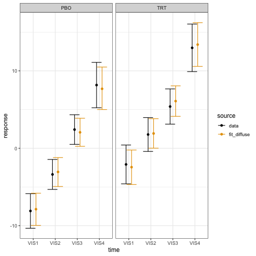
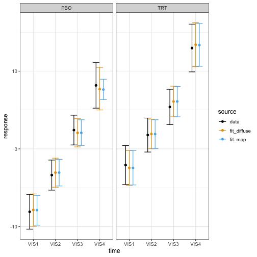

# Meta-analytic predictive priors

A meta-analytic predictive prior is a type of historical borrowing
approach that uses data from one or more previous studies to build a
prior distribution for parameters of interest in a new study
(Spiegelhalter et al. (2004), Neuenschwander et al. (2010), Schmidli et
al. (2014)). This vignette demonstrates how to supply a meta-analytic
predictive prior to a Bayesian MMRM fitted with `brms.mmrm`.

## Data of the current study

We use the FEV1 data from the `mmrm` package, which contains simulated
measurements of forced expiratory volume in 1 second (FEV1) for virtual
atients with chronic obstructive pulmonary disease (COPD) at multiple
visits.

``` r
set.seed(0L)
library(brms.mmrm)
library(dplyr)
library(ggplot2)
library(mmrm)
data(fev_data, package = "mmrm")
data_current <- fev_data |>
  mutate(FEV1_CHG = FEV1 - FEV1_BL) |>
  brm_data(
    outcome = "FEV1_CHG",
    group = "ARMCD",
    time = "AVISIT",
    patient = "USUBJID",
    reference_group = "PBO"
  ) |>
  brm_data_chronologize(order = "VISITN") |>
  brm_archetype_effects(intercept = FALSE)
data_current
#> # A tibble: 800 × 19
#>    x_PBO_VIS1 x_PBO_VIS2 x_PBO_VIS3 x_PBO_VIS4
#>  *      <int>      <int>      <int>      <int>
#>  1          1          0          0          0
#>  2          0          1          0          0
#>  3          0          0          1          0
#>  4          0          0          0          1
#>  5          1          0          0          0
#>  6          0          1          0          0
#>  7          0          0          1          0
#>  8          0          0          0          1
#>  9          1          0          0          0
#> 10          0          1          0          0
#> # ℹ 790 more rows
#> # ℹ 15 more variables: x_TRT_VIS1 <int>,
#> #   x_TRT_VIS2 <int>, x_TRT_VIS3 <int>,
#> #   x_TRT_VIS4 <int>, USUBJID <fct>, AVISIT <ord>,
#> #   ARMCD <fct>, RACE <fct>, SEX <fct>,
#> #   FEV1_BL <dbl>, FEV1 <dbl>, WEIGHT <dbl>,
#> #   VISITN <int>, VISITN2 <dbl>, FEV1_CHG <dbl>
```

We are using a treatment effect informative prior archetype that invites
the user to specify an informative prior on the placebo group mean at
each study visit. For more details on informative prior archetypes, see
[`vignette("archetypes", package = "brms.mmrm")`](../articles/archetypes.md).

``` r
summary(data_current)
#> # This is the "effects" informative prior archetype in brms.mmrm.
#> # The following equations show the relationships between the
#> # marginal means (left-hand side) and important fixed effect parameters
#> # (right-hand side). Nuisance parameters are omitted.
#> # 
#> #   PBO:VIS1 = x_PBO_VIS1
#> #   PBO:VIS2 = x_PBO_VIS2
#> #   PBO:VIS3 = x_PBO_VIS3
#> #   PBO:VIS4 = x_PBO_VIS4
#> #   TRT:VIS1 = x_PBO_VIS1 + x_TRT_VIS1
#> #   TRT:VIS2 = x_PBO_VIS2 + x_TRT_VIS2
#> #   TRT:VIS3 = x_PBO_VIS3 + x_TRT_VIS3
#> #   TRT:VIS4 = x_PBO_VIS4 + x_TRT_VIS4
```

## Benchmark analysis with a diffuse prior

As a basis for comparison, we first fit a Bayesian MMRM with a diffuse
prior:

``` r
fit_diffuse <- brm_model(
  data = data_current,
  formula = brm_formula(data_current),
  refresh = 0L
)
```

The estimated marginal means closely match the analogous data summaries:

``` r
draws_diffuse <- brm_marginal_draws(fit_diffuse)
summaries_diffuse <- brm_marginal_summaries(draws_diffuse)
summaries_data <- brm_marginal_data(data_current)
```

``` r
colors <- c(
  data = "#000000",
  fit_diffuse = "#E69F00",
  fit_map = "#56B4E9"
)
```

``` r
brm_plot_compare(data = summaries_data, fit_diffuse = summaries_diffuse) +
  scale_color_manual(values = colors) +
  theme_bw(12)
```



Suppose the trial is designed to declare efficacy if the posterior
probability of observing a treatment effect at visit 4 ($\delta$) of at
least 4 units of FEV1 is at least 85%:

$$\begin{array}{r}
{P\left( \delta > 4\  \mid \ \text{data} \right) > 0.85}
\end{array}$$

The posterior probability undershoots the efficacy threshold, which is
unsurprising because the dataset has few patients and MMRMs with diffuse
priors are weak.

``` r
draws_diffuse |>
  brm_marginal_probabilities(direction = "greater", threshold = 4) |>
  filter(time == "VIS4") |>
  pull(value)
#> [1] 0.806
```

## Constructing the robust MAP prior

Suppose we have a wealth of historical summary-level placebo data on
FEV1 at visit 4 in similar studies:

``` r
data_historical_visit4 <- tibble::tribble(
  ~study   , ~mean , ~sd   , ~patients ,
  "study1" , 8.16  , 10.01 ,       437 ,
  "study2" , 8.45  ,  9.87 ,       558 ,
  "study3" , 7.34  , 12.33 ,       489 ,
  "study4" , 6.87  , 14.44 ,       320 ,
  "study5" , 7.00  , 12.07 ,       491 ,
  "study6" , 7.10  , 11.11 ,       574
) |>
  mutate(se = sd / sqrt(patients))
```

Soon, we will make use of the pooled mean and standard deviation of this
external data:

``` r
pooled_external_data_mean <- sum(data_historical_visit4$mean * data_historical_visit4$patients) /
  sum(data_historical_visit4$patients)
pooled_external_data_sd <- sum(data_historical_visit4$sd^2 * data_historical_visit4$patients) /
  sum(data_historical_visit4$patients) |>
  sqrt()
```

We use `gMAP()` from `RBesT` to fit this summary data with a
meta-analytic predictive model, then `automixfit()` to approximate the
MAP posterior as a mixture of normals, and finally `robustify()` to add
a weakly informative component that protects against prior-data conflict
(Schmidli et al. (2014)). This robustified MAP posterior will serve as
the MAP prior for the Bayesian MMRM downstream.[¹](#fn1)

``` r
map_mcmc <- RBesT::gMAP(
  cbind(mean, se) ~ 1 | study,
  data = data_historical_visit4,
  family = gaussian,
  # See https://opensource.nibr.com/RBesT/reference/gMAP.html#details to set priors.
  tau.dist = "HalfNormal",
  tau.prior = pooled_external_data_sd / 4,
  beta.prior = cbind(0, 100)
)

map_mixture <- RBesT::automixfit(map_mcmc)

map_robust <- RBesT::robustify(
  map_mixture,
  weight = 0.2,
  mean = pooled_external_data_mean,
  sigma = pooled_external_data_sd
)
```

``` r
map_robust
#> Univariate normal mixture
#> Mixture Components:
#>   comp1        comp2        comp3        robust      
#> w 4.451438e-01 3.291704e-01 2.568579e-02 2.000000e-01
#> m 7.618285e+00 7.524934e+00 8.572269e+00 7.522161e+00
#> s 4.222427e-01 1.104931e+00 3.146753e+00 7.124200e+03
```

## Converting the prior for use in `brms.mmrm`

We assign robust MAP prior to the placebo group mean at visit
4:[²](#fn2)

``` r
prior <- brm_prior_label(
  code = "mixnorm(map_w, map_m, map_s)",
  group = "PBO",
  time = "VIS4"
) |>
  brm_prior_archetype(archetype = data_current)

prior
#> b_x_PBO_VIS4 ~ mixnorm(map_w, map_m, map_s)
```

We then use `RBesT::mixstanvar()` to tell the Stan code in `brms` how to
interpret `mixnorm()`. Below, the name “map” has to align with the
prefix “map” in the call to `mixnorm()` above.[³](#fn3)

``` r
stanvars <- RBesT::mixstanvar(map = map_robust)
```

## Fitting the Bayesian MMRM with the MAP prior

We simply plug `prior` and `stanvars` into the call to
[`brms.mmrm::brm_model()`](../reference/brm_model.md):

``` r
fit_map <- brm_model(
  data = data_current,
  formula = brm_formula(data_current),
  prior = prior,
  stanvars = stanvars,
  refresh = 0L
)
```

The model with the MAP prior has a more precise estimate of the placebo
group mean at the final visit.

``` r
draws_map <- brm_marginal_draws(fit_map)
summaries_map <- brm_marginal_summaries(draws_map)
```

``` r
brm_plot_compare(
  data = summaries_data,
  fit_diffuse = summaries_diffuse,
  fit_map = summaries_map
) +
  scale_color_manual(values = colors) +
  theme_bw(12)
```



With this added precision, we meet the efficacy threshold:

``` r
draws_map |>
  brm_marginal_probabilities(direction = "greater", threshold = 4) |>
  filter(time == "VIS4") |>
  pull(value)
#> [1] 0.865
```

In other trials, the MAP prior may have the opposite effect. To avoid
human decision-making bias, it is important to pre-specify the analysis
model used to evaluate the efficacy rule.

## Multivariate mixture priors

For a multivariate mixture prior with correlated model coefficients, we
can use `mixmvnorm()` in the `prior` specification and `mixstanvar()` to
convert the mixture for use in `brms.mmrm`. Not all multivariate mixture
priors are MAP priors, but you can translate a pre-computed MAP prior
into the `mixmvnorm()` format as shown below.

### Specifying a known prior

First, we specify the distributional family of the prior for `brms`:

``` r
prior <- brms::prior(
  "mixmvnorm(prior_w, prior_m, prior_sigma_L)",
  class = "b",
  dpar = ""
)
```

Before we construct the mixture prior, we need to note the order of the
model coefficients in `brms`. From
[`brms::prior_summary()`](https://mc-stan.org/rstantools/reference/prior_summary.html),
we see that the model coefficients are ordered first by study arm, then
by study visit. This is the order we will use for the components of the
mean and covariance of the multivariate normal mixture components.

``` r
brms::prior_summary(fit_diffuse)
#>                 prior    class       coef group resp
#>                (flat)        b                      
#>                (flat)        b x_PBO_VIS1           
#>                (flat)        b x_PBO_VIS2           
#>                (flat)        b x_PBO_VIS3           
#>                (flat)        b x_PBO_VIS4           
#>                (flat)        b x_TRT_VIS1           
#>                (flat)        b x_TRT_VIS2           
#>                (flat)        b x_TRT_VIS3           
#>                (flat)        b x_TRT_VIS4           
#>                (flat)        b                      
#>                (flat)        b AVISITVIS1           
#>                (flat)        b AVISITVIS2           
#>                (flat)        b AVISITVIS3           
#>                (flat)        b AVISITVIS4           
#>  lkj_corr_cholesky(1) Lcortime                      
#>   dpar nlpar lb ub tag       source
#>                             default
#>                        (vectorized)
#>                        (vectorized)
#>                        (vectorized)
#>                        (vectorized)
#>                        (vectorized)
#>                        (vectorized)
#>                        (vectorized)
#>                        (vectorized)
#>  sigma                      default
#>  sigma                 (vectorized)
#>  sigma                 (vectorized)
#>  sigma                 (vectorized)
#>  sigma                 (vectorized)
#>                             default
```

We assume a rigorous process of evidence synthesis estimated the
following marginal means for the placebo group. We also include vague
treatment effects for the active treatment group. We will use this mean
vector for both components of the mixture prior.

``` r
mean_mixture <- c(
  5, # x_PBO_VIS1
  7, # x_PBO_VIS2
  8, # x_PBO_VIS3
  9, # x_PBO_VIS4
  0, # x_TRT_VIS1
  0, # x_TRT_VIS2
  0, # x_TRT_VIS3
  0 #  x_TRT_VIS4
)
```

Similarly, we posit a block-diagonal covariance matrix with independent
study arms and a diffuse block for the treatment arm.

``` r
# Block-diagonal covariance:
# correlated control block, vague diagonal treatment block.
covariance_control <- matrix(
  rbind(
    c(4, 2, 1, 1),
    c(2, 4, 2, 1),
    c(1, 2, 4, 2),
    c(1, 1, 2, 9)
  ),
  nrow = 4
)
covariance_informative <- matrix(0, 8, 8)
covariance_informative[1:4, 1:4] <- covariance_control
covariance_informative[5:8, 5:8] <- diag(rep(64, 4))
```

To help prevent prior-data conflict, we add a robust mixture component.
Ordinarily, the variance of a robust MAP component is proportional to
the pooled patient-level variance from historical data. Since formal
evidence synthesis is outside the scope of this section, we simply
borrow from the diffuse block (i.e. the treatment arm) of the covariance
above.

``` r
mean_robust <- mean_mixture
covariance_robust <- diag(rep(64, 8))

# Each mixture component is a vector with the
# weight, mean vector, and covariance matrix elements all inline.
multivariate_mixture <- RBesT::mixmvnorm(
  informative = c(0.8, mean_mixture, covariance_informative),
  robust = c(0.2, mean_robust, covariance_robust)
)
```

We then translate the multivariate mixture into a format that `brms` can
use:

``` r
stanvars <- RBesT::mixstanvar(prior = multivariate_mixture)
```

Finally, we fit the model:

``` r
fit_multivariate_mixture <- brm_model(
  data = data_current,
  formula = brm_formula(data_current),
  prior = prior,
  stanvars = stanvars,
  refresh = 0L
)
```

### Constructing a prior from real data

Constructing a multivariate mixture prior from real data is more
involved than the univariate case, but the general principles are the
same. For details, please see Wang and Weber (2024).

## References

Neuenschwander, B., Capkun-Niggli, G., Branson, M., and Spiegelhalter,
D. J. (2010), “Summarizing historical information on controls in
clinical trials,” *Clinical Trials*, 7, 5–18.
<https://doi.org/10.1177/1740774509356002>.

Schmidli, H., Gsteiger, S., Roychoudhury, S., O’Hagan, A.,
Spiegelhalter, D. J., and Neuenschwander, B. (2014), “Robust
Meta-Analytic-Predictive Priors in Clinical Trials with Historical
Control Information,” *Biometrics*, 70, 1023–1032.
<https://doi.org/10.1111/biom.12201>.

Spiegelhalter, D. J., Abrams, K. R., and Myles, J. P. (2004), *Bayesian
Approaches to Clinical Trials and Health-Care Evaluation*, *Statistics
in Medicine*, Wiley. <https://doi.org/10.1002/0470092602>.

Wang, Y., and Weber, S. (2024), “[Use of historical control data with a
covariate](https://opensource.nibr.com/bamdd/src/02ad_meta_analysis_covariate.html),”
in *Applied Modelling in Drug Development*, Novartis AG.

------------------------------------------------------------------------

1.  See the documentation of `gMAP()`, `automixfit()` and `robustify()`
    in `RBesT` for details on how to do this in general.

2.  See the documentation of `RBesT::mixstanvar()`

3.  The suffixes “\_w”, “\_m”, and “\_s” in `mixnorm()` are hard-coded.
