# Simulation-based calibration checking

## About

This vignette shows the results of a simulation-based calibration (SBC)
checking study to validate the implementation of the models in
`brms.mmrm`. SBC checking tests the ability of a Bayesian model to
recapture the parameters used to simulate prior predictive data. For
details on SBC checking, please read Modrák et al. (2024) and the
[`SBC`](https://hyunjimoon.github.io/SBC/) R package (Kim et al. 2022).
This particular SBC checking study uses the
[`targets`](https://docs.ropensci.org/targets/) pipeline in the
[`viggnettes/sbc/`](https://github.com/openpharma/brms.mmrm/tree/main/vignettes/sbc)
subdirectory of the
[`brms.mmrm`](https://github.com/openpharma/brms.mmrm) package source
code.

## Conclusion

From the results below, the SBC rank statistics are approximately
uniformly distributed. In other words, the posterior distribution from
the `brms`/Stan MMRM modeling code matches the prior from which the
datasets were simulated. This is evidence that both the subgroup and
non-subgroup models in `brms.mmrm` are implemented correctly.

## Setup

To show the SBC checking results in this vignette, we first load code
from the SBC checking study, and we use custom functions to read and
plot rank statistics:

``` r
library(dplyr)
library(ggplot2)
library(tibble)
library(tidyr)

source("sbc/R/prior.R")
source("sbc/R/response.R")
source("sbc/R/scenarios.R")

read_ranks <- function(path) {
  fst::read_fst(path) |>
    tibble::as_tibble() |>
    pivot_longer(
      cols = everything(),
      names_to = "parameter",
      values_to = "rank"
    )
}

plot_ranks <- function(ranks) {
  ggplot(ranks) +
    geom_histogram(
      aes(x = rank),
      breaks = seq(from = 0, to = max(ranks$rank), length.out = 10)
    ) +
    facet_wrap(~parameter)
}
```

Each section below is its own SBC checking study based on a given
modeling scenario. Each scenario shows results from 1000 independent
simulations from the prior.

## Subgroup scenario

The subgroup scenario distinguishes itself from the others by the
presence of a subgroup factor. Assumptions:

- 2 treatment groups
- 2 subgroup levels
- 3 time points
- 150 patients per treatment group
- Baseline covariates (2 continuous and 2 categorical)
- 30% dropout
- 8% rate of independent/sporadic missing response.

Model formula:

    #> response ~ group + group:subgroup + group:subgroup:time + group:time + subgroup + subgroup:time + time + continuous1 + continuous2 + balanced + unbalanced + unstr(time = time, gr = patient) 
    #> sigma ~ 0 + time

The prior was randomly generated and used for both simulation and
analysis:

``` r
setup_prior(subgroup) |>
  select(prior, class, coef, dpar) |>
  as.data.frame()
#>                      prior     class                                       coef
#> 2  normal(-0.1736, 0.6054)         b                             balancedlevel2
#> 3   normal(-0.0447, 0.855)         b                             balancedlevel3
#> 4   normal(0.0406, 0.5496)         b                                continuous1
#> 5  normal(-0.0324, 0.7433)         b                                continuous2
#> 6  normal(-0.0181, 2.3641)         b                               groupgroup_2
#> 7    normal(0.2398, 1.451)         b            groupgroup_2:subgroupsubgroup_2
#> 8  normal(-0.0082, 2.7447)         b groupgroup_2:subgroupsubgroup_2:timetime_2
#> 9  normal(-0.1206, 0.9984)         b groupgroup_2:subgroupsubgroup_2:timetime_3
#> 10  normal(0.0883, 2.7254)         b                    groupgroup_2:timetime_2
#> 11  normal(0.0347, 0.3068)         b                    groupgroup_2:timetime_3
#> 12  normal(0.1064, 2.8303)         b                         subgroupsubgroup_2
#> 13  normal(0.1894, 1.2434)         b              subgroupsubgroup_2:timetime_2
#> 14 normal(-0.0294, 1.0162)         b              subgroupsubgroup_2:timetime_3
#> 15  normal(0.0649, 2.0052)         b                                 timetime_2
#> 16  normal(0.0826, 1.9545)         b                                 timetime_3
#> 17  normal(0.0491, 1.3319)         b                           unbalancedlevel2
#> 18   normal(-0.156, 1.255)         b                           unbalancedlevel3
#> 19             lkj(1.3461)   cortime                                           
#> 20   normal(0.088, 2.6479) Intercept                                           
#> 22  normal(0.0879, 2.8273)         b                                 timetime_1
#> 23  normal(0.2299, 2.2228)         b                                 timetime_2
#> 24  normal(0.0095, 2.2667)         b                                 timetime_3
#>     dpar
#> 2       
#> 3       
#> 4       
#> 5       
#> 6       
#> 7       
#> 8       
#> 9       
#> 10      
#> 11      
#> 12      
#> 13      
#> 14      
#> 15      
#> 16      
#> 17      
#> 18      
#> 19      
#> 20      
#> 22 sigma
#> 23 sigma
#> 24 sigma
```

The following histograms show the SBC rank statistics which compare the
prior parameter draws draws to the posterior draws. If the data
simulation code and modeling code are both correct and consistent, then
the rank statistics should be approximately uniformly distributed.

``` r
ranks_subgroup <- read_ranks("sbc/results/subgroup.fst")
```

Fixed effect parameter ranks:

``` r
ranks_subgroup |>
  filter(grepl("^b_", parameter)) |>
  filter(!grepl("^b_sigma", parameter)) |>
  plot_ranks()
```

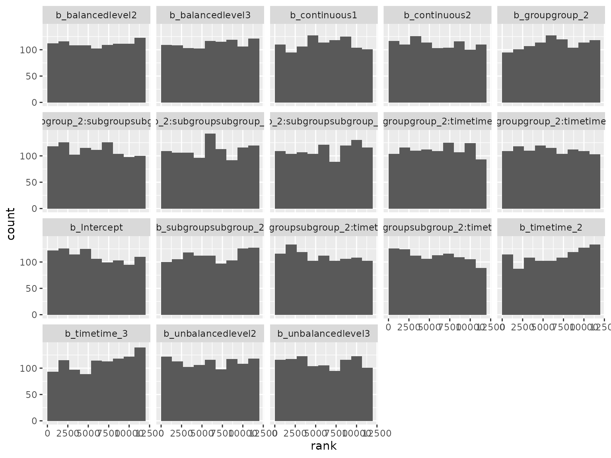

Standard deviation parameter ranks:

``` r
ranks_subgroup |>
  filter(grepl("b_sigma", parameter)) |>
  plot_ranks()
```

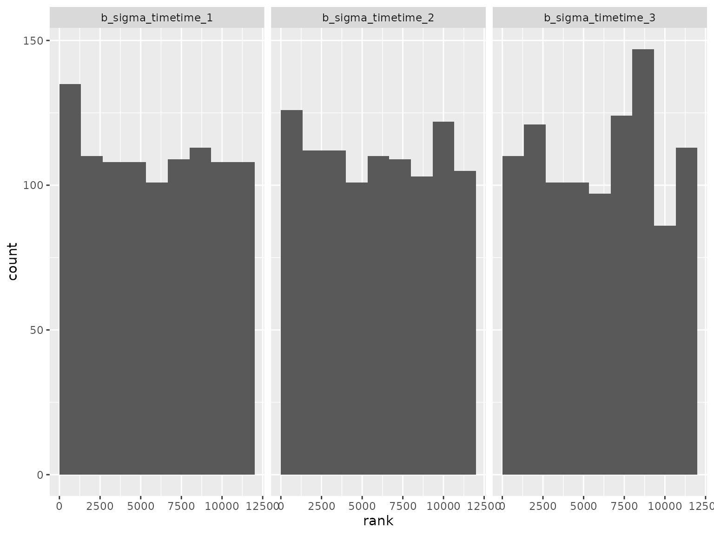

Correlation parameter ranks:

``` r
ranks_subgroup |>
  filter(grepl("cortime_", parameter)) |>
  plot_ranks()
```

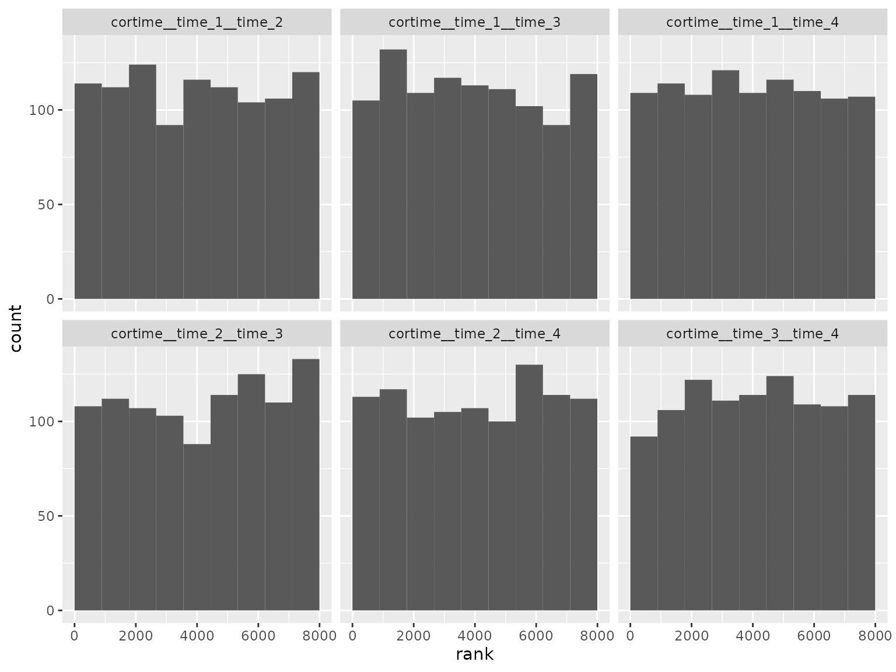

## Unstructured scenario

This scenario uses unstructured correlation and does not use a subgroup
variable. Assumptions:

- 3 treatment groups
- No subgroup
- 4 time points
- 100 patients per treatment group
- No covariate adjustment
- No missing responses

Model formula:

    #> response ~ 0 + group + time + unstr(time = time, gr = patient) 
    #> sigma ~ 0 + time

The prior was randomly generated and used for both simulation and
analysis:

``` r
setup_prior(unstructured) |>
  select(prior, class, coef, dpar) |>
  as.data.frame()
#>                      prior   class         coef  dpar
#> 2  normal(-0.1005, 1.6313)       b groupgroup_1      
#> 3   normal(0.2389, 0.4785)       b groupgroup_2      
#> 4  normal(-0.1541, 1.2388)       b groupgroup_3      
#> 5  normal(-0.0835, 2.2302)       b   timetime_2      
#> 6  normal(-0.0266, 1.9245)       b   timetime_3      
#> 7  normal(-0.1762, 2.2366)       b   timetime_4      
#> 8              lkj(1.1812) cortime                   
#> 10 normal(-0.0388, 2.5623)       b   timetime_1 sigma
#> 11  normal(0.1653, 2.7346)       b   timetime_2 sigma
#> 12  normal(0.0359, 2.3959)       b   timetime_3 sigma
#> 13   normal(0.127, 2.5864)       b   timetime_4 sigma
```

SBC checking rank statistics:

``` r
ranks_unstructured <- read_ranks("sbc/results/unstructured.fst")
```

Fixed effect parameter ranks:

``` r
ranks_unstructured |>
  filter(grepl("^b_", parameter)) |>
  filter(!grepl("^b_sigma", parameter)) |>
  plot_ranks()
```

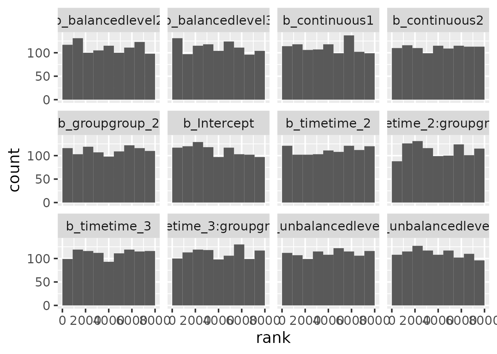 Log-scale standard
deviation parameter ranks:

``` r
ranks_unstructured |>
  filter(grepl("b_sigma", parameter)) |>
  plot_ranks()
```

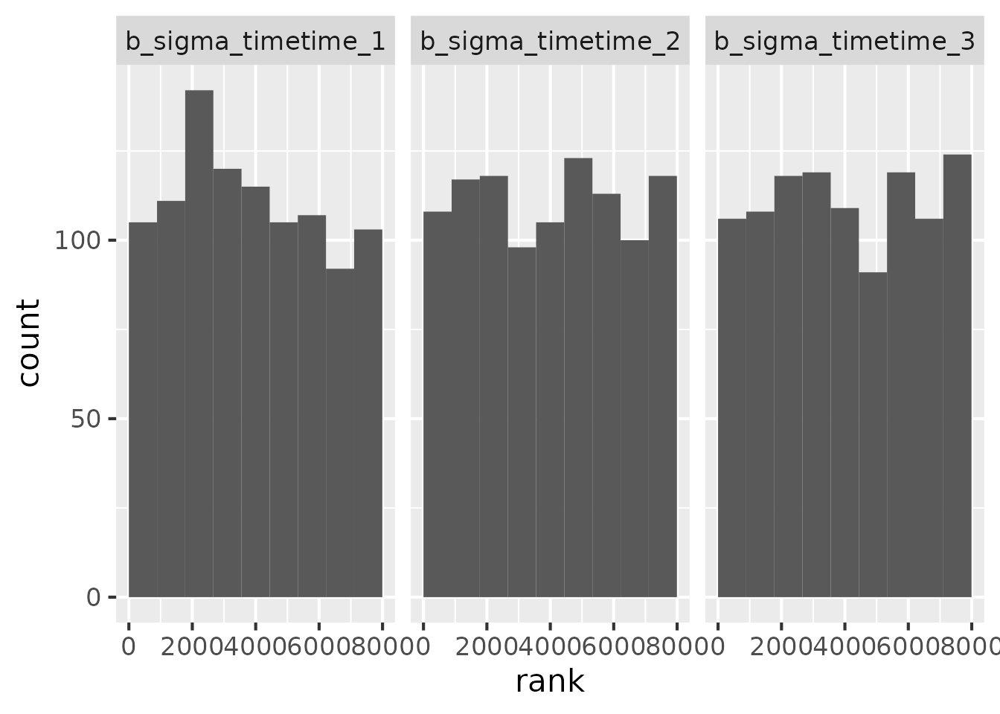

Correlation parameter ranks:

``` r
ranks_unstructured |>
  filter(grepl("cortime_", parameter)) |>
  plot_ranks()
```

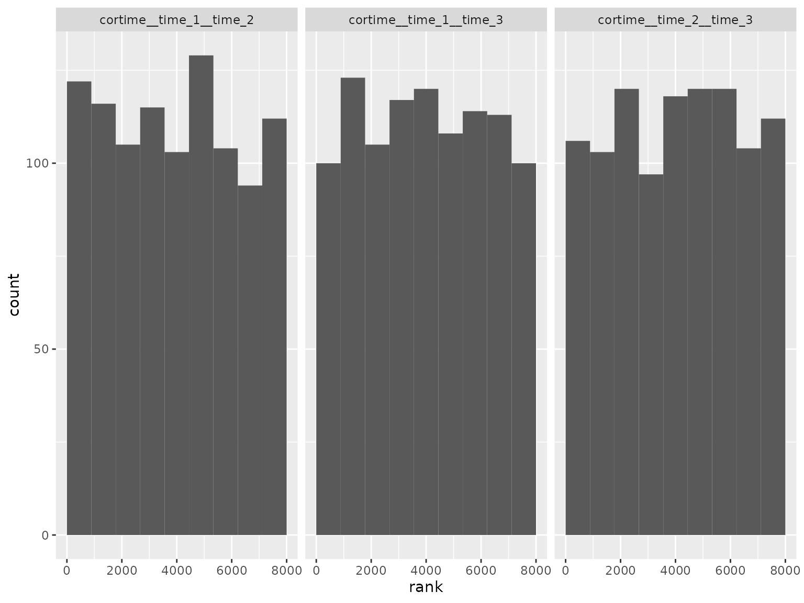

## Autoregressive moving average scenario

This scenario uses an autoregressive moving average (ARMA) model with
autoregressive order 1 and moving average order 1. Assumptions:

- 2 treatment groups
- No subgroup
- 3 time points
- 100 patients per treatment group
- No covariate adjustment
- No missing responses

Model formula:

    #> response ~ 0 + group + time + arma(time = time, gr = patient, p = 1L, q = 1L, cov = FALSE) 
    #> sigma ~ 0 + time

The prior was randomly generated and used for both simulation and
analysis:

``` r
setup_prior(autoregressive_moving_average) |>
  select(prior, class, coef, dpar) |>
  as.data.frame()
#>                      prior class         coef  dpar
#> 1        uniform(0.1, 0.9)    ar                   
#> 3   normal(0.1737, 0.3985)     b groupgroup_1      
#> 4  normal(-0.1215, 2.1487)     b groupgroup_2      
#> 5  normal(-0.0756, 2.4499)     b   timetime_2      
#> 6   normal(-0.0672, 1.454)     b   timetime_3      
#> 7        uniform(0.1, 0.9)    ma                   
#> 9   normal(0.0282, 1.8807)     b   timetime_1 sigma
#> 10   normal(0.101, 1.5519)     b   timetime_2 sigma
#> 11  normal(0.0335, 0.6042)     b   timetime_3 sigma
```

SBC checking rank statistics:

``` r
ranks_autoregressive_moving_average <- read_ranks(
  "sbc/results/autoregressive_moving_average.fst"
)
```

Fixed effect parameter ranks:

``` r
ranks_autoregressive_moving_average |>
  filter(grepl("^b_", parameter)) |>
  filter(!grepl("^b_sigma", parameter)) |>
  plot_ranks()
```

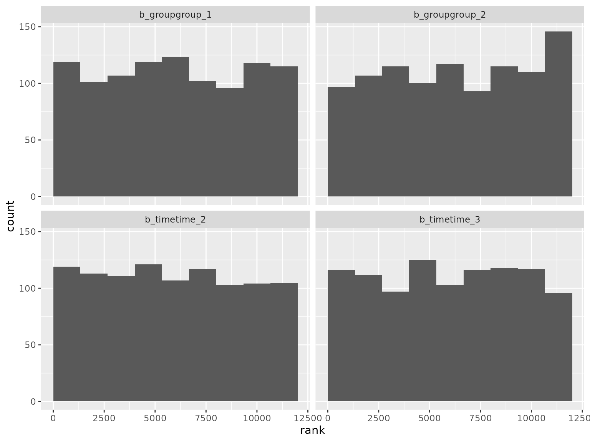

Log-scale standard deviation parameter ranks:

``` r
ranks_autoregressive_moving_average |>
  filter(grepl("b_sigma", parameter)) |>
  plot_ranks()
```

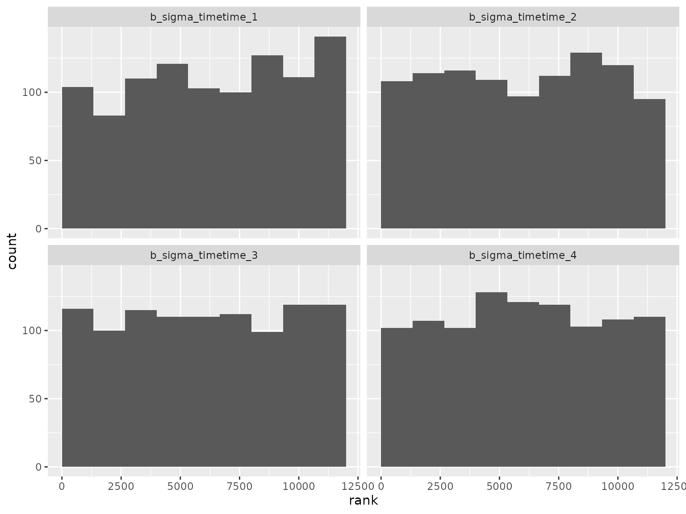

Correlation parameter ranks:

``` r
ranks_autoregressive_moving_average |>
  filter(parameter %in% c("ar[1]", "ma[1]")) |>
  plot_ranks()
```

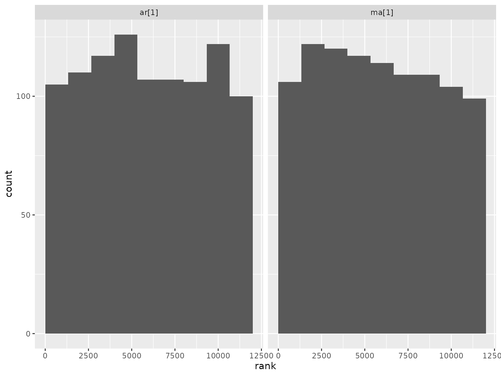

## Autoregressive scenario

This scenario is the same as above, but the correlation structure is
autoregressive with order 2. Model formula:

    #> response ~ 0 + group + time + ar(time = time, gr = patient, p = 2L, cov = FALSE) 
    #> sigma ~ 0 + time

The prior was randomly generated and used for both simulation and
analysis:

``` r
setup_prior(autoregressive) |>
  select(prior, class, coef, dpar) |>
  as.data.frame()
#>                      prior class         coef  dpar
#> 1        uniform(0.1, 0.9)    ar                   
#> 3  normal(-0.0257, 1.3542)     b groupgroup_1      
#> 4  normal(-0.0404, 1.5114)     b groupgroup_2      
#> 5   normal(0.1645, 1.6844)     b   timetime_2      
#> 6  normal(-0.1432, 0.3371)     b   timetime_3      
#> 8   normal(0.1859, 2.9435)     b   timetime_1 sigma
#> 9    normal(0.064, 2.2678)     b   timetime_2 sigma
#> 10  normal(-0.0904, 1.322)     b   timetime_3 sigma
```

SBC checking rank statistics:

``` r
ranks_autoregressive <- read_ranks("sbc/results/autoregressive.fst")
```

Fixed effect parameter ranks:

``` r
ranks_autoregressive |>
  filter(grepl("^b_", parameter)) |>
  filter(!grepl("^b_sigma", parameter)) |>
  plot_ranks()
```

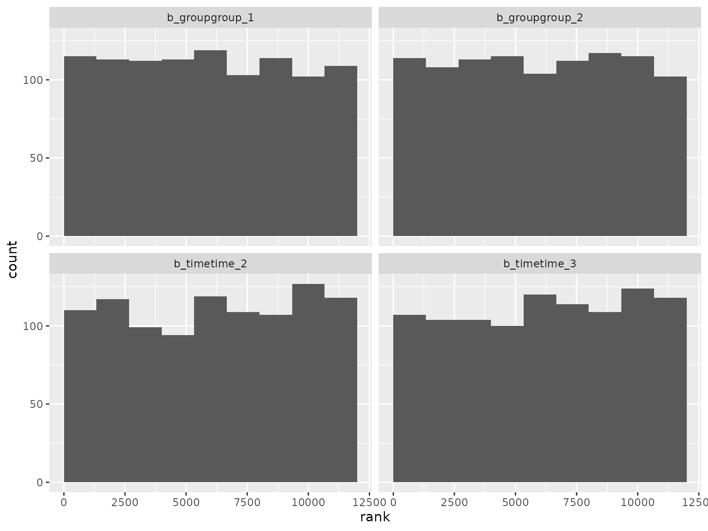 Log-scale standard
deviation parameter ranks:

``` r
ranks_autoregressive |>
  filter(grepl("b_sigma", parameter)) |>
  plot_ranks()
```

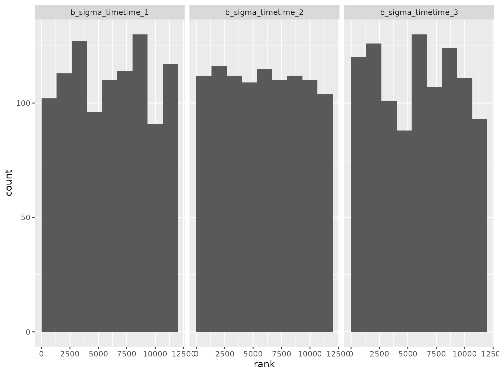

Correlation parameter ranks:

``` r
ranks_autoregressive |>
  filter(parameter %in% c("ar[1]", "ar[2]")) |>
  plot_ranks()
```

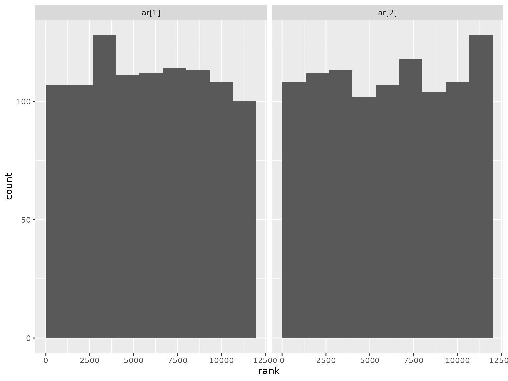

## Moving average scenario

This scenario is the same as above, but it uses a moving average
correlation structure with order 2. Model formula:

    #> response ~ 0 + group + time + ma(time = time, gr = patient, q = 2L, cov = FALSE) 
    #> sigma ~ 0 + time

The prior was randomly generated and used for both simulation and
analysis:

``` r
setup_prior(moving_average) |>
  select(prior, class, coef, dpar) |>
  as.data.frame()
#>                      prior class         coef  dpar
#> 2    normal(0.135, 1.0282)     b groupgroup_1      
#> 3   normal(0.1832, 1.1802)     b groupgroup_2      
#> 4     normal(0.231, 2.435)     b   timetime_2      
#> 5  normal(-0.0214, 1.3086)     b   timetime_3      
#> 6        uniform(0.1, 0.9)    ma                   
#> 8   normal(0.2003, 0.2999)     b   timetime_1 sigma
#> 9     normal(0.18, 2.6539)     b   timetime_2 sigma
#> 10   normal(0.057, 2.7014)     b   timetime_3 sigma
```

SBC checking rank statistics:

``` r
ranks_moving_average <- read_ranks("sbc/results/moving_average.fst")
```

Fixed effect parameter ranks:

``` r
ranks_moving_average |>
  filter(grepl("^b_", parameter)) |>
  filter(!grepl("^b_sigma", parameter)) |>
  plot_ranks()
```

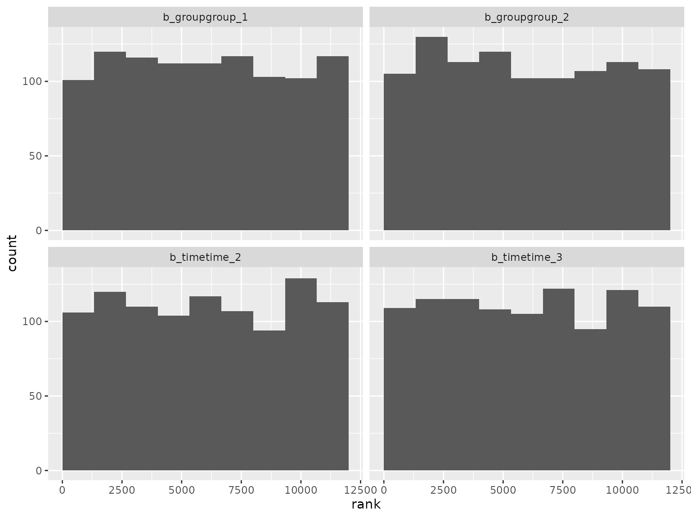 Log-scale standard
deviation parameter ranks:

``` r
ranks_moving_average |>
  filter(grepl("b_sigma", parameter)) |>
  plot_ranks()
```

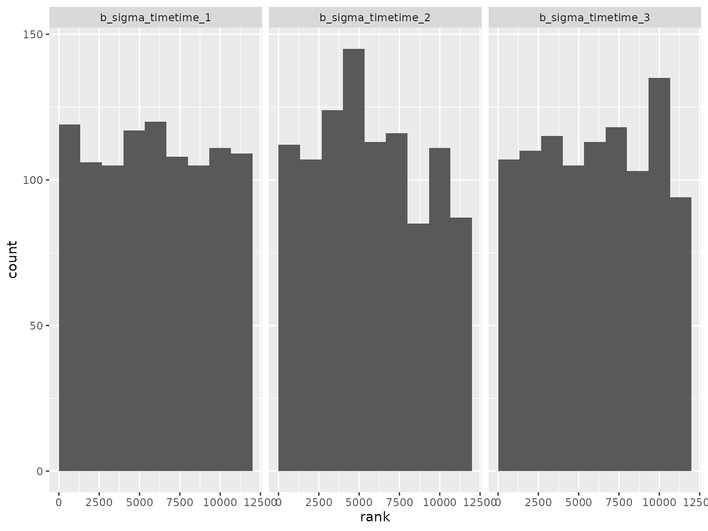

Correlation parameter ranks:

``` r
ranks_moving_average |>
  filter(parameter %in% c("ma[1]", "ma[2]")) |>
  plot_ranks()
```

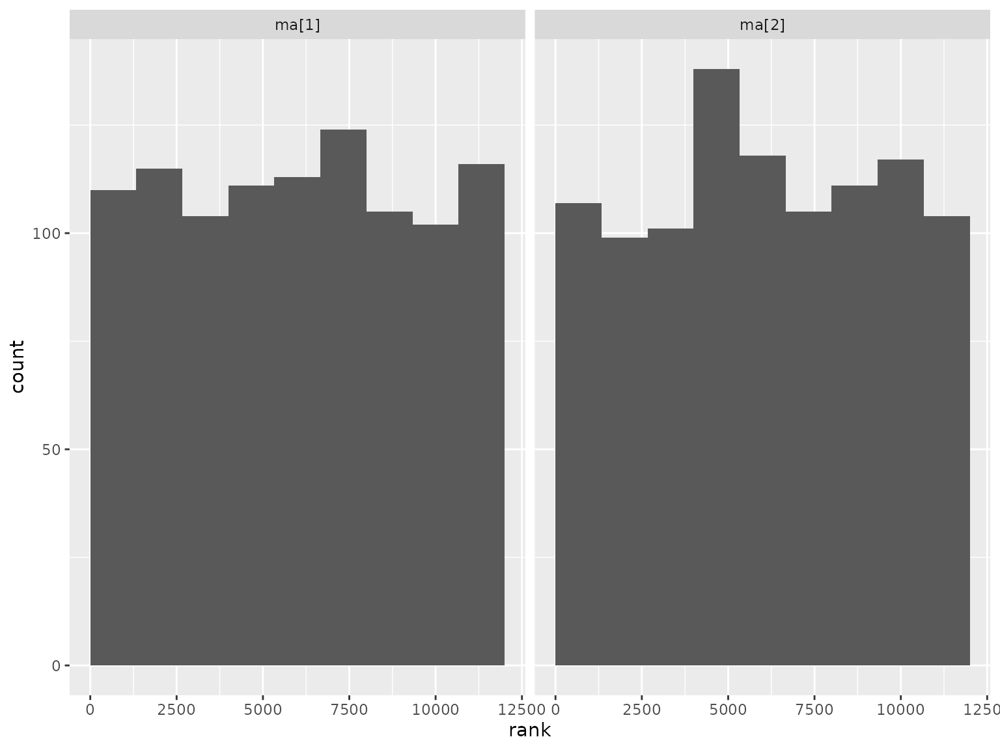

## Compound symmetry scenario

This scenario is the same as above, but it uses a compound symmetry
correlation structure. Model formula:

    #> response ~ 0 + group + time + cosy(time = time, gr = patient) 
    #> sigma ~ 0 + time

The prior was randomly generated and used for both simulation and
analysis:

``` r
setup_prior(compound_symmetry) |>
  select(prior, class, coef, dpar) |>
  as.data.frame()
#>                      prior class         coef  dpar
#> 2  normal(-0.0733, 0.9602)     b groupgroup_1      
#> 3   normal(0.2424, 2.9937)     b groupgroup_2      
#> 4   normal(0.1172, 0.4649)     b   timetime_2      
#> 5  normal(-0.0516, 0.3823)     b   timetime_3      
#> 6        uniform(0.1, 0.9)  cosy                   
#> 8   normal(0.1713, 2.6895)     b   timetime_1 sigma
#> 9  normal(-0.0965, 0.3201)     b   timetime_2 sigma
#> 10 normal(-0.1482, 1.6958)     b   timetime_3 sigma
```

SBC checking rank statistics:

``` r
ranks_compound_symmetry <- read_ranks("sbc/results/compound_symmetry.fst")
```

Fixed effect parameter ranks:

``` r
ranks_compound_symmetry |>
  filter(grepl("^b_", parameter)) |>
  filter(!grepl("^b_sigma", parameter)) |>
  plot_ranks()
```

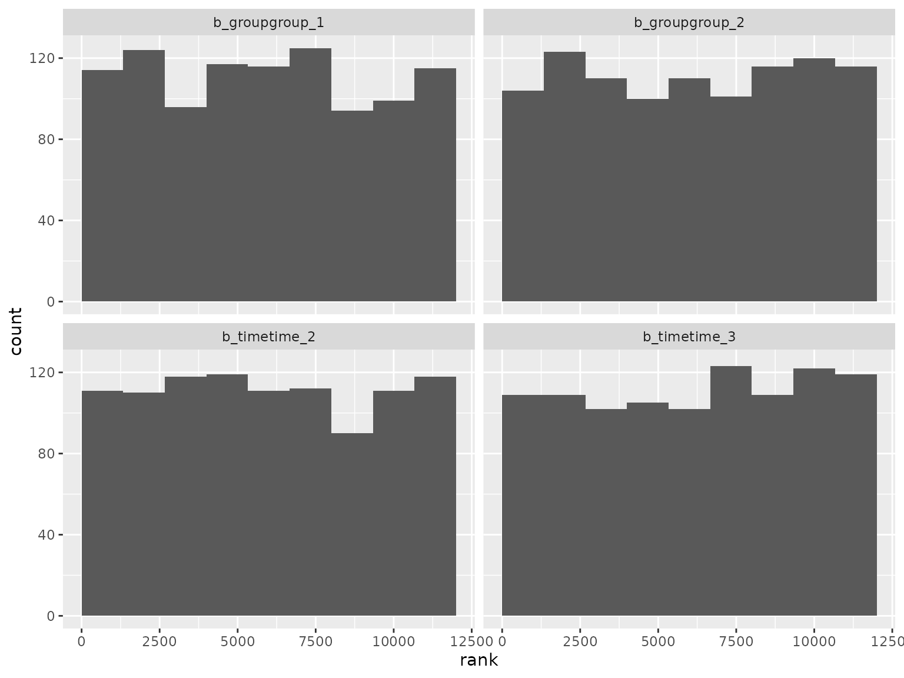 Log-scale standard
deviation parameter ranks:

``` r
ranks_compound_symmetry |>
  filter(grepl("b_sigma", parameter)) |>
  plot_ranks()
```

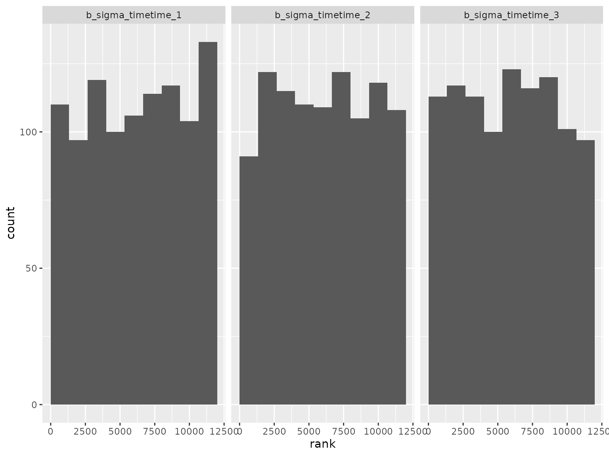

Correlation parameter ranks:

``` r
ranks_compound_symmetry |>
  filter(parameter == "cosy") |>
  plot_ranks()
```

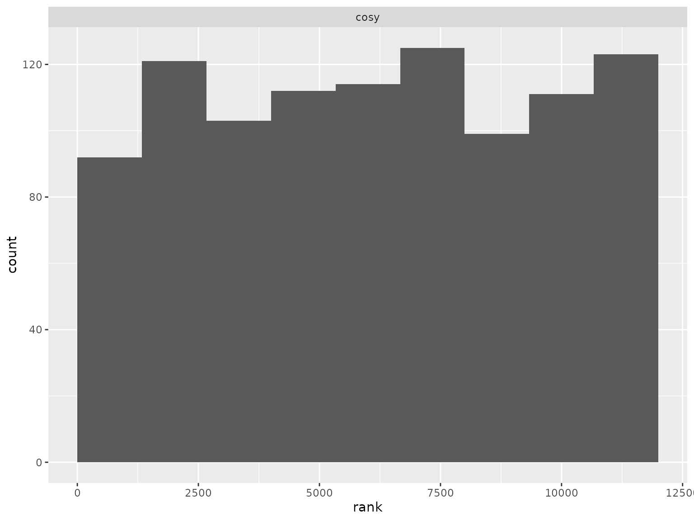

## Diagonal scenario

This scenario is the same as above, but it uses a diagonal correlation
structure (independent time points within patients). Model formula:

    #> response ~ 0 + group + time 
    #> sigma ~ group + group:time + time

The prior was randomly generated and used for both simulation and
analysis:

``` r
setup_prior(diagonal) |>
  select(prior, class, coef, dpar) |>
  as.data.frame()
#>                      prior     class                    coef  dpar
#> 2   normal(0.0688, 0.4554)         b            groupgroup_1      
#> 3  normal(-0.0271, 1.1727)         b            groupgroup_2      
#> 4  normal(-0.0439, 2.5765)         b              timetime_2      
#> 5  normal(-0.1282, 1.0305)         b              timetime_3      
#> 7   normal(0.2012, 0.7729)         b            groupgroup_2 sigma
#> 8  normal(-0.0137, 0.3341)         b groupgroup_2:timetime_2 sigma
#> 9   normal(0.0819, 1.9446)         b groupgroup_2:timetime_3 sigma
#> 10 normal(-0.1519, 1.0543)         b              timetime_2 sigma
#> 11  normal(0.1583, 1.5648)         b              timetime_3 sigma
#> 12  normal(0.0025, 1.3794) Intercept                         sigma
```

SBC checking rank statistics:

``` r
ranks_diagonal <- read_ranks("sbc/results/diagonal.fst")
```

Fixed effect parameter ranks:

``` r
ranks_diagonal |>
  filter(grepl("^b_", parameter)) |>
  filter(!grepl("^b_sigma", parameter)) |>
  plot_ranks()
```

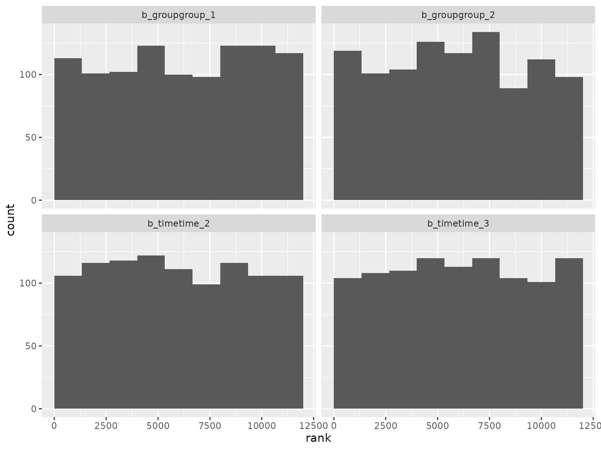 Log-scale standard
deviation parameter ranks:

``` r
ranks_diagonal |>
  filter(grepl("b_sigma", parameter)) |>
  plot_ranks()
```

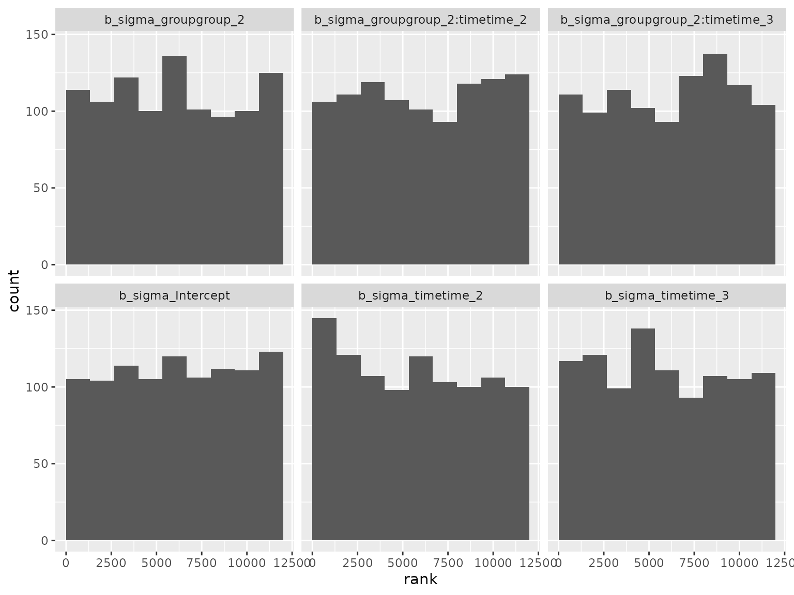

## References

Kim, S., Moon, H., Modrák, M., and Säilynoja, T. (2022), *SBC:
Simulation based calibration for rstan/cmdstanr models*.

Modrák, M., Moon, A. H., Kim, S., Bürkner, P., Huurre, N., Faltejsková,
K., Gelman, A., and Vehtari, A. (2024), “Simulation-Based Calibration
Checking for Bayesian Computation: The Choice of Test Quantities Shapes
Sensitivity,” *Bayesian Analysis*, forthcoming.
<https://doi.org/10.1214/23-BA1404>.
