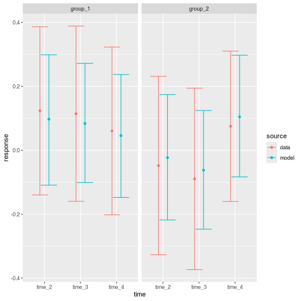

Informative prior archetypes allow users to conveniently set informative priors in `brms.mmrm` in a robust way, guarding against common pitfalls such as reference level issues, interpretation problems, and rank deficiency.

## Constructing an archetype

We begin with a simulated dataset.


```r
library(brms.mmrm)
set.seed(0L)
data <- brm_simulate_outline(
  n_group = 2,
  n_patient = 100,
  n_time = 4,
  rate_dropout = 0,
  rate_lapse = 0
) |>
  dplyr::mutate(response = rnorm(n = dplyr::n())) |>
  brm_data_change() |>
  brm_simulate_continuous(names = c("biomarker1", "biomarker2")) |>
  brm_simulate_categorical(
    names = c("status1", "status2"),
    levels = c("present", "absent")
  )
dplyr::select(
  data,
  group,
  time,
  patient,
  starts_with("biomarker"),
  starts_with("status")
)
#> # A tibble: 600 × 7
#>    group   time   patient     biomarker1 biomarker2 status1 status2
#>    <chr>   <chr>  <chr>            <dbl>      <dbl> <chr>   <chr>  
#>  1 group_1 time_2 patient_001     -1.42      -0.287 absent  present
#>  2 group_1 time_3 patient_001     -1.42      -0.287 absent  present
#>  3 group_1 time_4 patient_001     -1.42      -0.287 absent  present
#>  4 group_1 time_2 patient_002     -1.67       1.84  absent  present
#>  5 group_1 time_3 patient_002     -1.67       1.84  absent  present
#>  6 group_1 time_4 patient_002     -1.67       1.84  absent  present
#>  7 group_1 time_2 patient_003      1.38      -0.157 absent  absent 
#>  8 group_1 time_3 patient_003      1.38      -0.157 absent  absent 
#>  9 group_1 time_4 patient_003      1.38      -0.157 absent  absent 
#> 10 group_1 time_2 patient_004     -0.920     -1.39  present present
#> # ℹ 590 more rows
```

The functions listed at <https://openpharma.github.io/brms.mmrm/reference/index.html#informative-prior-archetypes> can create different kinds of informative prior archetypes from a dataset like the one above. For example, suppose we want to place informative priors on the successive differences between adjacent time points. This approach is appropriate and desirable in many situations because the structure naturally captures the prior correlations among adjacent visits of a clinical trial. To do this, we create an instance of the "successive cells" archetype.


```r
archetype <- brm_archetype_successive_cells(data)
```

The instance of the archetype is an ordinary tibble, but it adds new columns.


```r
archetype
#> # A tibble: 600 × 23
#>    x_group_1_time_2 x_group_1_time_3 x_group_1_time_4 x_group_2_time_2 x_group_2_time_3
#>  *            <dbl>            <dbl>            <dbl>            <dbl>            <dbl>
#>  1                1                0                0                0                0
#>  2                1                1                0                0                0
#>  3                1                1                1                0                0
#>  4                1                0                0                0                0
#>  5                1                1                0                0                0
#>  6                1                1                1                0                0
#>  7                1                0                0                0                0
#>  8                1                1                0                0                0
#>  9                1                1                1                0                0
#> 10                1                0                0                0                0
#> # ℹ 590 more rows
#> # ℹ 18 more variables: x_group_2_time_4 <dbl>, nuisance_biomarker1 <dbl>,
#> #   nuisance_biomarker2 <dbl>, nuisance_status1_absent <dbl>, nuisance_status2_present <dbl>,
#> #   nuisance_baseline <dbl>, nuisance_baseline.timetime_2 <dbl>,
#> #   nuisance_baseline.timetime_3 <dbl>, patient <chr>, time <chr>, change <dbl>, missing <lgl>,
#> #   baseline <dbl>, group <chr>, biomarker1 <dbl>, biomarker2 <dbl>, status1 <chr>, status2 <chr>
```

Those new columns constitute a custom model matrix to describe the desired parameterization. We have effects of interest to express successive differences,


```r
attr(archetype, "brm_archetype_interest")
#> [1] "x_group_1_time_2" "x_group_1_time_3" "x_group_1_time_4" "x_group_2_time_2" "x_group_2_time_3"
#> [6] "x_group_2_time_4"
```

and we have nuisance variables. Some nuisance variables are continuous covariates, while others are levels of one-hot-encoded concomitant factors or interactions of those concomitant factors with baseline and/or subgroup. All nuisance variables are centered at their means so the reference level of the model is at the "center" of the data and not implicitly conditional on a subset of the data. In addition, some nuisance variables are automatically dropped in order to ensure the model matrix is full-rank. This is critically important to preserve the interpretation of the columns of interest and make sure the informative priors behave as expected.


```r
attr(archetype, "brm_archetype_nuisance")
#> [1] "nuisance_biomarker1"          "nuisance_biomarker2"          "nuisance_status1_absent"     
#> [4] "nuisance_status2_present"     "nuisance_baseline"            "nuisance_baseline.timetime_2"
#> [7] "nuisance_baseline.timetime_3"
```

The factors of interest linearly map to marginal means. To see the mapping, call `summary()` on the archetype. The printed output helps build intuition on how the archetype is parameterized and what those parameters are doing.


```r
summary(archetype)
#> # This object is an informative prior archetype in brms.mmrm.
#> # The fixed effect parameters of interest express the
#> # marginal means as follows (on the link scale):
#> # 
#> #    group_1:time_2 = x_group_1_time_2
#> #    group_1:time_3 = x_group_1_time_2 + x_group_1_time_3
#> #    group_1:time_4 = x_group_1_time_2 + x_group_1_time_3 + x_group_1_time_4
#> #    group_2:time_2 = x_group_2_time_2
#> #    group_2:time_3 = x_group_2_time_2 + x_group_2_time_3
#> #    group_2:time_4 = x_group_2_time_2 + x_group_2_time_3 + x_group_2_time_4
```

## Informative priors

Let's assume you want to assign informative priors to the fixed effect parameters of interest declared in the archetype, such as `x_group_1_time_2` and `x_group_2_time_3`. Your priors may come from expert elicitation, historical data, or some other method. Either way, `brms.mmrm` helps you assign these priors to the model without having to guess at the automatically-generated names of model coefficients in R.

In the printed output from `summary(archetype)`, parameters of interest such as `x_group_1_time_2` and `x_group_2_time_3` are always labeled using treatment groups and time points in the data (and subgroup levels, if applicable). Even though different archetypes have different parameterizations and thus different ways of expressing marginal means, this labeling scheme remains consistent across all archetypes. This is how `brms.mmrm` helps you assign priors. First, match your priors to levels in the data.


```r
label <- brm_prior_label(
  code = "normal(1, 2.2)",
  group = "group_1",
  time = "time_2"
) |>
  brm_prior_label("normal(1, 3.3)", group = "group_1", time = "time_3") |>
  brm_prior_label("normal(1, 4.4)", group = "group_1", time = "time_4") |>
  brm_prior_label("normal(2, 2.2)", group = "group_2", time = "time_2") |>
  brm_prior_label("normal(2, 3.3)", group = "group_2", time = "time_3") |>
  brm_prior_label("normal(2, 4.4)", group = "group_2", time = "time_4")
label
#> # A tibble: 6 × 3
#>   code           group   time  
#>   <chr>          <chr>   <chr> 
#> 1 normal(1, 2.2) group_1 time_2
#> 2 normal(1, 3.3) group_1 time_3
#> 3 normal(1, 4.4) group_1 time_4
#> 4 normal(2, 2.2) group_2 time_2
#> 5 normal(2, 3.3) group_2 time_3
#> 6 normal(2, 4.4) group_2 time_4
```

Those `group` and `time` labels map your priors to the corresponding `x_*` parameters. `brm_prior_archetype()` accepts a collection of labeled priors and returns a `brms` prior object as documented in <https://paul-buerkner.github.io/brms/reference/set_prior.html>.


```r
prior <- brm_prior_archetype(label = label, archetype = archetype)
prior
#>           prior class             coef group resp dpar nlpar   lb   ub source
#>  normal(1, 2.2)     b x_group_1_time_2                       <NA> <NA>   user
#>  normal(1, 3.3)     b x_group_1_time_3                       <NA> <NA>   user
#>  normal(1, 4.4)     b x_group_1_time_4                       <NA> <NA>   user
#>  normal(2, 2.2)     b x_group_2_time_2                       <NA> <NA>   user
#>  normal(2, 3.3)     b x_group_2_time_3                       <NA> <NA>   user
#>  normal(2, 4.4)     b x_group_2_time_4                       <NA> <NA>   user
```

The other methods in `brms.mmrm` automatically understand how to work with informative prior archetypes. Notably, the formula uses custom interest and nuisance variables instead of the original variables in the data.


```r
formula <- brm_formula(archetype)
formula
#> change ~ 0 + x_group_1_time_2 + x_group_1_time_3 + x_group_1_time_4 + x_group_2_time_2 + x_group_2_time_3 + x_group_2_time_4 + nuisance_biomarker1 + nuisance_biomarker2 + nuisance_status1_absent + nuisance_status2_present + nuisance_baseline + nuisance_baseline.timetime_2 + nuisance_baseline.timetime_3 + unstr(time = time, gr = patient) 
#> sigma ~ 0 + time
```

## Modeling and analysis

The model can accept the archetype, formula, and prior. Usage is the same as in non-archetype workflows.


```r
model <- brm_model(
  data = archetype,
  formula = formula,
  prior = prior,
  refresh = 0
)
#> Compiling Stan program...
#> Start sampling
brms::prior_summary(model)
#>                 prior    class                         coef group resp  dpar nlpar lb ub
#>                (flat)        b                                                          
#>                (flat)        b            nuisance_baseline                             
#>                (flat)        b nuisance_baseline.timetime_2                             
#>                (flat)        b nuisance_baseline.timetime_3                             
#>                (flat)        b          nuisance_biomarker1                             
#>                (flat)        b          nuisance_biomarker2                             
#>                (flat)        b      nuisance_status1_absent                             
#>                (flat)        b     nuisance_status2_present                             
#>        normal(1, 2.2)        b             x_group_1_time_2                             
#>        normal(1, 3.3)        b             x_group_1_time_3                             
#>        normal(1, 4.4)        b             x_group_1_time_4                             
#>        normal(2, 2.2)        b             x_group_2_time_2                             
#>        normal(2, 3.3)        b             x_group_2_time_3                             
#>        normal(2, 4.4)        b             x_group_2_time_4                             
#>                (flat)        b                                         sigma            
#>                (flat)        b                   timetime_2            sigma            
#>                (flat)        b                   timetime_3            sigma            
#>                (flat)        b                   timetime_4            sigma            
#>  lkj_corr_cholesky(1) Lcortime                                                          
#>        source
#>       default
#>  (vectorized)
#>  (vectorized)
#>  (vectorized)
#>  (vectorized)
#>  (vectorized)
#>  (vectorized)
#>  (vectorized)
#>          user
#>          user
#>          user
#>          user
#>          user
#>          user
#>       default
#>  (vectorized)
#>  (vectorized)
#>  (vectorized)
#>       default
```

Marginal mean estimation, post-processing, and visualization automatically understand the archetype without any user intervention.


```r
draws <- brm_marginal_draws(
  data = archetype,
  formula = formula,
  model = model
)
summaries_model <- brm_marginal_summaries(draws)
summaries_data <- brm_marginal_data(data)
brm_plot_compare(model = summaries_model, data = summaries_data)
```

<div class="figure" style="text-align: center">

<p class="caption">plot of chunk archetype_compare_data</p>
</div>

## Other archetypes

Other informative prior archetypes use different fixed effects. For example, `brms.mmrm` supports simple cell mean and treatment effect parameterizations.


```r
summary(brm_archetype_cells(data))
#> # This object is an informative prior archetype in brms.mmrm.
#> # The fixed effect parameters of interest express the
#> # marginal means as follows (on the link scale):
#> # 
#> #    group_1:time_2 = x_group_1_time_2
#> #    group_1:time_3 = x_group_1_time_3
#> #    group_1:time_4 = x_group_1_time_4
#> #    group_2:time_2 = x_group_2_time_2
#> #    group_2:time_3 = x_group_2_time_3
#> #    group_2:time_4 = x_group_2_time_4
```


```r
summary(brm_archetype_effects(data))
#> # This object is an informative prior archetype in brms.mmrm.
#> # The fixed effect parameters of interest express the
#> # marginal means as follows (on the link scale):
#> # 
#> #    group_1:time_2 = x_group_1_time_2
#> #    group_1:time_3 = x_group_1_time_3
#> #    group_1:time_4 = x_group_1_time_4
#> #    group_2:time_2 = x_group_1_time_2 + x_group_2_time_2
#> #    group_2:time_3 = x_group_1_time_3 + x_group_2_time_3
#> #    group_2:time_4 = x_group_1_time_4 + x_group_2_time_4
```

There are archetypes to parameterize the average across all time points in the data. Below, `x_group_1_time_2` is the average across time points for group 1 because it is the algebraic result of simplifying `(group_1:time_2 + group_1:time_3 + group_1:time_3) / 3`.


```r
summary(brm_archetype_average_cells(data))
#> # This object is an informative prior archetype in brms.mmrm.
#> # The fixed effect parameters of interest express the
#> # marginal means as follows (on the link scale):
#> # 
#> #    group_1:time_2 = 3*x_group_1_time_2 - x_group_1_time_3 - x_group_1_time_4
#> #    group_1:time_3 = x_group_1_time_3
#> #    group_1:time_4 = x_group_1_time_4
#> #    group_2:time_2 = 3*x_group_2_time_2 - x_group_2_time_3 - x_group_2_time_4
#> #    group_2:time_3 = x_group_2_time_3
#> #    group_2:time_4 = x_group_2_time_4
```

There is also a treatment effect version where `x_group_2_time_2` becomes the time-averaged treatment effect of group 2 relative to group 1.


```r
summary(brm_archetype_average_effects(data))
#> # This object is an informative prior archetype in brms.mmrm.
#> # The fixed effect parameters of interest express the
#> # marginal means as follows (on the link scale):
#> # 
#> #    group_1:time_2 = 3*x_group_1_time_2 - x_group_1_time_3 - x_group_1_time_4
#> #    group_1:time_3 = x_group_1_time_3
#> #    group_1:time_4 = x_group_1_time_4
#> #    group_2:time_2 = 3*x_group_1_time_2 - x_group_1_time_3 - x_group_1_time_4 + 3*x_group_2_time_2 - x_group_2_time_3 - x_group_2_time_4
#> #    group_2:time_3 = x_group_1_time_3 + x_group_2_time_3
#> #    group_2:time_4 = x_group_1_time_4 + x_group_2_time_4
```

In addition, there is a treatment effect version of the successive differences archetype from earlier in the vignette.


```r
summary(brm_archetype_successive_effects(data))
#> # This object is an informative prior archetype in brms.mmrm.
#> # The fixed effect parameters of interest express the
#> # marginal means as follows (on the link scale):
#> # 
#> #    group_1:time_2 = x_group_1_time_2
#> #    group_1:time_3 = x_group_1_time_2 + x_group_1_time_3
#> #    group_1:time_4 = x_group_1_time_2 + x_group_1_time_3 + x_group_1_time_4
#> #    group_2:time_2 = x_group_1_time_2 + x_group_2_time_2
#> #    group_2:time_3 = x_group_1_time_2 + x_group_1_time_3 + x_group_2_time_2 + x_group_2_time_3
#> #    group_2:time_4 = x_group_1_time_2 + x_group_1_time_3 + x_group_1_time_4 + x_group_2_time_2 + x_group_2_time_3 + x_group_2_time_4
```

There are archetypes for simple cell means and treatment effect parameterizations.
