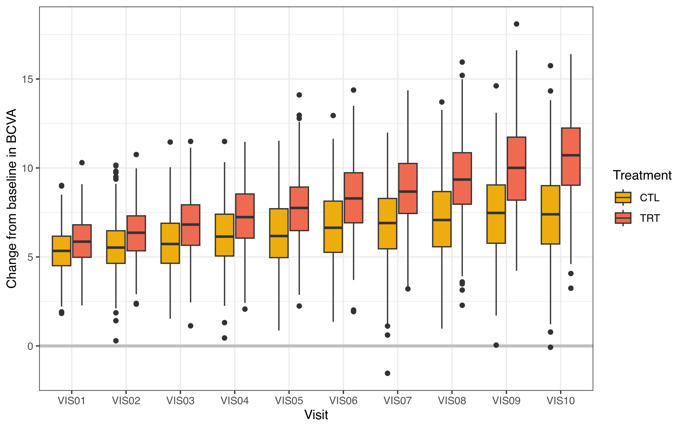

# About {.unnumbered}

This vignette uses the `bcva_data` dataset from the `mmrm` package to compare a Bayesian MMRM fit, obtained by `brms.mmrm::brm_model()`, and a frequentist MMRM fit, 
obtained by `mmrm::mmrm()`. An overview of parameter estimates and 
differences by type of MMRM is given in the [summary (Tables 4 and 5)](#Summary) 
at the end.

# Prerequisites

This comparison workflow requires the following packages.


```r
> packages <- c(
+   "dplyr",
+   "tidyr",
+   "ggplot2",
+   "gt",
+   "gtsummary",
+   "purrr",
+   "parallel",
+   "brms.mmrm",
+   "mmrm",
+   "posterior"
+ )
> invisible(lapply(packages, library, character.only = TRUE))
```

We set a seed for the random number generator to ensure statistical reproducibility.


```r
> set.seed(123L)
```

# Data

## Pre-processing

This analysis exercise uses the `bcva_data` dataset contained in the `mmrm` package:


```r
> data(bcva_data, package = "mmrm")
```

According to <https://openpharma.github.io/mmrm/latest-tag/articles/mmrm_review_methods.html>:

> The BCVA dataset contains data from a randomized longitudinal ophthalmology trial evaluating the change in baseline corrected visual acuity (BCVA) over the course of 10 visits. BCVA corresponds to the number of letters read from a visual acuity chart.

The dataset is a `tibble` with 8605 rows and the following notable variables.

* `USUBJID` (subject ID)
* `AVISIT` (visit number, factor)
* `VISITN` (visit number, numeric)
* `ARMCD` (treatment, `TRT` or `CTL`)
* `RACE` (3-category race)
* `BCVA_BL` (BCVA at baseline)
* `BCVA_CHG` (BCVA change from baseline, primary endpoint for the analysis)

The rest of the pre-processing steps create factors for the study arm and visit and apply the usual checking and standardization steps of `brms.mmrm::brm_data()`.


```r
> bcva_data <- brm_data(
+   data = bcva_data,
+   outcome = "BCVA_CHG",
+   role = "change",
+   group = "ARMCD",
+   time = "AVISIT",
+   patient = "USUBJID",
+   baseline = "BCVA_BL",
+   reference_group = "CTL",
+   covariates = "RACE"
+ ) |>
+   brm_data_chronologize(order = "VISITN")
#> Error:
#> ! Cannot create an ordered factor for the discrete time variable because the elements of the discrete time variable do not have a 1:1 correspondence with the elements of the ordering variable. Please make sure variables AVISIT and VISITN have a 1:1 correspondence between their levels.
```

The following table shows the first rows of the dataset.


```r
> head(bcva_data) |>
+   gt() |>
+   tab_caption(caption = md("Table 1. First rows of the pre-processed `bcva_data` dataset."))
```

<!--html_preserve--><div id="osncjrvket" style="padding-left:0px;padding-right:0px;padding-top:10px;padding-bottom:10px;overflow-x:auto;overflow-y:auto;width:auto;height:auto;">
<style>#osncjrvket table {
  font-family: system-ui, 'Segoe UI', Roboto, Helvetica, Arial, sans-serif, 'Apple Color Emoji', 'Segoe UI Emoji', 'Segoe UI Symbol', 'Noto Color Emoji';
  -webkit-font-smoothing: antialiased;
  -moz-osx-font-smoothing: grayscale;
}

#osncjrvket thead, #osncjrvket tbody, #osncjrvket tfoot, #osncjrvket tr, #osncjrvket td, #osncjrvket th {
  border-style: none;
}

#osncjrvket p {
  margin: 0;
  padding: 0;
}

#osncjrvket .gt_table {
  display: table;
  border-collapse: collapse;
  line-height: normal;
  margin-left: auto;
  margin-right: auto;
  color: #333333;
  font-size: 16px;
  font-weight: normal;
  font-style: normal;
  background-color: #FFFFFF;
  width: auto;
  border-top-style: solid;
  border-top-width: 2px;
  border-top-color: #A8A8A8;
  border-right-style: none;
  border-right-width: 2px;
  border-right-color: #D3D3D3;
  border-bottom-style: solid;
  border-bottom-width: 2px;
  border-bottom-color: #A8A8A8;
  border-left-style: none;
  border-left-width: 2px;
  border-left-color: #D3D3D3;
}

#osncjrvket .gt_caption {
  padding-top: 4px;
  padding-bottom: 4px;
}

#osncjrvket .gt_title {
  color: #333333;
  font-size: 125%;
  font-weight: initial;
  padding-top: 4px;
  padding-bottom: 4px;
  padding-left: 5px;
  padding-right: 5px;
  border-bottom-color: #FFFFFF;
  border-bottom-width: 0;
}

#osncjrvket .gt_subtitle {
  color: #333333;
  font-size: 85%;
  font-weight: initial;
  padding-top: 3px;
  padding-bottom: 5px;
  padding-left: 5px;
  padding-right: 5px;
  border-top-color: #FFFFFF;
  border-top-width: 0;
}

#osncjrvket .gt_heading {
  background-color: #FFFFFF;
  text-align: center;
  border-bottom-color: #FFFFFF;
  border-left-style: none;
  border-left-width: 1px;
  border-left-color: #D3D3D3;
  border-right-style: none;
  border-right-width: 1px;
  border-right-color: #D3D3D3;
}

#osncjrvket .gt_bottom_border {
  border-bottom-style: solid;
  border-bottom-width: 2px;
  border-bottom-color: #D3D3D3;
}

#osncjrvket .gt_col_headings {
  border-top-style: solid;
  border-top-width: 2px;
  border-top-color: #D3D3D3;
  border-bottom-style: solid;
  border-bottom-width: 2px;
  border-bottom-color: #D3D3D3;
  border-left-style: none;
  border-left-width: 1px;
  border-left-color: #D3D3D3;
  border-right-style: none;
  border-right-width: 1px;
  border-right-color: #D3D3D3;
}

#osncjrvket .gt_col_heading {
  color: #333333;
  background-color: #FFFFFF;
  font-size: 100%;
  font-weight: normal;
  text-transform: inherit;
  border-left-style: none;
  border-left-width: 1px;
  border-left-color: #D3D3D3;
  border-right-style: none;
  border-right-width: 1px;
  border-right-color: #D3D3D3;
  vertical-align: bottom;
  padding-top: 5px;
  padding-bottom: 6px;
  padding-left: 5px;
  padding-right: 5px;
  overflow-x: hidden;
}

#osncjrvket .gt_column_spanner_outer {
  color: #333333;
  background-color: #FFFFFF;
  font-size: 100%;
  font-weight: normal;
  text-transform: inherit;
  padding-top: 0;
  padding-bottom: 0;
  padding-left: 4px;
  padding-right: 4px;
}

#osncjrvket .gt_column_spanner_outer:first-child {
  padding-left: 0;
}

#osncjrvket .gt_column_spanner_outer:last-child {
  padding-right: 0;
}

#osncjrvket .gt_column_spanner {
  border-bottom-style: solid;
  border-bottom-width: 2px;
  border-bottom-color: #D3D3D3;
  vertical-align: bottom;
  padding-top: 5px;
  padding-bottom: 5px;
  overflow-x: hidden;
  display: inline-block;
  width: 100%;
}

#osncjrvket .gt_spanner_row {
  border-bottom-style: hidden;
}

#osncjrvket .gt_group_heading {
  padding-top: 8px;
  padding-bottom: 8px;
  padding-left: 5px;
  padding-right: 5px;
  color: #333333;
  background-color: #FFFFFF;
  font-size: 100%;
  font-weight: initial;
  text-transform: inherit;
  border-top-style: solid;
  border-top-width: 2px;
  border-top-color: #D3D3D3;
  border-bottom-style: solid;
  border-bottom-width: 2px;
  border-bottom-color: #D3D3D3;
  border-left-style: none;
  border-left-width: 1px;
  border-left-color: #D3D3D3;
  border-right-style: none;
  border-right-width: 1px;
  border-right-color: #D3D3D3;
  vertical-align: middle;
  text-align: left;
}

#osncjrvket .gt_empty_group_heading {
  padding: 0.5px;
  color: #333333;
  background-color: #FFFFFF;
  font-size: 100%;
  font-weight: initial;
  border-top-style: solid;
  border-top-width: 2px;
  border-top-color: #D3D3D3;
  border-bottom-style: solid;
  border-bottom-width: 2px;
  border-bottom-color: #D3D3D3;
  vertical-align: middle;
}

#osncjrvket .gt_from_md > :first-child {
  margin-top: 0;
}

#osncjrvket .gt_from_md > :last-child {
  margin-bottom: 0;
}

#osncjrvket .gt_row {
  padding-top: 8px;
  padding-bottom: 8px;
  padding-left: 5px;
  padding-right: 5px;
  margin: 10px;
  border-top-style: solid;
  border-top-width: 1px;
  border-top-color: #D3D3D3;
  border-left-style: none;
  border-left-width: 1px;
  border-left-color: #D3D3D3;
  border-right-style: none;
  border-right-width: 1px;
  border-right-color: #D3D3D3;
  vertical-align: middle;
  overflow-x: hidden;
}

#osncjrvket .gt_stub {
  color: #333333;
  background-color: #FFFFFF;
  font-size: 100%;
  font-weight: initial;
  text-transform: inherit;
  border-right-style: solid;
  border-right-width: 2px;
  border-right-color: #D3D3D3;
  padding-left: 5px;
  padding-right: 5px;
}

#osncjrvket .gt_stub_row_group {
  color: #333333;
  background-color: #FFFFFF;
  font-size: 100%;
  font-weight: initial;
  text-transform: inherit;
  border-right-style: solid;
  border-right-width: 2px;
  border-right-color: #D3D3D3;
  padding-left: 5px;
  padding-right: 5px;
  vertical-align: top;
}

#osncjrvket .gt_row_group_first td {
  border-top-width: 2px;
}

#osncjrvket .gt_row_group_first th {
  border-top-width: 2px;
}

#osncjrvket .gt_summary_row {
  color: #333333;
  background-color: #FFFFFF;
  text-transform: inherit;
  padding-top: 8px;
  padding-bottom: 8px;
  padding-left: 5px;
  padding-right: 5px;
}

#osncjrvket .gt_first_summary_row {
  border-top-style: solid;
  border-top-color: #D3D3D3;
}

#osncjrvket .gt_first_summary_row.thick {
  border-top-width: 2px;
}

#osncjrvket .gt_last_summary_row {
  padding-top: 8px;
  padding-bottom: 8px;
  padding-left: 5px;
  padding-right: 5px;
  border-bottom-style: solid;
  border-bottom-width: 2px;
  border-bottom-color: #D3D3D3;
}

#osncjrvket .gt_grand_summary_row {
  color: #333333;
  background-color: #FFFFFF;
  text-transform: inherit;
  padding-top: 8px;
  padding-bottom: 8px;
  padding-left: 5px;
  padding-right: 5px;
}

#osncjrvket .gt_first_grand_summary_row {
  padding-top: 8px;
  padding-bottom: 8px;
  padding-left: 5px;
  padding-right: 5px;
  border-top-style: double;
  border-top-width: 6px;
  border-top-color: #D3D3D3;
}

#osncjrvket .gt_last_grand_summary_row_top {
  padding-top: 8px;
  padding-bottom: 8px;
  padding-left: 5px;
  padding-right: 5px;
  border-bottom-style: double;
  border-bottom-width: 6px;
  border-bottom-color: #D3D3D3;
}

#osncjrvket .gt_striped {
  background-color: rgba(128, 128, 128, 0.05);
}

#osncjrvket .gt_table_body {
  border-top-style: solid;
  border-top-width: 2px;
  border-top-color: #D3D3D3;
  border-bottom-style: solid;
  border-bottom-width: 2px;
  border-bottom-color: #D3D3D3;
}

#osncjrvket .gt_footnotes {
  color: #333333;
  background-color: #FFFFFF;
  border-bottom-style: none;
  border-bottom-width: 2px;
  border-bottom-color: #D3D3D3;
  border-left-style: none;
  border-left-width: 2px;
  border-left-color: #D3D3D3;
  border-right-style: none;
  border-right-width: 2px;
  border-right-color: #D3D3D3;
}

#osncjrvket .gt_footnote {
  margin: 0px;
  font-size: 90%;
  padding-top: 4px;
  padding-bottom: 4px;
  padding-left: 5px;
  padding-right: 5px;
}

#osncjrvket .gt_sourcenotes {
  color: #333333;
  background-color: #FFFFFF;
  border-bottom-style: none;
  border-bottom-width: 2px;
  border-bottom-color: #D3D3D3;
  border-left-style: none;
  border-left-width: 2px;
  border-left-color: #D3D3D3;
  border-right-style: none;
  border-right-width: 2px;
  border-right-color: #D3D3D3;
}

#osncjrvket .gt_sourcenote {
  font-size: 90%;
  padding-top: 4px;
  padding-bottom: 4px;
  padding-left: 5px;
  padding-right: 5px;
}

#osncjrvket .gt_left {
  text-align: left;
}

#osncjrvket .gt_center {
  text-align: center;
}

#osncjrvket .gt_right {
  text-align: right;
  font-variant-numeric: tabular-nums;
}

#osncjrvket .gt_font_normal {
  font-weight: normal;
}

#osncjrvket .gt_font_bold {
  font-weight: bold;
}

#osncjrvket .gt_font_italic {
  font-style: italic;
}

#osncjrvket .gt_super {
  font-size: 65%;
}

#osncjrvket .gt_footnote_marks {
  font-size: 75%;
  vertical-align: 0.4em;
  position: initial;
}

#osncjrvket .gt_asterisk {
  font-size: 100%;
  vertical-align: 0;
}

#osncjrvket .gt_indent_1 {
  text-indent: 5px;
}

#osncjrvket .gt_indent_2 {
  text-indent: 10px;
}

#osncjrvket .gt_indent_3 {
  text-indent: 15px;
}

#osncjrvket .gt_indent_4 {
  text-indent: 20px;
}

#osncjrvket .gt_indent_5 {
  text-indent: 25px;
}
</style>
<table class="gt_table" data-quarto-disable-processing="false" data-quarto-bootstrap="false">
  <!--/html_preserve--><caption class='gt_caption'>Table 1. First rows of the pre-processed <code>bcva_data</code> dataset.</caption><!--html_preserve-->
  <thead>
    <tr class="gt_col_headings">
      <th class="gt_col_heading gt_columns_bottom_border gt_center" rowspan="1" colspan="1" scope="col" id="USUBJID">USUBJID</th>
      <th class="gt_col_heading gt_columns_bottom_border gt_right" rowspan="1" colspan="1" scope="col" id="VISITN">VISITN</th>
      <th class="gt_col_heading gt_columns_bottom_border gt_center" rowspan="1" colspan="1" scope="col" id="AVISIT">AVISIT</th>
      <th class="gt_col_heading gt_columns_bottom_border gt_left" rowspan="1" colspan="1" scope="col" id="ARMCD">ARMCD</th>
      <th class="gt_col_heading gt_columns_bottom_border gt_left" rowspan="1" colspan="1" scope="col" id="RACE">RACE</th>
      <th class="gt_col_heading gt_columns_bottom_border gt_right" rowspan="1" colspan="1" scope="col" id="BCVA_BL">BCVA_BL</th>
      <th class="gt_col_heading gt_columns_bottom_border gt_right" rowspan="1" colspan="1" scope="col" id="BCVA_CHG">BCVA_CHG</th>
    </tr>
  </thead>
  <tbody class="gt_table_body">
    <tr><td headers="USUBJID" class="gt_row gt_center">1</td>
<td headers="VISITN" class="gt_row gt_right">1</td>
<td headers="AVISIT" class="gt_row gt_center">VIS01</td>
<td headers="ARMCD" class="gt_row gt_left">TRT</td>
<td headers="RACE" class="gt_row gt_left">White</td>
<td headers="BCVA_BL" class="gt_row gt_right">103.2888</td>
<td headers="BCVA_CHG" class="gt_row gt_right">6.926116</td></tr>
    <tr><td headers="USUBJID" class="gt_row gt_center">1</td>
<td headers="VISITN" class="gt_row gt_right">2</td>
<td headers="AVISIT" class="gt_row gt_center">VIS02</td>
<td headers="ARMCD" class="gt_row gt_left">TRT</td>
<td headers="RACE" class="gt_row gt_left">White</td>
<td headers="BCVA_BL" class="gt_row gt_right">103.2888</td>
<td headers="BCVA_CHG" class="gt_row gt_right">5.661401</td></tr>
    <tr><td headers="USUBJID" class="gt_row gt_center">1</td>
<td headers="VISITN" class="gt_row gt_right">3</td>
<td headers="AVISIT" class="gt_row gt_center">VIS03</td>
<td headers="ARMCD" class="gt_row gt_left">TRT</td>
<td headers="RACE" class="gt_row gt_left">White</td>
<td headers="BCVA_BL" class="gt_row gt_right">103.2888</td>
<td headers="BCVA_CHG" class="gt_row gt_right">7.143584</td></tr>
    <tr><td headers="USUBJID" class="gt_row gt_center">1</td>
<td headers="VISITN" class="gt_row gt_right">4</td>
<td headers="AVISIT" class="gt_row gt_center">VIS04</td>
<td headers="ARMCD" class="gt_row gt_left">TRT</td>
<td headers="RACE" class="gt_row gt_left">White</td>
<td headers="BCVA_BL" class="gt_row gt_right">103.2888</td>
<td headers="BCVA_CHG" class="gt_row gt_right">6.144163</td></tr>
    <tr><td headers="USUBJID" class="gt_row gt_center">1</td>
<td headers="VISITN" class="gt_row gt_right">5</td>
<td headers="AVISIT" class="gt_row gt_center">VIS05</td>
<td headers="ARMCD" class="gt_row gt_left">TRT</td>
<td headers="RACE" class="gt_row gt_left">White</td>
<td headers="BCVA_BL" class="gt_row gt_right">103.2888</td>
<td headers="BCVA_CHG" class="gt_row gt_right">6.886287</td></tr>
    <tr><td headers="USUBJID" class="gt_row gt_center">1</td>
<td headers="VISITN" class="gt_row gt_right">6</td>
<td headers="AVISIT" class="gt_row gt_center">VIS06</td>
<td headers="ARMCD" class="gt_row gt_left">TRT</td>
<td headers="RACE" class="gt_row gt_left">White</td>
<td headers="BCVA_BL" class="gt_row gt_right">103.2888</td>
<td headers="BCVA_CHG" class="gt_row gt_right">7.847026</td></tr>
  </tbody>
  
  
</table>
</div><!--/html_preserve-->

## Descriptive statistics

Table of baseline characteristics:


```{.r .fold-hide}
> bcva_data |>
+   select(ARMCD, USUBJID, RACE, BCVA_BL) |>
+   distinct() |>
+   select(-USUBJID) |>
+   tbl_summary(
+     by = c(ARMCD),
+     statistic = list(
+       all_continuous() ~ "{mean} ({sd})",
+       all_categorical() ~ "{n} / {N} ({p}%)"
+     )
+   ) |>
+   modify_caption("Table 2. Baseline characteristics.")
```

<!--html_preserve--><div id="zesyyichzg" style="padding-left:0px;padding-right:0px;padding-top:10px;padding-bottom:10px;overflow-x:auto;overflow-y:auto;width:auto;height:auto;">
<style>#zesyyichzg table {
  font-family: system-ui, 'Segoe UI', Roboto, Helvetica, Arial, sans-serif, 'Apple Color Emoji', 'Segoe UI Emoji', 'Segoe UI Symbol', 'Noto Color Emoji';
  -webkit-font-smoothing: antialiased;
  -moz-osx-font-smoothing: grayscale;
}

#zesyyichzg thead, #zesyyichzg tbody, #zesyyichzg tfoot, #zesyyichzg tr, #zesyyichzg td, #zesyyichzg th {
  border-style: none;
}

#zesyyichzg p {
  margin: 0;
  padding: 0;
}

#zesyyichzg .gt_table {
  display: table;
  border-collapse: collapse;
  line-height: normal;
  margin-left: auto;
  margin-right: auto;
  color: #333333;
  font-size: 16px;
  font-weight: normal;
  font-style: normal;
  background-color: #FFFFFF;
  width: auto;
  border-top-style: solid;
  border-top-width: 2px;
  border-top-color: #A8A8A8;
  border-right-style: none;
  border-right-width: 2px;
  border-right-color: #D3D3D3;
  border-bottom-style: solid;
  border-bottom-width: 2px;
  border-bottom-color: #A8A8A8;
  border-left-style: none;
  border-left-width: 2px;
  border-left-color: #D3D3D3;
}

#zesyyichzg .gt_caption {
  padding-top: 4px;
  padding-bottom: 4px;
}

#zesyyichzg .gt_title {
  color: #333333;
  font-size: 125%;
  font-weight: initial;
  padding-top: 4px;
  padding-bottom: 4px;
  padding-left: 5px;
  padding-right: 5px;
  border-bottom-color: #FFFFFF;
  border-bottom-width: 0;
}

#zesyyichzg .gt_subtitle {
  color: #333333;
  font-size: 85%;
  font-weight: initial;
  padding-top: 3px;
  padding-bottom: 5px;
  padding-left: 5px;
  padding-right: 5px;
  border-top-color: #FFFFFF;
  border-top-width: 0;
}

#zesyyichzg .gt_heading {
  background-color: #FFFFFF;
  text-align: center;
  border-bottom-color: #FFFFFF;
  border-left-style: none;
  border-left-width: 1px;
  border-left-color: #D3D3D3;
  border-right-style: none;
  border-right-width: 1px;
  border-right-color: #D3D3D3;
}

#zesyyichzg .gt_bottom_border {
  border-bottom-style: solid;
  border-bottom-width: 2px;
  border-bottom-color: #D3D3D3;
}

#zesyyichzg .gt_col_headings {
  border-top-style: solid;
  border-top-width: 2px;
  border-top-color: #D3D3D3;
  border-bottom-style: solid;
  border-bottom-width: 2px;
  border-bottom-color: #D3D3D3;
  border-left-style: none;
  border-left-width: 1px;
  border-left-color: #D3D3D3;
  border-right-style: none;
  border-right-width: 1px;
  border-right-color: #D3D3D3;
}

#zesyyichzg .gt_col_heading {
  color: #333333;
  background-color: #FFFFFF;
  font-size: 100%;
  font-weight: normal;
  text-transform: inherit;
  border-left-style: none;
  border-left-width: 1px;
  border-left-color: #D3D3D3;
  border-right-style: none;
  border-right-width: 1px;
  border-right-color: #D3D3D3;
  vertical-align: bottom;
  padding-top: 5px;
  padding-bottom: 6px;
  padding-left: 5px;
  padding-right: 5px;
  overflow-x: hidden;
}

#zesyyichzg .gt_column_spanner_outer {
  color: #333333;
  background-color: #FFFFFF;
  font-size: 100%;
  font-weight: normal;
  text-transform: inherit;
  padding-top: 0;
  padding-bottom: 0;
  padding-left: 4px;
  padding-right: 4px;
}

#zesyyichzg .gt_column_spanner_outer:first-child {
  padding-left: 0;
}

#zesyyichzg .gt_column_spanner_outer:last-child {
  padding-right: 0;
}

#zesyyichzg .gt_column_spanner {
  border-bottom-style: solid;
  border-bottom-width: 2px;
  border-bottom-color: #D3D3D3;
  vertical-align: bottom;
  padding-top: 5px;
  padding-bottom: 5px;
  overflow-x: hidden;
  display: inline-block;
  width: 100%;
}

#zesyyichzg .gt_spanner_row {
  border-bottom-style: hidden;
}

#zesyyichzg .gt_group_heading {
  padding-top: 8px;
  padding-bottom: 8px;
  padding-left: 5px;
  padding-right: 5px;
  color: #333333;
  background-color: #FFFFFF;
  font-size: 100%;
  font-weight: initial;
  text-transform: inherit;
  border-top-style: solid;
  border-top-width: 2px;
  border-top-color: #D3D3D3;
  border-bottom-style: solid;
  border-bottom-width: 2px;
  border-bottom-color: #D3D3D3;
  border-left-style: none;
  border-left-width: 1px;
  border-left-color: #D3D3D3;
  border-right-style: none;
  border-right-width: 1px;
  border-right-color: #D3D3D3;
  vertical-align: middle;
  text-align: left;
}

#zesyyichzg .gt_empty_group_heading {
  padding: 0.5px;
  color: #333333;
  background-color: #FFFFFF;
  font-size: 100%;
  font-weight: initial;
  border-top-style: solid;
  border-top-width: 2px;
  border-top-color: #D3D3D3;
  border-bottom-style: solid;
  border-bottom-width: 2px;
  border-bottom-color: #D3D3D3;
  vertical-align: middle;
}

#zesyyichzg .gt_from_md > :first-child {
  margin-top: 0;
}

#zesyyichzg .gt_from_md > :last-child {
  margin-bottom: 0;
}

#zesyyichzg .gt_row {
  padding-top: 8px;
  padding-bottom: 8px;
  padding-left: 5px;
  padding-right: 5px;
  margin: 10px;
  border-top-style: solid;
  border-top-width: 1px;
  border-top-color: #D3D3D3;
  border-left-style: none;
  border-left-width: 1px;
  border-left-color: #D3D3D3;
  border-right-style: none;
  border-right-width: 1px;
  border-right-color: #D3D3D3;
  vertical-align: middle;
  overflow-x: hidden;
}

#zesyyichzg .gt_stub {
  color: #333333;
  background-color: #FFFFFF;
  font-size: 100%;
  font-weight: initial;
  text-transform: inherit;
  border-right-style: solid;
  border-right-width: 2px;
  border-right-color: #D3D3D3;
  padding-left: 5px;
  padding-right: 5px;
}

#zesyyichzg .gt_stub_row_group {
  color: #333333;
  background-color: #FFFFFF;
  font-size: 100%;
  font-weight: initial;
  text-transform: inherit;
  border-right-style: solid;
  border-right-width: 2px;
  border-right-color: #D3D3D3;
  padding-left: 5px;
  padding-right: 5px;
  vertical-align: top;
}

#zesyyichzg .gt_row_group_first td {
  border-top-width: 2px;
}

#zesyyichzg .gt_row_group_first th {
  border-top-width: 2px;
}

#zesyyichzg .gt_summary_row {
  color: #333333;
  background-color: #FFFFFF;
  text-transform: inherit;
  padding-top: 8px;
  padding-bottom: 8px;
  padding-left: 5px;
  padding-right: 5px;
}

#zesyyichzg .gt_first_summary_row {
  border-top-style: solid;
  border-top-color: #D3D3D3;
}

#zesyyichzg .gt_first_summary_row.thick {
  border-top-width: 2px;
}

#zesyyichzg .gt_last_summary_row {
  padding-top: 8px;
  padding-bottom: 8px;
  padding-left: 5px;
  padding-right: 5px;
  border-bottom-style: solid;
  border-bottom-width: 2px;
  border-bottom-color: #D3D3D3;
}

#zesyyichzg .gt_grand_summary_row {
  color: #333333;
  background-color: #FFFFFF;
  text-transform: inherit;
  padding-top: 8px;
  padding-bottom: 8px;
  padding-left: 5px;
  padding-right: 5px;
}

#zesyyichzg .gt_first_grand_summary_row {
  padding-top: 8px;
  padding-bottom: 8px;
  padding-left: 5px;
  padding-right: 5px;
  border-top-style: double;
  border-top-width: 6px;
  border-top-color: #D3D3D3;
}

#zesyyichzg .gt_last_grand_summary_row_top {
  padding-top: 8px;
  padding-bottom: 8px;
  padding-left: 5px;
  padding-right: 5px;
  border-bottom-style: double;
  border-bottom-width: 6px;
  border-bottom-color: #D3D3D3;
}

#zesyyichzg .gt_striped {
  background-color: rgba(128, 128, 128, 0.05);
}

#zesyyichzg .gt_table_body {
  border-top-style: solid;
  border-top-width: 2px;
  border-top-color: #D3D3D3;
  border-bottom-style: solid;
  border-bottom-width: 2px;
  border-bottom-color: #D3D3D3;
}

#zesyyichzg .gt_footnotes {
  color: #333333;
  background-color: #FFFFFF;
  border-bottom-style: none;
  border-bottom-width: 2px;
  border-bottom-color: #D3D3D3;
  border-left-style: none;
  border-left-width: 2px;
  border-left-color: #D3D3D3;
  border-right-style: none;
  border-right-width: 2px;
  border-right-color: #D3D3D3;
}

#zesyyichzg .gt_footnote {
  margin: 0px;
  font-size: 90%;
  padding-top: 4px;
  padding-bottom: 4px;
  padding-left: 5px;
  padding-right: 5px;
}

#zesyyichzg .gt_sourcenotes {
  color: #333333;
  background-color: #FFFFFF;
  border-bottom-style: none;
  border-bottom-width: 2px;
  border-bottom-color: #D3D3D3;
  border-left-style: none;
  border-left-width: 2px;
  border-left-color: #D3D3D3;
  border-right-style: none;
  border-right-width: 2px;
  border-right-color: #D3D3D3;
}

#zesyyichzg .gt_sourcenote {
  font-size: 90%;
  padding-top: 4px;
  padding-bottom: 4px;
  padding-left: 5px;
  padding-right: 5px;
}

#zesyyichzg .gt_left {
  text-align: left;
}

#zesyyichzg .gt_center {
  text-align: center;
}

#zesyyichzg .gt_right {
  text-align: right;
  font-variant-numeric: tabular-nums;
}

#zesyyichzg .gt_font_normal {
  font-weight: normal;
}

#zesyyichzg .gt_font_bold {
  font-weight: bold;
}

#zesyyichzg .gt_font_italic {
  font-style: italic;
}

#zesyyichzg .gt_super {
  font-size: 65%;
}

#zesyyichzg .gt_footnote_marks {
  font-size: 75%;
  vertical-align: 0.4em;
  position: initial;
}

#zesyyichzg .gt_asterisk {
  font-size: 100%;
  vertical-align: 0;
}

#zesyyichzg .gt_indent_1 {
  text-indent: 5px;
}

#zesyyichzg .gt_indent_2 {
  text-indent: 10px;
}

#zesyyichzg .gt_indent_3 {
  text-indent: 15px;
}

#zesyyichzg .gt_indent_4 {
  text-indent: 20px;
}

#zesyyichzg .gt_indent_5 {
  text-indent: 25px;
}
</style>
<table class="gt_table" data-quarto-disable-processing="false" data-quarto-bootstrap="false">
  <!--/html_preserve--><caption class='gt_caption'>Table 2. Baseline characteristics.</caption><!--html_preserve-->
  <thead>
    <tr class="gt_col_headings">
      <th class="gt_col_heading gt_columns_bottom_border gt_left" rowspan="1" colspan="1" scope="col" id="&lt;strong&gt;Characteristic&lt;/strong&gt;"><strong>Characteristic</strong></th>
      <th class="gt_col_heading gt_columns_bottom_border gt_center" rowspan="1" colspan="1" scope="col" id="&lt;strong&gt;CTL&lt;/strong&gt;&lt;br /&gt;&#10;N = 494&lt;span class=&quot;gt_footnote_marks&quot; style=&quot;white-space:nowrap;font-style:italic;font-weight:normal;&quot;&gt;&lt;sup&gt;1&lt;/sup&gt;&lt;/span&gt;"><strong>CTL</strong><br />
N = 494<span class="gt_footnote_marks" style="white-space:nowrap;font-style:italic;font-weight:normal;"><sup>1</sup></span></th>
      <th class="gt_col_heading gt_columns_bottom_border gt_center" rowspan="1" colspan="1" scope="col" id="&lt;strong&gt;TRT&lt;/strong&gt;&lt;br /&gt;&#10;N = 506&lt;span class=&quot;gt_footnote_marks&quot; style=&quot;white-space:nowrap;font-style:italic;font-weight:normal;&quot;&gt;&lt;sup&gt;1&lt;/sup&gt;&lt;/span&gt;"><strong>TRT</strong><br />
N = 506<span class="gt_footnote_marks" style="white-space:nowrap;font-style:italic;font-weight:normal;"><sup>1</sup></span></th>
    </tr>
  </thead>
  <tbody class="gt_table_body">
    <tr><td headers="label" class="gt_row gt_left">RACE</td>
<td headers="stat_1" class="gt_row gt_center"><br /></td>
<td headers="stat_2" class="gt_row gt_center"><br /></td></tr>
    <tr><td headers="label" class="gt_row gt_left">    Asian</td>
<td headers="stat_1" class="gt_row gt_center">151 / 494 (31%)</td>
<td headers="stat_2" class="gt_row gt_center">146 / 506 (29%)</td></tr>
    <tr><td headers="label" class="gt_row gt_left">    Black</td>
<td headers="stat_1" class="gt_row gt_center">149 / 494 (30%)</td>
<td headers="stat_2" class="gt_row gt_center">168 / 506 (33%)</td></tr>
    <tr><td headers="label" class="gt_row gt_left">    White</td>
<td headers="stat_1" class="gt_row gt_center">194 / 494 (39%)</td>
<td headers="stat_2" class="gt_row gt_center">192 / 506 (38%)</td></tr>
    <tr><td headers="label" class="gt_row gt_left">BCVA_BL</td>
<td headers="stat_1" class="gt_row gt_center">75 (10)</td>
<td headers="stat_2" class="gt_row gt_center">75 (10)</td></tr>
  </tbody>
  
  <tfoot class="gt_footnotes">
    <tr>
      <td class="gt_footnote" colspan="3"><span class="gt_footnote_marks" style="white-space:nowrap;font-style:italic;font-weight:normal;"><sup>1</sup></span> n / N (%); Mean (SD)</td>
    </tr>
  </tfoot>
</table>
</div><!--/html_preserve-->

Table of change from baseline in BCVA over 52 weeks:


```{.r .fold-hide}
> bcva_data |>
+   pull(AVISIT) |>
+   unique() |>
+   sort() |>
+   purrr::map(
+     .f = ~ bcva_data |>
+       filter(AVISIT %in% .x) |>
+       tbl_summary(
+         by = ARMCD,
+         include = BCVA_CHG,
+         type = BCVA_CHG ~ "continuous2",
+         statistic = BCVA_CHG ~ c(
+           "{mean} ({sd})",
+           "{median} ({p25}, {p75})",
+           "{min}, {max}"
+         ),
+         label = list(BCVA_CHG = paste("Visit ", .x))
+       )
+   ) |>
+   tbl_stack(quiet = TRUE) |>
+   modify_caption("Table 3. Change from baseline.")
```

<!--html_preserve--><div id="ehlmrayyfu" style="padding-left:0px;padding-right:0px;padding-top:10px;padding-bottom:10px;overflow-x:auto;overflow-y:auto;width:auto;height:auto;">
<style>#ehlmrayyfu table {
  font-family: system-ui, 'Segoe UI', Roboto, Helvetica, Arial, sans-serif, 'Apple Color Emoji', 'Segoe UI Emoji', 'Segoe UI Symbol', 'Noto Color Emoji';
  -webkit-font-smoothing: antialiased;
  -moz-osx-font-smoothing: grayscale;
}

#ehlmrayyfu thead, #ehlmrayyfu tbody, #ehlmrayyfu tfoot, #ehlmrayyfu tr, #ehlmrayyfu td, #ehlmrayyfu th {
  border-style: none;
}

#ehlmrayyfu p {
  margin: 0;
  padding: 0;
}

#ehlmrayyfu .gt_table {
  display: table;
  border-collapse: collapse;
  line-height: normal;
  margin-left: auto;
  margin-right: auto;
  color: #333333;
  font-size: 16px;
  font-weight: normal;
  font-style: normal;
  background-color: #FFFFFF;
  width: auto;
  border-top-style: solid;
  border-top-width: 2px;
  border-top-color: #A8A8A8;
  border-right-style: none;
  border-right-width: 2px;
  border-right-color: #D3D3D3;
  border-bottom-style: solid;
  border-bottom-width: 2px;
  border-bottom-color: #A8A8A8;
  border-left-style: none;
  border-left-width: 2px;
  border-left-color: #D3D3D3;
}

#ehlmrayyfu .gt_caption {
  padding-top: 4px;
  padding-bottom: 4px;
}

#ehlmrayyfu .gt_title {
  color: #333333;
  font-size: 125%;
  font-weight: initial;
  padding-top: 4px;
  padding-bottom: 4px;
  padding-left: 5px;
  padding-right: 5px;
  border-bottom-color: #FFFFFF;
  border-bottom-width: 0;
}

#ehlmrayyfu .gt_subtitle {
  color: #333333;
  font-size: 85%;
  font-weight: initial;
  padding-top: 3px;
  padding-bottom: 5px;
  padding-left: 5px;
  padding-right: 5px;
  border-top-color: #FFFFFF;
  border-top-width: 0;
}

#ehlmrayyfu .gt_heading {
  background-color: #FFFFFF;
  text-align: center;
  border-bottom-color: #FFFFFF;
  border-left-style: none;
  border-left-width: 1px;
  border-left-color: #D3D3D3;
  border-right-style: none;
  border-right-width: 1px;
  border-right-color: #D3D3D3;
}

#ehlmrayyfu .gt_bottom_border {
  border-bottom-style: solid;
  border-bottom-width: 2px;
  border-bottom-color: #D3D3D3;
}

#ehlmrayyfu .gt_col_headings {
  border-top-style: solid;
  border-top-width: 2px;
  border-top-color: #D3D3D3;
  border-bottom-style: solid;
  border-bottom-width: 2px;
  border-bottom-color: #D3D3D3;
  border-left-style: none;
  border-left-width: 1px;
  border-left-color: #D3D3D3;
  border-right-style: none;
  border-right-width: 1px;
  border-right-color: #D3D3D3;
}

#ehlmrayyfu .gt_col_heading {
  color: #333333;
  background-color: #FFFFFF;
  font-size: 100%;
  font-weight: normal;
  text-transform: inherit;
  border-left-style: none;
  border-left-width: 1px;
  border-left-color: #D3D3D3;
  border-right-style: none;
  border-right-width: 1px;
  border-right-color: #D3D3D3;
  vertical-align: bottom;
  padding-top: 5px;
  padding-bottom: 6px;
  padding-left: 5px;
  padding-right: 5px;
  overflow-x: hidden;
}

#ehlmrayyfu .gt_column_spanner_outer {
  color: #333333;
  background-color: #FFFFFF;
  font-size: 100%;
  font-weight: normal;
  text-transform: inherit;
  padding-top: 0;
  padding-bottom: 0;
  padding-left: 4px;
  padding-right: 4px;
}

#ehlmrayyfu .gt_column_spanner_outer:first-child {
  padding-left: 0;
}

#ehlmrayyfu .gt_column_spanner_outer:last-child {
  padding-right: 0;
}

#ehlmrayyfu .gt_column_spanner {
  border-bottom-style: solid;
  border-bottom-width: 2px;
  border-bottom-color: #D3D3D3;
  vertical-align: bottom;
  padding-top: 5px;
  padding-bottom: 5px;
  overflow-x: hidden;
  display: inline-block;
  width: 100%;
}

#ehlmrayyfu .gt_spanner_row {
  border-bottom-style: hidden;
}

#ehlmrayyfu .gt_group_heading {
  padding-top: 8px;
  padding-bottom: 8px;
  padding-left: 5px;
  padding-right: 5px;
  color: #333333;
  background-color: #FFFFFF;
  font-size: 100%;
  font-weight: initial;
  text-transform: inherit;
  border-top-style: solid;
  border-top-width: 2px;
  border-top-color: #D3D3D3;
  border-bottom-style: solid;
  border-bottom-width: 2px;
  border-bottom-color: #D3D3D3;
  border-left-style: none;
  border-left-width: 1px;
  border-left-color: #D3D3D3;
  border-right-style: none;
  border-right-width: 1px;
  border-right-color: #D3D3D3;
  vertical-align: middle;
  text-align: left;
}

#ehlmrayyfu .gt_empty_group_heading {
  padding: 0.5px;
  color: #333333;
  background-color: #FFFFFF;
  font-size: 100%;
  font-weight: initial;
  border-top-style: solid;
  border-top-width: 2px;
  border-top-color: #D3D3D3;
  border-bottom-style: solid;
  border-bottom-width: 2px;
  border-bottom-color: #D3D3D3;
  vertical-align: middle;
}

#ehlmrayyfu .gt_from_md > :first-child {
  margin-top: 0;
}

#ehlmrayyfu .gt_from_md > :last-child {
  margin-bottom: 0;
}

#ehlmrayyfu .gt_row {
  padding-top: 8px;
  padding-bottom: 8px;
  padding-left: 5px;
  padding-right: 5px;
  margin: 10px;
  border-top-style: solid;
  border-top-width: 1px;
  border-top-color: #D3D3D3;
  border-left-style: none;
  border-left-width: 1px;
  border-left-color: #D3D3D3;
  border-right-style: none;
  border-right-width: 1px;
  border-right-color: #D3D3D3;
  vertical-align: middle;
  overflow-x: hidden;
}

#ehlmrayyfu .gt_stub {
  color: #333333;
  background-color: #FFFFFF;
  font-size: 100%;
  font-weight: initial;
  text-transform: inherit;
  border-right-style: solid;
  border-right-width: 2px;
  border-right-color: #D3D3D3;
  padding-left: 5px;
  padding-right: 5px;
}

#ehlmrayyfu .gt_stub_row_group {
  color: #333333;
  background-color: #FFFFFF;
  font-size: 100%;
  font-weight: initial;
  text-transform: inherit;
  border-right-style: solid;
  border-right-width: 2px;
  border-right-color: #D3D3D3;
  padding-left: 5px;
  padding-right: 5px;
  vertical-align: top;
}

#ehlmrayyfu .gt_row_group_first td {
  border-top-width: 2px;
}

#ehlmrayyfu .gt_row_group_first th {
  border-top-width: 2px;
}

#ehlmrayyfu .gt_summary_row {
  color: #333333;
  background-color: #FFFFFF;
  text-transform: inherit;
  padding-top: 8px;
  padding-bottom: 8px;
  padding-left: 5px;
  padding-right: 5px;
}

#ehlmrayyfu .gt_first_summary_row {
  border-top-style: solid;
  border-top-color: #D3D3D3;
}

#ehlmrayyfu .gt_first_summary_row.thick {
  border-top-width: 2px;
}

#ehlmrayyfu .gt_last_summary_row {
  padding-top: 8px;
  padding-bottom: 8px;
  padding-left: 5px;
  padding-right: 5px;
  border-bottom-style: solid;
  border-bottom-width: 2px;
  border-bottom-color: #D3D3D3;
}

#ehlmrayyfu .gt_grand_summary_row {
  color: #333333;
  background-color: #FFFFFF;
  text-transform: inherit;
  padding-top: 8px;
  padding-bottom: 8px;
  padding-left: 5px;
  padding-right: 5px;
}

#ehlmrayyfu .gt_first_grand_summary_row {
  padding-top: 8px;
  padding-bottom: 8px;
  padding-left: 5px;
  padding-right: 5px;
  border-top-style: double;
  border-top-width: 6px;
  border-top-color: #D3D3D3;
}

#ehlmrayyfu .gt_last_grand_summary_row_top {
  padding-top: 8px;
  padding-bottom: 8px;
  padding-left: 5px;
  padding-right: 5px;
  border-bottom-style: double;
  border-bottom-width: 6px;
  border-bottom-color: #D3D3D3;
}

#ehlmrayyfu .gt_striped {
  background-color: rgba(128, 128, 128, 0.05);
}

#ehlmrayyfu .gt_table_body {
  border-top-style: solid;
  border-top-width: 2px;
  border-top-color: #D3D3D3;
  border-bottom-style: solid;
  border-bottom-width: 2px;
  border-bottom-color: #D3D3D3;
}

#ehlmrayyfu .gt_footnotes {
  color: #333333;
  background-color: #FFFFFF;
  border-bottom-style: none;
  border-bottom-width: 2px;
  border-bottom-color: #D3D3D3;
  border-left-style: none;
  border-left-width: 2px;
  border-left-color: #D3D3D3;
  border-right-style: none;
  border-right-width: 2px;
  border-right-color: #D3D3D3;
}

#ehlmrayyfu .gt_footnote {
  margin: 0px;
  font-size: 90%;
  padding-top: 4px;
  padding-bottom: 4px;
  padding-left: 5px;
  padding-right: 5px;
}

#ehlmrayyfu .gt_sourcenotes {
  color: #333333;
  background-color: #FFFFFF;
  border-bottom-style: none;
  border-bottom-width: 2px;
  border-bottom-color: #D3D3D3;
  border-left-style: none;
  border-left-width: 2px;
  border-left-color: #D3D3D3;
  border-right-style: none;
  border-right-width: 2px;
  border-right-color: #D3D3D3;
}

#ehlmrayyfu .gt_sourcenote {
  font-size: 90%;
  padding-top: 4px;
  padding-bottom: 4px;
  padding-left: 5px;
  padding-right: 5px;
}

#ehlmrayyfu .gt_left {
  text-align: left;
}

#ehlmrayyfu .gt_center {
  text-align: center;
}

#ehlmrayyfu .gt_right {
  text-align: right;
  font-variant-numeric: tabular-nums;
}

#ehlmrayyfu .gt_font_normal {
  font-weight: normal;
}

#ehlmrayyfu .gt_font_bold {
  font-weight: bold;
}

#ehlmrayyfu .gt_font_italic {
  font-style: italic;
}

#ehlmrayyfu .gt_super {
  font-size: 65%;
}

#ehlmrayyfu .gt_footnote_marks {
  font-size: 75%;
  vertical-align: 0.4em;
  position: initial;
}

#ehlmrayyfu .gt_asterisk {
  font-size: 100%;
  vertical-align: 0;
}

#ehlmrayyfu .gt_indent_1 {
  text-indent: 5px;
}

#ehlmrayyfu .gt_indent_2 {
  text-indent: 10px;
}

#ehlmrayyfu .gt_indent_3 {
  text-indent: 15px;
}

#ehlmrayyfu .gt_indent_4 {
  text-indent: 20px;
}

#ehlmrayyfu .gt_indent_5 {
  text-indent: 25px;
}
</style>
<table class="gt_table" data-quarto-disable-processing="false" data-quarto-bootstrap="false">
  <!--/html_preserve--><caption class='gt_caption'>Table 3. Change from baseline.</caption><!--html_preserve-->
  <thead>
    <tr class="gt_col_headings">
      <th class="gt_col_heading gt_columns_bottom_border gt_left" rowspan="1" colspan="1" scope="col" id="&lt;strong&gt;Characteristic&lt;/strong&gt;"><strong>Characteristic</strong></th>
      <th class="gt_col_heading gt_columns_bottom_border gt_center" rowspan="1" colspan="1" scope="col" id="&lt;strong&gt;CTL&lt;/strong&gt;&lt;br /&gt;&#10;N = 482"><strong>CTL</strong><br />
N = 482</th>
      <th class="gt_col_heading gt_columns_bottom_border gt_center" rowspan="1" colspan="1" scope="col" id="&lt;strong&gt;TRT&lt;/strong&gt;&lt;br /&gt;&#10;N = 501"><strong>TRT</strong><br />
N = 501</th>
    </tr>
  </thead>
  <tbody class="gt_table_body">
    <tr><td headers="label" class="gt_row gt_left">Visit  VIS01</td>
<td headers="stat_1" class="gt_row gt_center"><br /></td>
<td headers="stat_2" class="gt_row gt_center"><br /></td></tr>
    <tr><td headers="label" class="gt_row gt_left">    Mean (SD)</td>
<td headers="stat_1" class="gt_row gt_center">5.32 (1.23)</td>
<td headers="stat_2" class="gt_row gt_center">5.86 (1.33)</td></tr>
    <tr><td headers="label" class="gt_row gt_left">    Median (Q1, Q3)</td>
<td headers="stat_1" class="gt_row gt_center">5.34 (4.51, 6.17)</td>
<td headers="stat_2" class="gt_row gt_center">5.86 (4.98, 6.81)</td></tr>
    <tr><td headers="label" class="gt_row gt_left">    Min, Max</td>
<td headers="stat_1" class="gt_row gt_center">1.83, 9.02</td>
<td headers="stat_2" class="gt_row gt_center">2.28, 10.30</td></tr>
    <tr><td headers="label" class="gt_row gt_left">Visit  VIS02</td>
<td headers="stat_1" class="gt_row gt_center"><br /></td>
<td headers="stat_2" class="gt_row gt_center"><br /></td></tr>
    <tr><td headers="label" class="gt_row gt_left">    Mean (SD)</td>
<td headers="stat_1" class="gt_row gt_center">5.59 (1.49)</td>
<td headers="stat_2" class="gt_row gt_center">6.33 (1.45)</td></tr>
    <tr><td headers="label" class="gt_row gt_left">    Median (Q1, Q3)</td>
<td headers="stat_1" class="gt_row gt_center">5.53 (4.64, 6.47)</td>
<td headers="stat_2" class="gt_row gt_center">6.36 (5.34, 7.31)</td></tr>
    <tr><td headers="label" class="gt_row gt_left">    Min, Max</td>
<td headers="stat_1" class="gt_row gt_center">0.29, 10.15</td>
<td headers="stat_2" class="gt_row gt_center">2.35, 10.75</td></tr>
    <tr><td headers="label" class="gt_row gt_left">Visit  VIS03</td>
<td headers="stat_1" class="gt_row gt_center"><br /></td>
<td headers="stat_2" class="gt_row gt_center"><br /></td></tr>
    <tr><td headers="label" class="gt_row gt_left">    Mean (SD)</td>
<td headers="stat_1" class="gt_row gt_center">5.79 (1.61)</td>
<td headers="stat_2" class="gt_row gt_center">6.79 (1.71)</td></tr>
    <tr><td headers="label" class="gt_row gt_left">    Median (Q1, Q3)</td>
<td headers="stat_1" class="gt_row gt_center">5.73 (4.64, 6.91)</td>
<td headers="stat_2" class="gt_row gt_center">6.82 (5.66, 7.93)</td></tr>
    <tr><td headers="label" class="gt_row gt_left">    Min, Max</td>
<td headers="stat_1" class="gt_row gt_center">1.53, 11.46</td>
<td headers="stat_2" class="gt_row gt_center">1.13, 11.49</td></tr>
    <tr><td headers="label" class="gt_row gt_left">Visit  VIS04</td>
<td headers="stat_1" class="gt_row gt_center"><br /></td>
<td headers="stat_2" class="gt_row gt_center"><br /></td></tr>
    <tr><td headers="label" class="gt_row gt_left">    Mean (SD)</td>
<td headers="stat_1" class="gt_row gt_center">6.18 (1.73)</td>
<td headers="stat_2" class="gt_row gt_center">7.29 (1.82)</td></tr>
    <tr><td headers="label" class="gt_row gt_left">    Median (Q1, Q3)</td>
<td headers="stat_1" class="gt_row gt_center">6.14 (5.05, 7.41)</td>
<td headers="stat_2" class="gt_row gt_center">7.24 (6.05, 8.54)</td></tr>
    <tr><td headers="label" class="gt_row gt_left">    Min, Max</td>
<td headers="stat_1" class="gt_row gt_center">0.45, 11.49</td>
<td headers="stat_2" class="gt_row gt_center">2.07, 11.47</td></tr>
    <tr><td headers="label" class="gt_row gt_left">Visit  VIS05</td>
<td headers="stat_1" class="gt_row gt_center"><br /></td>
<td headers="stat_2" class="gt_row gt_center"><br /></td></tr>
    <tr><td headers="label" class="gt_row gt_left">    Mean (SD)</td>
<td headers="stat_1" class="gt_row gt_center">6.28 (1.97)</td>
<td headers="stat_2" class="gt_row gt_center">7.68 (1.94)</td></tr>
    <tr><td headers="label" class="gt_row gt_left">    Median (Q1, Q3)</td>
<td headers="stat_1" class="gt_row gt_center">6.18 (4.96, 7.71)</td>
<td headers="stat_2" class="gt_row gt_center">7.75 (6.48, 8.95)</td></tr>
    <tr><td headers="label" class="gt_row gt_left">    Min, Max</td>
<td headers="stat_1" class="gt_row gt_center">0.87, 11.53</td>
<td headers="stat_2" class="gt_row gt_center">2.24, 14.10</td></tr>
    <tr><td headers="label" class="gt_row gt_left">Visit  VIS06</td>
<td headers="stat_1" class="gt_row gt_center"><br /></td>
<td headers="stat_2" class="gt_row gt_center"><br /></td></tr>
    <tr><td headers="label" class="gt_row gt_left">    Mean (SD)</td>
<td headers="stat_1" class="gt_row gt_center">6.69 (1.97)</td>
<td headers="stat_2" class="gt_row gt_center">8.31 (1.98)</td></tr>
    <tr><td headers="label" class="gt_row gt_left">    Median (Q1, Q3)</td>
<td headers="stat_1" class="gt_row gt_center">6.64 (5.26, 8.14)</td>
<td headers="stat_2" class="gt_row gt_center">8.29 (6.92, 9.74)</td></tr>
    <tr><td headers="label" class="gt_row gt_left">    Min, Max</td>
<td headers="stat_1" class="gt_row gt_center">1.35, 12.95</td>
<td headers="stat_2" class="gt_row gt_center">1.93, 14.38</td></tr>
    <tr><td headers="label" class="gt_row gt_left">Visit  VIS07</td>
<td headers="stat_1" class="gt_row gt_center"><br /></td>
<td headers="stat_2" class="gt_row gt_center"><br /></td></tr>
    <tr><td headers="label" class="gt_row gt_left">    Mean (SD)</td>
<td headers="stat_1" class="gt_row gt_center">6.78 (2.09)</td>
<td headers="stat_2" class="gt_row gt_center">8.78 (2.11)</td></tr>
    <tr><td headers="label" class="gt_row gt_left">    Median (Q1, Q3)</td>
<td headers="stat_1" class="gt_row gt_center">6.91 (5.46, 8.29)</td>
<td headers="stat_2" class="gt_row gt_center">8.67 (7.44, 10.26)</td></tr>
    <tr><td headers="label" class="gt_row gt_left">    Min, Max</td>
<td headers="stat_1" class="gt_row gt_center">-1.54, 11.99</td>
<td headers="stat_2" class="gt_row gt_center">3.21, 14.36</td></tr>
    <tr><td headers="label" class="gt_row gt_left">Visit  VIS08</td>
<td headers="stat_1" class="gt_row gt_center"><br /></td>
<td headers="stat_2" class="gt_row gt_center"><br /></td></tr>
    <tr><td headers="label" class="gt_row gt_left">    Mean (SD)</td>
<td headers="stat_1" class="gt_row gt_center">7.08 (2.25)</td>
<td headers="stat_2" class="gt_row gt_center">9.40 (2.26)</td></tr>
    <tr><td headers="label" class="gt_row gt_left">    Median (Q1, Q3)</td>
<td headers="stat_1" class="gt_row gt_center">7.08 (5.55, 8.68)</td>
<td headers="stat_2" class="gt_row gt_center">9.35 (7.96, 10.86)</td></tr>
    <tr><td headers="label" class="gt_row gt_left">    Min, Max</td>
<td headers="stat_1" class="gt_row gt_center">0.97, 13.71</td>
<td headers="stat_2" class="gt_row gt_center">2.28, 15.95</td></tr>
    <tr><td headers="label" class="gt_row gt_left">Visit  VIS09</td>
<td headers="stat_1" class="gt_row gt_center"><br /></td>
<td headers="stat_2" class="gt_row gt_center"><br /></td></tr>
    <tr><td headers="label" class="gt_row gt_left">    Mean (SD)</td>
<td headers="stat_1" class="gt_row gt_center">7.39 (2.33)</td>
<td headers="stat_2" class="gt_row gt_center">10.01 (2.50)</td></tr>
    <tr><td headers="label" class="gt_row gt_left">    Median (Q1, Q3)</td>
<td headers="stat_1" class="gt_row gt_center">7.47 (5.76, 9.05)</td>
<td headers="stat_2" class="gt_row gt_center">10.01 (8.19, 11.74)</td></tr>
    <tr><td headers="label" class="gt_row gt_left">    Min, Max</td>
<td headers="stat_1" class="gt_row gt_center">0.04, 14.61</td>
<td headers="stat_2" class="gt_row gt_center">4.22, 18.09</td></tr>
    <tr><td headers="label" class="gt_row gt_left">Visit  VIS10</td>
<td headers="stat_1" class="gt_row gt_center"><br /></td>
<td headers="stat_2" class="gt_row gt_center"><br /></td></tr>
    <tr><td headers="label" class="gt_row gt_left">    Mean (SD)</td>
<td headers="stat_1" class="gt_row gt_center">7.49 (2.58)</td>
<td headers="stat_2" class="gt_row gt_center">10.59 (2.36)</td></tr>
    <tr><td headers="label" class="gt_row gt_left">    Median (Q1, Q3)</td>
<td headers="stat_1" class="gt_row gt_center">7.40 (5.73, 9.01)</td>
<td headers="stat_2" class="gt_row gt_center">10.71 (9.03, 12.25)</td></tr>
    <tr><td headers="label" class="gt_row gt_left">    Min, Max</td>
<td headers="stat_1" class="gt_row gt_center">-0.08, 15.75</td>
<td headers="stat_2" class="gt_row gt_center">3.24, 16.40</td></tr>
  </tbody>
  
  
</table>
</div><!--/html_preserve-->

The following figure shows the primary endpoint over the four study visits in the data.


```r
> bcva_data |>
+   group_by(ARMCD) |>
+   ggplot(aes(x = AVISIT, y = BCVA_CHG, fill = factor(ARMCD))) +
+   geom_hline(yintercept = 0, col = "grey", linewidth = 1.2) +
+   geom_boxplot(na.rm = TRUE) +
+   labs(
+     x = "Visit",
+     y = "Change from baseline in BCVA",
+     fill = "Treatment"
+   ) +
+   scale_fill_manual(values = c("darkgoldenrod2", "coral2")) +
+   theme_bw()
```

<div class="figure" style="text-align: center">

<p class="caption">Figure 1. Change from baseline in BCVA over 4 visit time points.</p>
</div>

# Fitting MMRMs

## Bayesian model

The formula for the Bayesian model includes additive effects for baseline, study visit, race, and study-arm-by-visit interaction.


```{.r .fold-hide}
> b_mmrm_formula <- brm_formula(
+   data = bcva_data,
+   intercept = TRUE,
+   baseline = TRUE,
+   group = FALSE,
+   time = TRUE,
+   baseline_time = FALSE,
+   group_time = TRUE,
+   correlation = "unstructured"
+ )
#> Error:
#> ! please use brm_data() to preprocess your data
> print(b_mmrm_formula)
#> Error in eval(expr, envir, enclos): object 'b_mmrm_formula' not found
```

We fit the model using `brms.mmrm::brm_model()`. The computation takes several minutes because of the size of the dataset. To ensure a good basis of comparison with the frequentist model, we put an extremely diffuse prior on the intercept. The parameters already have diffuse flexible priors by default.


```{.r .fold-hide}
> b_mmrm_fit <- brm_model(
+   data = filter(bcva_data, !is.na(BCVA_CHG)),
+   formula = b_mmrm_formula,
+   prior = brms::prior(class = "Intercept", prior = "student_t(3, 0, 1000)"),
+   iter = 10000,
+   warmup = 2000,
+   chains = 4,
+   cores = 4,
+   seed = 1,
+   refresh = 0
+ )
#> Error:
#> ! please use brm_data() to preprocess your data
```

Here is a posterior summary of model parameters, including fixed effects and pairwise correlation among visits within patients.


```{.r .fold-hide}
> summary(b_mmrm_fit)
#> Error in eval(expr, envir, enclos): object 'b_mmrm_fit' not found
```

## Frequentist model

The formula for the frequentist model is the same, except for the different syntax for specifying the covariance structure of the MMRM. We fit the model below.


```{.r .fold-hide}
> f_mmrm_fit <- mmrm::mmrm(
+   formula = BCVA_CHG ~ BCVA_BL + ARMCD:AVISIT + AVISIT + RACE +
+     us(AVISIT | USUBJID),
+   data = bcva_data
+ )
```

The parameter summaries of the frequentist model are below.


```{.r .fold-hide}
> summary(f_mmrm_fit)
#> mmrm fit
#> 
#> Formula:     BCVA_CHG ~ BCVA_BL + ARMCD:AVISIT + AVISIT + RACE + us(AVISIT |  
#>     USUBJID)
#> Data:        bcva_data (used 8605 observations from 1000 subjects with maximum 
#> 10 timepoints)
#> Covariance:  unstructured (55 variance parameters)
#> Method:      Satterthwaite
#> Vcov Method: Asymptotic
#> Inference:   REML
#> 
#> Model selection criteria:
#>      AIC      BIC   logLik deviance 
#>  32181.0  32451.0 -16035.5  32071.0 
#> 
#> Coefficients: 
#>                        Estimate Std. Error         df t value Pr(>|t|)    
#> (Intercept)           4.288e+00  1.709e-01  1.065e+03  25.086  < 2e-16 ***
#> BCVA_BL              -9.933e-04  2.156e-03  9.906e+02  -0.461    0.645    
#> AVISITVIS02           2.810e-01  7.067e-02  9.995e+02   3.976 7.51e-05 ***
#> AVISITVIS03           4.573e-01  6.716e-02  9.747e+02   6.809 1.71e-11 ***
#> AVISITVIS04           8.570e-01  7.637e-02  9.795e+02  11.221  < 2e-16 ***
#> AVISITVIS05           9.638e-01  8.634e-02  9.629e+02  11.163  < 2e-16 ***
#> AVISITVIS06           1.334e+00  8.650e-02  9.450e+02  15.421  < 2e-16 ***
#> AVISITVIS07           1.417e+00  1.071e-01  8.698e+02  13.233  < 2e-16 ***
#> AVISITVIS08           1.711e+00  1.145e-01  8.467e+02  14.943  < 2e-16 ***
#> AVISITVIS09           1.996e+00  1.283e-01  7.784e+02  15.550  < 2e-16 ***
#> AVISITVIS10           2.101e+00  1.400e-01  7.025e+02  15.003  < 2e-16 ***
#> RACEBlack             1.038e+00  5.496e-02  1.011e+03  18.892  < 2e-16 ***
#> RACEWhite             2.005e+00  5.198e-02  9.769e+02  38.574  < 2e-16 ***
#> AVISITVIS01:ARMCDTRT  5.391e-01  6.281e-02  9.859e+02   8.583  < 2e-16 ***
#> AVISITVIS02:ARMCDTRT  7.248e-01  7.984e-02  9.803e+02   9.078  < 2e-16 ***
#> AVISITVIS03:ARMCDTRT  1.012e+00  9.163e-02  9.638e+02  11.039  < 2e-16 ***
#> AVISITVIS04:ARMCDTRT  1.104e+00  1.004e-01  9.653e+02  11.003  < 2e-16 ***
#> AVISITVIS05:ARMCDTRT  1.383e+00  1.147e-01  9.505e+02  12.065  < 2e-16 ***
#> AVISITVIS06:ARMCDTRT  1.630e+00  1.189e-01  9.157e+02  13.715  < 2e-16 ***
#> AVISITVIS07:ARMCDTRT  2.016e+00  1.382e-01  8.262e+02  14.592  < 2e-16 ***
#> AVISITVIS08:ARMCDTRT  2.347e+00  1.474e-01  8.041e+02  15.924  < 2e-16 ***
#> AVISITVIS09:ARMCDTRT  2.658e+00  1.644e-01  7.277e+02  16.173  < 2e-16 ***
#> AVISITVIS10:ARMCDTRT  3.072e+00  1.815e-01  6.621e+02  16.929  < 2e-16 ***
#> ---
#> Signif. codes:  0 '***' 0.001 '**' 0.01 '*' 0.05 '.' 0.1 ' ' 1
#> 
#> Covariance estimate:
#>        VIS01   VIS02   VIS03   VIS04   VIS05  VIS06   VIS07   VIS08   VIS09
#> VIS01 0.9712  0.0630  0.4371  0.3314  0.3055 0.4686  0.1324  0.1019  0.0610
#> VIS02 0.0630  1.5618  0.0871  0.2685  0.2635 0.4636  0.2180  0.2776 -0.0153
#> VIS03 0.4371  0.0871  2.0221 -0.0216 -0.0189 0.1102 -0.0048 -0.0993 -0.1322
#> VIS04 0.3314  0.2685 -0.0216  2.4114  1.0476 1.1409  0.4625  0.5660  0.4086
#> VIS05 0.3055  0.2635 -0.0189  1.0476  3.0915 1.2592  0.6909  0.6307  0.3593
#> VIS06 0.4686  0.4636  0.1102  1.1409  1.2592 3.1852  0.7539  0.6093  0.6821
#> VIS07 0.1324  0.2180 -0.0048  0.4625  0.6909 0.7539  3.9273  0.2306  0.0723
#> VIS08 0.1019  0.2776 -0.0993  0.5660  0.6307 0.6093  0.2306  4.3272  0.2682
#> VIS09 0.0610 -0.0153 -0.1322  0.4086  0.3593 0.6821  0.0723  0.2682  4.8635
#> VIS10 0.0585  0.3762  0.0719  1.1481  0.9999 1.2559  0.3017  0.4658  0.4138
#>        VIS10
#> VIS01 0.0585
#> VIS02 0.3762
#> VIS03 0.0719
#> VIS04 1.1481
#> VIS05 0.9999
#> VIS06 1.2559
#> VIS07 0.3017
#> VIS08 0.4658
#> VIS09 0.4138
#> VIS10 5.3520
```

# Comparison 

This section compares the Bayesian posterior parameter estimates from `brms.mmrm` to the frequentist parameter estimates of the `mmrm` package.

## Extract estimates from Bayesian model

We extract and standardize the Bayesian estimates.


```{.r .fold-hide}
> b_mmrm_draws <- b_mmrm_fit |>
+   as_draws_df()
#> Error in eval(expr, envir, enclos): object 'b_mmrm_fit' not found
> visit_levels <- sort(unique(as.character(bcva_data$AVISIT)))
> for (level in visit_levels) {
+   name <- paste0("b_sigma_AVISIT", level)
+   b_mmrm_draws[[name]] <- exp(b_mmrm_draws[[name]])
+ }
#> Error in eval(expr, envir, enclos): object 'b_mmrm_draws' not found
> b_mmrm_summary <- b_mmrm_draws |>
+   summarize_draws() |>
+   select(variable, mean, sd) |>
+   filter(!(variable %in% c("Intercept", "lprior", "lp__"))) |>
+   rename(bayes_estimate = mean, bayes_se = sd) |>
+   mutate(
+     variable = variable |>
+       tolower() |>
+       gsub(pattern = "b_", replacement = "") |>
+       gsub(pattern = "b_sigma_AVISIT", replacement = "sigma_") |>
+       gsub(pattern = "cortime", replacement = "correlation") |>
+       gsub(pattern = "__", replacement = "_")
+   )
#> Error in eval(expr, envir, enclos): object 'b_mmrm_draws' not found
```

## Extract estimates from frequentist model

We extract and standardize the frequentist estimates.


```{.r .fold-hide}
> f_mmrm_fixed <- summary(f_mmrm_fit)$coefficients |>
+   as_tibble(rownames = "variable") |>
+   mutate(variable = tolower(variable)) |>
+   mutate(variable = gsub("(", "", variable, fixed = TRUE)) |>
+   mutate(variable = gsub(")", "", variable, fixed = TRUE)) |>
+   rename(freq_estimate = Estimate, freq_se = `Std. Error`) |>
+   select(variable, freq_estimate, freq_se)
```


```{.r .fold-hide}
> f_mmrm_variance <- tibble(
+   variable = paste0("sigma_AVISIT", visit_levels) |> tolower(),
+   freq_estimate = sqrt(diag(f_mmrm_fit$cov))
+ )
```


```{.r .fold-hide}
> f_diagonal_factor <- diag(1 / sqrt(diag(f_mmrm_fit$cov)))
> f_corr_matrix <- f_diagonal_factor %*% f_mmrm_fit$cov %*% f_diagonal_factor
> colnames(f_corr_matrix) <- visit_levels
```


```{.r .fold-hide}
> f_mmrm_correlation <- f_corr_matrix |>
+   as.data.frame() |>
+   as_tibble() |>
+   mutate(x1 = visit_levels) |>
+   pivot_longer(
+     cols = -any_of("x1"),
+     names_to = "x2",
+     values_to = "freq_estimate"
+   ) |>
+   filter(
+     as.numeric(gsub("[^0-9]", "", x1)) < as.numeric(gsub("[^0-9]", "", x2))
+   ) |>
+   mutate(variable = sprintf("correlation_%s_%s", x1, x2)) |>
+   select(variable, freq_estimate)
```


```{.r .fold-hide}
> f_mmrm_summary <- bind_rows(
+   f_mmrm_fixed,
+   f_mmrm_variance,
+   f_mmrm_correlation
+ ) |>
+   mutate(variable = gsub("\\s+", "", variable) |> tolower())
```

## Summary {#Summary}

The first table below summarizes the parameter estimates from each model and the differences between estimates (Bayesian minus frequentist). The second table shows the standard errors of these estimates and differences between standard errors. In each table, the "Relative" column shows the relative difference (the difference divided by the frequentist quantity).

Because of the different statistical paradigms and estimation procedures, especially regarding the covariance parameters, it would not be realistic to expect the Bayesian and frequentist approaches to yield virtually identical results. Nevertheless, the absolute and relative differences in the table below show strong agreement between `brms.mmrm` and `mmrm`.


```{.r .fold-hide}
> b_f_comparison <- full_join(
+   x = b_mmrm_summary,
+   y = f_mmrm_summary,
+   by = "variable"
+ ) |>
+   mutate(
+     diff_estimate = bayes_estimate - freq_estimate,
+     diff_relative_estimate = diff_estimate / freq_estimate,
+     diff_se = bayes_se - freq_se,
+     diff_relative_se = diff_se / freq_se
+   ) |>
+   select(variable, ends_with("estimate"), ends_with("se"))
#> Error in eval(expr, envir, enclos): object 'b_mmrm_summary' not found
```


```{.r .fold-hide}
> table_estimates <- b_f_comparison |>
+   select(variable, ends_with("estimate"))
#> Error in eval(expr, envir, enclos): object 'b_f_comparison' not found
> gt(table_estimates) |>
+   fmt_number(decimals = 4) |>
+   tab_caption(
+     caption = md(
+       paste(
+         "Table 4. Comparison of parameter estimates between",
+         "Bayesian and frequentist MMRMs."
+       )
+     )
+   ) |>
+   cols_label(
+     variable = "Variable",
+     bayes_estimate = "Bayesian",
+     freq_estimate = "Frequentist",
+     diff_estimate = "Difference",
+     diff_relative_estimate = "Relative"
+   )
#> Error in eval(expr, envir, enclos): object 'table_estimates' not found
```


```{.r .fold-hide}
> table_se <- b_f_comparison |>
+   select(variable, ends_with("se")) |>
+   filter(!is.na(freq_se))
#> Error in eval(expr, envir, enclos): object 'b_f_comparison' not found
> gt(table_se) |>
+   fmt_number(decimals = 4) |>
+   tab_caption(
+     caption = md(
+       paste(
+         "Table 5. Comparison of parameter standard errors between",
+         "Bayesian and frequentist MMRMs."
+       )
+     )
+   ) |>
+   cols_label(
+     variable = "Variable",
+     bayes_se = "Bayesian",
+     freq_se = "Frequentist",
+     diff_se = "Difference",
+     diff_relative_se = "Relative"
+   )
#> Error in eval(expr, envir, enclos): object 'table_se' not found
```
