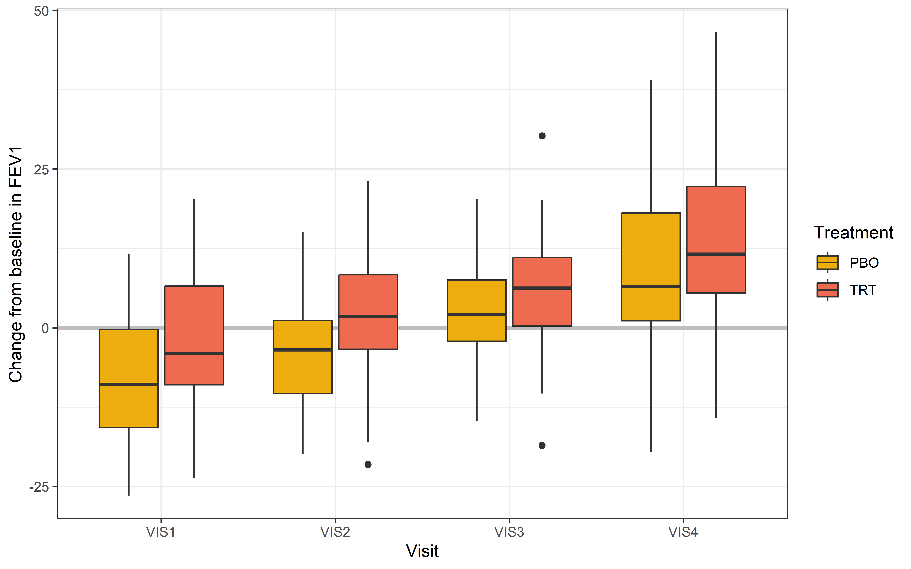

# About {.unnumbered}

This vignette provides an example comparison of a Bayesian MMRM fit, 
obtained by `brms.mmrm::brm_model()`, and a frequentist MMRM fit, 
obtained by `mmrm::mmrm()`. An overview of parameter estimates and 
differences by type of MMRM is given in the [summary (Table 4)](#Summary) 
at the end.


# Prerequisites

Load required packages:


```r
> packages <- c(
+   "dplyr",
+   "tidyr",
+   "ggplot2",
+   "gt",
+   "gtsummary",
+   "purrr",
+   "parallel",
+   "brms.mmrm",
+   "mmrm",
+   "emmeans",
+   "posterior"
+ )
> invisible(lapply(packages, library, character.only = TRUE))
```

Set seed:

```r
> set.seed(123L)
```

# Data

## Pre-processing

The `fev_dat` dataset is used that is contained in the `mmrm`-package:

```r
> data(fev_data, package = "mmrm")
```

It is an artificial (simulated) dataset of a clinical trial investigating the 
effect of an active treatment on `FEV1` (forced expired volume in one second),
compared to placebo. `FEV1` is a measure of how quickly the lungs can be 
emptied and low levels may indicate chronic obstructive pulmonary disease 
(COPD). 

The dataset is a `tibble` with 800 rows and 7 variables:

* `USUBJID` (subject ID),
* `AVISIT` (visit number),
* `ARMCD` (treatment, `TRT` or `PBO`),
* `RACE` (3-category race),
* `SEX` (sex),
* `FEV1_BL` (FEV1 at baseline, %),
* `FEV1` (FEV1 at study visits),
* `WEIGHT` (weighting variable).

In this analysis, change from baseline in `FEV1` is used as an endpoint and
a corresponding new variable (`FEV1_CHG`) is created.

Create and preprocess dataset for MMRM analysis:

```r
> fev_data <- fev_data |>
+   mutate("FEV1_CHG" = FEV1 - FEV1_BL)
> fev_data <- brm_data(
+   data = fev_data,
+   outcome = "FEV1_CHG",
+   role = "change",
+   group = "ARMCD",
+   time = "AVISIT",
+   patient = "USUBJID",
+   baseline = "FEV1_BL",
+   reference_group = "PBO",
+   covariates = c("RACE", "SEX")
+ ) |>
+   mutate(ARMCD = factor(ARMCD), AVISIT = factor(AVISIT))
```

First rows of dataset:

```r
> head(fev_data) |>
+   gt() |>
+   tab_caption(caption = md("Table 1. First rows of dataset."))
```

<!--html_preserve--><div id="osncjrvket" style="padding-left:0px;padding-right:0px;padding-top:10px;padding-bottom:10px;overflow-x:auto;overflow-y:auto;width:auto;height:auto;">
<style>#osncjrvket table {
  font-family: system-ui, 'Segoe UI', Roboto, Helvetica, Arial, sans-serif, 'Apple Color Emoji', 'Segoe UI Emoji', 'Segoe UI Symbol', 'Noto Color Emoji';
  -webkit-font-smoothing: antialiased;
  -moz-osx-font-smoothing: grayscale;
}

#osncjrvket thead, #osncjrvket tbody, #osncjrvket tfoot, #osncjrvket tr, #osncjrvket td, #osncjrvket th {
  border-style: none;
}

#osncjrvket p {
  margin: 0;
  padding: 0;
}

#osncjrvket .gt_table {
  display: table;
  border-collapse: collapse;
  line-height: normal;
  margin-left: auto;
  margin-right: auto;
  color: #333333;
  font-size: 16px;
  font-weight: normal;
  font-style: normal;
  background-color: #FFFFFF;
  width: auto;
  border-top-style: solid;
  border-top-width: 2px;
  border-top-color: #A8A8A8;
  border-right-style: none;
  border-right-width: 2px;
  border-right-color: #D3D3D3;
  border-bottom-style: solid;
  border-bottom-width: 2px;
  border-bottom-color: #A8A8A8;
  border-left-style: none;
  border-left-width: 2px;
  border-left-color: #D3D3D3;
}

#osncjrvket .gt_caption {
  padding-top: 4px;
  padding-bottom: 4px;
}

#osncjrvket .gt_title {
  color: #333333;
  font-size: 125%;
  font-weight: initial;
  padding-top: 4px;
  padding-bottom: 4px;
  padding-left: 5px;
  padding-right: 5px;
  border-bottom-color: #FFFFFF;
  border-bottom-width: 0;
}

#osncjrvket .gt_subtitle {
  color: #333333;
  font-size: 85%;
  font-weight: initial;
  padding-top: 3px;
  padding-bottom: 5px;
  padding-left: 5px;
  padding-right: 5px;
  border-top-color: #FFFFFF;
  border-top-width: 0;
}

#osncjrvket .gt_heading {
  background-color: #FFFFFF;
  text-align: center;
  border-bottom-color: #FFFFFF;
  border-left-style: none;
  border-left-width: 1px;
  border-left-color: #D3D3D3;
  border-right-style: none;
  border-right-width: 1px;
  border-right-color: #D3D3D3;
}

#osncjrvket .gt_bottom_border {
  border-bottom-style: solid;
  border-bottom-width: 2px;
  border-bottom-color: #D3D3D3;
}

#osncjrvket .gt_col_headings {
  border-top-style: solid;
  border-top-width: 2px;
  border-top-color: #D3D3D3;
  border-bottom-style: solid;
  border-bottom-width: 2px;
  border-bottom-color: #D3D3D3;
  border-left-style: none;
  border-left-width: 1px;
  border-left-color: #D3D3D3;
  border-right-style: none;
  border-right-width: 1px;
  border-right-color: #D3D3D3;
}

#osncjrvket .gt_col_heading {
  color: #333333;
  background-color: #FFFFFF;
  font-size: 100%;
  font-weight: normal;
  text-transform: inherit;
  border-left-style: none;
  border-left-width: 1px;
  border-left-color: #D3D3D3;
  border-right-style: none;
  border-right-width: 1px;
  border-right-color: #D3D3D3;
  vertical-align: bottom;
  padding-top: 5px;
  padding-bottom: 6px;
  padding-left: 5px;
  padding-right: 5px;
  overflow-x: hidden;
}

#osncjrvket .gt_column_spanner_outer {
  color: #333333;
  background-color: #FFFFFF;
  font-size: 100%;
  font-weight: normal;
  text-transform: inherit;
  padding-top: 0;
  padding-bottom: 0;
  padding-left: 4px;
  padding-right: 4px;
}

#osncjrvket .gt_column_spanner_outer:first-child {
  padding-left: 0;
}

#osncjrvket .gt_column_spanner_outer:last-child {
  padding-right: 0;
}

#osncjrvket .gt_column_spanner {
  border-bottom-style: solid;
  border-bottom-width: 2px;
  border-bottom-color: #D3D3D3;
  vertical-align: bottom;
  padding-top: 5px;
  padding-bottom: 5px;
  overflow-x: hidden;
  display: inline-block;
  width: 100%;
}

#osncjrvket .gt_spanner_row {
  border-bottom-style: hidden;
}

#osncjrvket .gt_group_heading {
  padding-top: 8px;
  padding-bottom: 8px;
  padding-left: 5px;
  padding-right: 5px;
  color: #333333;
  background-color: #FFFFFF;
  font-size: 100%;
  font-weight: initial;
  text-transform: inherit;
  border-top-style: solid;
  border-top-width: 2px;
  border-top-color: #D3D3D3;
  border-bottom-style: solid;
  border-bottom-width: 2px;
  border-bottom-color: #D3D3D3;
  border-left-style: none;
  border-left-width: 1px;
  border-left-color: #D3D3D3;
  border-right-style: none;
  border-right-width: 1px;
  border-right-color: #D3D3D3;
  vertical-align: middle;
  text-align: left;
}

#osncjrvket .gt_empty_group_heading {
  padding: 0.5px;
  color: #333333;
  background-color: #FFFFFF;
  font-size: 100%;
  font-weight: initial;
  border-top-style: solid;
  border-top-width: 2px;
  border-top-color: #D3D3D3;
  border-bottom-style: solid;
  border-bottom-width: 2px;
  border-bottom-color: #D3D3D3;
  vertical-align: middle;
}

#osncjrvket .gt_from_md > :first-child {
  margin-top: 0;
}

#osncjrvket .gt_from_md > :last-child {
  margin-bottom: 0;
}

#osncjrvket .gt_row {
  padding-top: 8px;
  padding-bottom: 8px;
  padding-left: 5px;
  padding-right: 5px;
  margin: 10px;
  border-top-style: solid;
  border-top-width: 1px;
  border-top-color: #D3D3D3;
  border-left-style: none;
  border-left-width: 1px;
  border-left-color: #D3D3D3;
  border-right-style: none;
  border-right-width: 1px;
  border-right-color: #D3D3D3;
  vertical-align: middle;
  overflow-x: hidden;
}

#osncjrvket .gt_stub {
  color: #333333;
  background-color: #FFFFFF;
  font-size: 100%;
  font-weight: initial;
  text-transform: inherit;
  border-right-style: solid;
  border-right-width: 2px;
  border-right-color: #D3D3D3;
  padding-left: 5px;
  padding-right: 5px;
}

#osncjrvket .gt_stub_row_group {
  color: #333333;
  background-color: #FFFFFF;
  font-size: 100%;
  font-weight: initial;
  text-transform: inherit;
  border-right-style: solid;
  border-right-width: 2px;
  border-right-color: #D3D3D3;
  padding-left: 5px;
  padding-right: 5px;
  vertical-align: top;
}

#osncjrvket .gt_row_group_first td {
  border-top-width: 2px;
}

#osncjrvket .gt_row_group_first th {
  border-top-width: 2px;
}

#osncjrvket .gt_summary_row {
  color: #333333;
  background-color: #FFFFFF;
  text-transform: inherit;
  padding-top: 8px;
  padding-bottom: 8px;
  padding-left: 5px;
  padding-right: 5px;
}

#osncjrvket .gt_first_summary_row {
  border-top-style: solid;
  border-top-color: #D3D3D3;
}

#osncjrvket .gt_first_summary_row.thick {
  border-top-width: 2px;
}

#osncjrvket .gt_last_summary_row {
  padding-top: 8px;
  padding-bottom: 8px;
  padding-left: 5px;
  padding-right: 5px;
  border-bottom-style: solid;
  border-bottom-width: 2px;
  border-bottom-color: #D3D3D3;
}

#osncjrvket .gt_grand_summary_row {
  color: #333333;
  background-color: #FFFFFF;
  text-transform: inherit;
  padding-top: 8px;
  padding-bottom: 8px;
  padding-left: 5px;
  padding-right: 5px;
}

#osncjrvket .gt_first_grand_summary_row {
  padding-top: 8px;
  padding-bottom: 8px;
  padding-left: 5px;
  padding-right: 5px;
  border-top-style: double;
  border-top-width: 6px;
  border-top-color: #D3D3D3;
}

#osncjrvket .gt_last_grand_summary_row_top {
  padding-top: 8px;
  padding-bottom: 8px;
  padding-left: 5px;
  padding-right: 5px;
  border-bottom-style: double;
  border-bottom-width: 6px;
  border-bottom-color: #D3D3D3;
}

#osncjrvket .gt_striped {
  background-color: rgba(128, 128, 128, 0.05);
}

#osncjrvket .gt_table_body {
  border-top-style: solid;
  border-top-width: 2px;
  border-top-color: #D3D3D3;
  border-bottom-style: solid;
  border-bottom-width: 2px;
  border-bottom-color: #D3D3D3;
}

#osncjrvket .gt_footnotes {
  color: #333333;
  background-color: #FFFFFF;
  border-bottom-style: none;
  border-bottom-width: 2px;
  border-bottom-color: #D3D3D3;
  border-left-style: none;
  border-left-width: 2px;
  border-left-color: #D3D3D3;
  border-right-style: none;
  border-right-width: 2px;
  border-right-color: #D3D3D3;
}

#osncjrvket .gt_footnote {
  margin: 0px;
  font-size: 90%;
  padding-top: 4px;
  padding-bottom: 4px;
  padding-left: 5px;
  padding-right: 5px;
}

#osncjrvket .gt_sourcenotes {
  color: #333333;
  background-color: #FFFFFF;
  border-bottom-style: none;
  border-bottom-width: 2px;
  border-bottom-color: #D3D3D3;
  border-left-style: none;
  border-left-width: 2px;
  border-left-color: #D3D3D3;
  border-right-style: none;
  border-right-width: 2px;
  border-right-color: #D3D3D3;
}

#osncjrvket .gt_sourcenote {
  font-size: 90%;
  padding-top: 4px;
  padding-bottom: 4px;
  padding-left: 5px;
  padding-right: 5px;
}

#osncjrvket .gt_left {
  text-align: left;
}

#osncjrvket .gt_center {
  text-align: center;
}

#osncjrvket .gt_right {
  text-align: right;
  font-variant-numeric: tabular-nums;
}

#osncjrvket .gt_font_normal {
  font-weight: normal;
}

#osncjrvket .gt_font_bold {
  font-weight: bold;
}

#osncjrvket .gt_font_italic {
  font-style: italic;
}

#osncjrvket .gt_super {
  font-size: 65%;
}

#osncjrvket .gt_footnote_marks {
  font-size: 75%;
  vertical-align: 0.4em;
  position: initial;
}

#osncjrvket .gt_asterisk {
  font-size: 100%;
  vertical-align: 0;
}

#osncjrvket .gt_indent_1 {
  text-indent: 5px;
}

#osncjrvket .gt_indent_2 {
  text-indent: 10px;
}

#osncjrvket .gt_indent_3 {
  text-indent: 15px;
}

#osncjrvket .gt_indent_4 {
  text-indent: 20px;
}

#osncjrvket .gt_indent_5 {
  text-indent: 25px;
}
</style>
<table class="gt_table" data-quarto-disable-processing="false" data-quarto-bootstrap="false">
  <!--/html_preserve--><caption class='gt_caption'>Table 1. First rows of dataset.</caption><!--html_preserve-->
  <thead>
    <tr class="gt_col_headings">
      <th class="gt_col_heading gt_columns_bottom_border gt_right" rowspan="1" colspan="1" scope="col" id="FEV1_CHG">FEV1_CHG</th>
      <th class="gt_col_heading gt_columns_bottom_border gt_right" rowspan="1" colspan="1" scope="col" id="FEV1_BL">FEV1_BL</th>
      <th class="gt_col_heading gt_columns_bottom_border gt_center" rowspan="1" colspan="1" scope="col" id="ARMCD">ARMCD</th>
      <th class="gt_col_heading gt_columns_bottom_border gt_center" rowspan="1" colspan="1" scope="col" id="AVISIT">AVISIT</th>
      <th class="gt_col_heading gt_columns_bottom_border gt_center" rowspan="1" colspan="1" scope="col" id="USUBJID">USUBJID</th>
      <th class="gt_col_heading gt_columns_bottom_border gt_center" rowspan="1" colspan="1" scope="col" id="RACE">RACE</th>
      <th class="gt_col_heading gt_columns_bottom_border gt_center" rowspan="1" colspan="1" scope="col" id="SEX">SEX</th>
    </tr>
  </thead>
  <tbody class="gt_table_body">
    <tr><td headers="FEV1_CHG" class="gt_row gt_right">NA</td>
<td headers="FEV1_BL" class="gt_row gt_right">45.02477</td>
<td headers="ARMCD" class="gt_row gt_center">PBO</td>
<td headers="AVISIT" class="gt_row gt_center">VIS1</td>
<td headers="USUBJID" class="gt_row gt_center">PT2</td>
<td headers="RACE" class="gt_row gt_center">Asian</td>
<td headers="SEX" class="gt_row gt_center">Male</td></tr>
    <tr><td headers="FEV1_CHG" class="gt_row gt_right">-13.569552</td>
<td headers="FEV1_BL" class="gt_row gt_right">45.02477</td>
<td headers="ARMCD" class="gt_row gt_center">PBO</td>
<td headers="AVISIT" class="gt_row gt_center">VIS2</td>
<td headers="USUBJID" class="gt_row gt_center">PT2</td>
<td headers="RACE" class="gt_row gt_center">Asian</td>
<td headers="SEX" class="gt_row gt_center">Male</td></tr>
    <tr><td headers="FEV1_CHG" class="gt_row gt_right">-8.145878</td>
<td headers="FEV1_BL" class="gt_row gt_right">45.02477</td>
<td headers="ARMCD" class="gt_row gt_center">PBO</td>
<td headers="AVISIT" class="gt_row gt_center">VIS3</td>
<td headers="USUBJID" class="gt_row gt_center">PT2</td>
<td headers="RACE" class="gt_row gt_center">Asian</td>
<td headers="SEX" class="gt_row gt_center">Male</td></tr>
    <tr><td headers="FEV1_CHG" class="gt_row gt_right">3.783324</td>
<td headers="FEV1_BL" class="gt_row gt_right">45.02477</td>
<td headers="ARMCD" class="gt_row gt_center">PBO</td>
<td headers="AVISIT" class="gt_row gt_center">VIS4</td>
<td headers="USUBJID" class="gt_row gt_center">PT2</td>
<td headers="RACE" class="gt_row gt_center">Asian</td>
<td headers="SEX" class="gt_row gt_center">Male</td></tr>
    <tr><td headers="FEV1_CHG" class="gt_row gt_right">NA</td>
<td headers="FEV1_BL" class="gt_row gt_right">43.50070</td>
<td headers="ARMCD" class="gt_row gt_center">PBO</td>
<td headers="AVISIT" class="gt_row gt_center">VIS1</td>
<td headers="USUBJID" class="gt_row gt_center">PT3</td>
<td headers="RACE" class="gt_row gt_center">Black or African American</td>
<td headers="SEX" class="gt_row gt_center">Female</td></tr>
    <tr><td headers="FEV1_CHG" class="gt_row gt_right">-7.513705</td>
<td headers="FEV1_BL" class="gt_row gt_right">43.50070</td>
<td headers="ARMCD" class="gt_row gt_center">PBO</td>
<td headers="AVISIT" class="gt_row gt_center">VIS2</td>
<td headers="USUBJID" class="gt_row gt_center">PT3</td>
<td headers="RACE" class="gt_row gt_center">Black or African American</td>
<td headers="SEX" class="gt_row gt_center">Female</td></tr>
  </tbody>
  
  
</table>
</div><!--/html_preserve-->

## Descriptive statistics

Table of baseline characteristics:

```{.r .fold-hide}
> fev_data |>
+   select(ARMCD, USUBJID, SEX, RACE, FEV1_BL) |>
+   distinct() |>
+   select(-USUBJID) |>
+   tbl_summary(
+     by = c(ARMCD),
+     statistic = list(
+       all_continuous() ~ "{mean} ({sd})",
+       all_categorical() ~ "{n} / {N} ({p}%)"
+     )
+   ) |>
+   modify_caption("Table 2. Baseline characteristics.")
```

<!--html_preserve--><div id="zesyyichzg" style="padding-left:0px;padding-right:0px;padding-top:10px;padding-bottom:10px;overflow-x:auto;overflow-y:auto;width:auto;height:auto;">
<style>#zesyyichzg table {
  font-family: system-ui, 'Segoe UI', Roboto, Helvetica, Arial, sans-serif, 'Apple Color Emoji', 'Segoe UI Emoji', 'Segoe UI Symbol', 'Noto Color Emoji';
  -webkit-font-smoothing: antialiased;
  -moz-osx-font-smoothing: grayscale;
}

#zesyyichzg thead, #zesyyichzg tbody, #zesyyichzg tfoot, #zesyyichzg tr, #zesyyichzg td, #zesyyichzg th {
  border-style: none;
}

#zesyyichzg p {
  margin: 0;
  padding: 0;
}

#zesyyichzg .gt_table {
  display: table;
  border-collapse: collapse;
  line-height: normal;
  margin-left: auto;
  margin-right: auto;
  color: #333333;
  font-size: 16px;
  font-weight: normal;
  font-style: normal;
  background-color: #FFFFFF;
  width: auto;
  border-top-style: solid;
  border-top-width: 2px;
  border-top-color: #A8A8A8;
  border-right-style: none;
  border-right-width: 2px;
  border-right-color: #D3D3D3;
  border-bottom-style: solid;
  border-bottom-width: 2px;
  border-bottom-color: #A8A8A8;
  border-left-style: none;
  border-left-width: 2px;
  border-left-color: #D3D3D3;
}

#zesyyichzg .gt_caption {
  padding-top: 4px;
  padding-bottom: 4px;
}

#zesyyichzg .gt_title {
  color: #333333;
  font-size: 125%;
  font-weight: initial;
  padding-top: 4px;
  padding-bottom: 4px;
  padding-left: 5px;
  padding-right: 5px;
  border-bottom-color: #FFFFFF;
  border-bottom-width: 0;
}

#zesyyichzg .gt_subtitle {
  color: #333333;
  font-size: 85%;
  font-weight: initial;
  padding-top: 3px;
  padding-bottom: 5px;
  padding-left: 5px;
  padding-right: 5px;
  border-top-color: #FFFFFF;
  border-top-width: 0;
}

#zesyyichzg .gt_heading {
  background-color: #FFFFFF;
  text-align: center;
  border-bottom-color: #FFFFFF;
  border-left-style: none;
  border-left-width: 1px;
  border-left-color: #D3D3D3;
  border-right-style: none;
  border-right-width: 1px;
  border-right-color: #D3D3D3;
}

#zesyyichzg .gt_bottom_border {
  border-bottom-style: solid;
  border-bottom-width: 2px;
  border-bottom-color: #D3D3D3;
}

#zesyyichzg .gt_col_headings {
  border-top-style: solid;
  border-top-width: 2px;
  border-top-color: #D3D3D3;
  border-bottom-style: solid;
  border-bottom-width: 2px;
  border-bottom-color: #D3D3D3;
  border-left-style: none;
  border-left-width: 1px;
  border-left-color: #D3D3D3;
  border-right-style: none;
  border-right-width: 1px;
  border-right-color: #D3D3D3;
}

#zesyyichzg .gt_col_heading {
  color: #333333;
  background-color: #FFFFFF;
  font-size: 100%;
  font-weight: normal;
  text-transform: inherit;
  border-left-style: none;
  border-left-width: 1px;
  border-left-color: #D3D3D3;
  border-right-style: none;
  border-right-width: 1px;
  border-right-color: #D3D3D3;
  vertical-align: bottom;
  padding-top: 5px;
  padding-bottom: 6px;
  padding-left: 5px;
  padding-right: 5px;
  overflow-x: hidden;
}

#zesyyichzg .gt_column_spanner_outer {
  color: #333333;
  background-color: #FFFFFF;
  font-size: 100%;
  font-weight: normal;
  text-transform: inherit;
  padding-top: 0;
  padding-bottom: 0;
  padding-left: 4px;
  padding-right: 4px;
}

#zesyyichzg .gt_column_spanner_outer:first-child {
  padding-left: 0;
}

#zesyyichzg .gt_column_spanner_outer:last-child {
  padding-right: 0;
}

#zesyyichzg .gt_column_spanner {
  border-bottom-style: solid;
  border-bottom-width: 2px;
  border-bottom-color: #D3D3D3;
  vertical-align: bottom;
  padding-top: 5px;
  padding-bottom: 5px;
  overflow-x: hidden;
  display: inline-block;
  width: 100%;
}

#zesyyichzg .gt_spanner_row {
  border-bottom-style: hidden;
}

#zesyyichzg .gt_group_heading {
  padding-top: 8px;
  padding-bottom: 8px;
  padding-left: 5px;
  padding-right: 5px;
  color: #333333;
  background-color: #FFFFFF;
  font-size: 100%;
  font-weight: initial;
  text-transform: inherit;
  border-top-style: solid;
  border-top-width: 2px;
  border-top-color: #D3D3D3;
  border-bottom-style: solid;
  border-bottom-width: 2px;
  border-bottom-color: #D3D3D3;
  border-left-style: none;
  border-left-width: 1px;
  border-left-color: #D3D3D3;
  border-right-style: none;
  border-right-width: 1px;
  border-right-color: #D3D3D3;
  vertical-align: middle;
  text-align: left;
}

#zesyyichzg .gt_empty_group_heading {
  padding: 0.5px;
  color: #333333;
  background-color: #FFFFFF;
  font-size: 100%;
  font-weight: initial;
  border-top-style: solid;
  border-top-width: 2px;
  border-top-color: #D3D3D3;
  border-bottom-style: solid;
  border-bottom-width: 2px;
  border-bottom-color: #D3D3D3;
  vertical-align: middle;
}

#zesyyichzg .gt_from_md > :first-child {
  margin-top: 0;
}

#zesyyichzg .gt_from_md > :last-child {
  margin-bottom: 0;
}

#zesyyichzg .gt_row {
  padding-top: 8px;
  padding-bottom: 8px;
  padding-left: 5px;
  padding-right: 5px;
  margin: 10px;
  border-top-style: solid;
  border-top-width: 1px;
  border-top-color: #D3D3D3;
  border-left-style: none;
  border-left-width: 1px;
  border-left-color: #D3D3D3;
  border-right-style: none;
  border-right-width: 1px;
  border-right-color: #D3D3D3;
  vertical-align: middle;
  overflow-x: hidden;
}

#zesyyichzg .gt_stub {
  color: #333333;
  background-color: #FFFFFF;
  font-size: 100%;
  font-weight: initial;
  text-transform: inherit;
  border-right-style: solid;
  border-right-width: 2px;
  border-right-color: #D3D3D3;
  padding-left: 5px;
  padding-right: 5px;
}

#zesyyichzg .gt_stub_row_group {
  color: #333333;
  background-color: #FFFFFF;
  font-size: 100%;
  font-weight: initial;
  text-transform: inherit;
  border-right-style: solid;
  border-right-width: 2px;
  border-right-color: #D3D3D3;
  padding-left: 5px;
  padding-right: 5px;
  vertical-align: top;
}

#zesyyichzg .gt_row_group_first td {
  border-top-width: 2px;
}

#zesyyichzg .gt_row_group_first th {
  border-top-width: 2px;
}

#zesyyichzg .gt_summary_row {
  color: #333333;
  background-color: #FFFFFF;
  text-transform: inherit;
  padding-top: 8px;
  padding-bottom: 8px;
  padding-left: 5px;
  padding-right: 5px;
}

#zesyyichzg .gt_first_summary_row {
  border-top-style: solid;
  border-top-color: #D3D3D3;
}

#zesyyichzg .gt_first_summary_row.thick {
  border-top-width: 2px;
}

#zesyyichzg .gt_last_summary_row {
  padding-top: 8px;
  padding-bottom: 8px;
  padding-left: 5px;
  padding-right: 5px;
  border-bottom-style: solid;
  border-bottom-width: 2px;
  border-bottom-color: #D3D3D3;
}

#zesyyichzg .gt_grand_summary_row {
  color: #333333;
  background-color: #FFFFFF;
  text-transform: inherit;
  padding-top: 8px;
  padding-bottom: 8px;
  padding-left: 5px;
  padding-right: 5px;
}

#zesyyichzg .gt_first_grand_summary_row {
  padding-top: 8px;
  padding-bottom: 8px;
  padding-left: 5px;
  padding-right: 5px;
  border-top-style: double;
  border-top-width: 6px;
  border-top-color: #D3D3D3;
}

#zesyyichzg .gt_last_grand_summary_row_top {
  padding-top: 8px;
  padding-bottom: 8px;
  padding-left: 5px;
  padding-right: 5px;
  border-bottom-style: double;
  border-bottom-width: 6px;
  border-bottom-color: #D3D3D3;
}

#zesyyichzg .gt_striped {
  background-color: rgba(128, 128, 128, 0.05);
}

#zesyyichzg .gt_table_body {
  border-top-style: solid;
  border-top-width: 2px;
  border-top-color: #D3D3D3;
  border-bottom-style: solid;
  border-bottom-width: 2px;
  border-bottom-color: #D3D3D3;
}

#zesyyichzg .gt_footnotes {
  color: #333333;
  background-color: #FFFFFF;
  border-bottom-style: none;
  border-bottom-width: 2px;
  border-bottom-color: #D3D3D3;
  border-left-style: none;
  border-left-width: 2px;
  border-left-color: #D3D3D3;
  border-right-style: none;
  border-right-width: 2px;
  border-right-color: #D3D3D3;
}

#zesyyichzg .gt_footnote {
  margin: 0px;
  font-size: 90%;
  padding-top: 4px;
  padding-bottom: 4px;
  padding-left: 5px;
  padding-right: 5px;
}

#zesyyichzg .gt_sourcenotes {
  color: #333333;
  background-color: #FFFFFF;
  border-bottom-style: none;
  border-bottom-width: 2px;
  border-bottom-color: #D3D3D3;
  border-left-style: none;
  border-left-width: 2px;
  border-left-color: #D3D3D3;
  border-right-style: none;
  border-right-width: 2px;
  border-right-color: #D3D3D3;
}

#zesyyichzg .gt_sourcenote {
  font-size: 90%;
  padding-top: 4px;
  padding-bottom: 4px;
  padding-left: 5px;
  padding-right: 5px;
}

#zesyyichzg .gt_left {
  text-align: left;
}

#zesyyichzg .gt_center {
  text-align: center;
}

#zesyyichzg .gt_right {
  text-align: right;
  font-variant-numeric: tabular-nums;
}

#zesyyichzg .gt_font_normal {
  font-weight: normal;
}

#zesyyichzg .gt_font_bold {
  font-weight: bold;
}

#zesyyichzg .gt_font_italic {
  font-style: italic;
}

#zesyyichzg .gt_super {
  font-size: 65%;
}

#zesyyichzg .gt_footnote_marks {
  font-size: 75%;
  vertical-align: 0.4em;
  position: initial;
}

#zesyyichzg .gt_asterisk {
  font-size: 100%;
  vertical-align: 0;
}

#zesyyichzg .gt_indent_1 {
  text-indent: 5px;
}

#zesyyichzg .gt_indent_2 {
  text-indent: 10px;
}

#zesyyichzg .gt_indent_3 {
  text-indent: 15px;
}

#zesyyichzg .gt_indent_4 {
  text-indent: 20px;
}

#zesyyichzg .gt_indent_5 {
  text-indent: 25px;
}
</style>
<table class="gt_table" data-quarto-disable-processing="false" data-quarto-bootstrap="false">
  <!--/html_preserve--><caption class='gt_caption'>Table 2. Baseline characteristics.</caption><!--html_preserve-->
  <thead>
    <tr class="gt_col_headings">
      <th class="gt_col_heading gt_columns_bottom_border gt_left" rowspan="1" colspan="1" scope="col" id="&lt;strong&gt;Characteristic&lt;/strong&gt;"><strong>Characteristic</strong></th>
      <th class="gt_col_heading gt_columns_bottom_border gt_center" rowspan="1" colspan="1" scope="col" id="&lt;strong&gt;PBO&lt;/strong&gt;, N = 105&lt;span class=&quot;gt_footnote_marks&quot; style=&quot;white-space:nowrap;font-style:italic;font-weight:normal;&quot;&gt;&lt;sup&gt;1&lt;/sup&gt;&lt;/span&gt;"><strong>PBO</strong>, N = 105<span class="gt_footnote_marks" style="white-space:nowrap;font-style:italic;font-weight:normal;"><sup>1</sup></span></th>
      <th class="gt_col_heading gt_columns_bottom_border gt_center" rowspan="1" colspan="1" scope="col" id="&lt;strong&gt;TRT&lt;/strong&gt;, N = 95&lt;span class=&quot;gt_footnote_marks&quot; style=&quot;white-space:nowrap;font-style:italic;font-weight:normal;&quot;&gt;&lt;sup&gt;1&lt;/sup&gt;&lt;/span&gt;"><strong>TRT</strong>, N = 95<span class="gt_footnote_marks" style="white-space:nowrap;font-style:italic;font-weight:normal;"><sup>1</sup></span></th>
    </tr>
  </thead>
  <tbody class="gt_table_body">
    <tr><td headers="label" class="gt_row gt_left">SEX</td>
<td headers="stat_1" class="gt_row gt_center"><br /></td>
<td headers="stat_2" class="gt_row gt_center"><br /></td></tr>
    <tr><td headers="label" class="gt_row gt_left">    Male</td>
<td headers="stat_1" class="gt_row gt_center">50 / 105 (48%)</td>
<td headers="stat_2" class="gt_row gt_center">44 / 95 (46%)</td></tr>
    <tr><td headers="label" class="gt_row gt_left">    Female</td>
<td headers="stat_1" class="gt_row gt_center">55 / 105 (52%)</td>
<td headers="stat_2" class="gt_row gt_center">51 / 95 (54%)</td></tr>
    <tr><td headers="label" class="gt_row gt_left">RACE</td>
<td headers="stat_1" class="gt_row gt_center"><br /></td>
<td headers="stat_2" class="gt_row gt_center"><br /></td></tr>
    <tr><td headers="label" class="gt_row gt_left">    Asian</td>
<td headers="stat_1" class="gt_row gt_center">38 / 105 (36%)</td>
<td headers="stat_2" class="gt_row gt_center">32 / 95 (34%)</td></tr>
    <tr><td headers="label" class="gt_row gt_left">    Black or African American</td>
<td headers="stat_1" class="gt_row gt_center">46 / 105 (44%)</td>
<td headers="stat_2" class="gt_row gt_center">29 / 95 (31%)</td></tr>
    <tr><td headers="label" class="gt_row gt_left">    White</td>
<td headers="stat_1" class="gt_row gt_center">21 / 105 (20%)</td>
<td headers="stat_2" class="gt_row gt_center">34 / 95 (36%)</td></tr>
    <tr><td headers="label" class="gt_row gt_left">FEV1_BL</td>
<td headers="stat_1" class="gt_row gt_center">40 (9)</td>
<td headers="stat_2" class="gt_row gt_center">40 (9)</td></tr>
  </tbody>
  
  <tfoot class="gt_footnotes">
    <tr>
      <td class="gt_footnote" colspan="3"><span class="gt_footnote_marks" style="white-space:nowrap;font-style:italic;font-weight:normal;"><sup>1</sup></span> n / N (%); Mean (SD)</td>
    </tr>
  </tfoot>
</table>
</div><!--/html_preserve-->

Table of change from baseline in FEV1 over 52 weeks:

```{.r .fold-hide}
> fev_data |>
+   pull(AVISIT) |>
+   unique() |>
+   sort() |>
+   purrr::map(
+     .f = ~ fev_data |>
+       filter(AVISIT %in% .x) |>
+       tbl_summary(
+         by = ARMCD,
+         include = FEV1_CHG,
+         type = FEV1_CHG ~ "continuous2",
+         statistic = FEV1_CHG ~ c("{mean} ({sd})",
+                                  "{median} ({p25}, {p75})",
+                                  "{min}, {max}"),
+         label = list(FEV1_CHG = paste("Visit ", .x))
+       )
+   ) |>
+   tbl_stack(quiet = TRUE) |>
+   modify_caption("Table 3. Change from baseline.")
```

<!--html_preserve--><div id="ehlmrayyfu" style="padding-left:0px;padding-right:0px;padding-top:10px;padding-bottom:10px;overflow-x:auto;overflow-y:auto;width:auto;height:auto;">
<style>#ehlmrayyfu table {
  font-family: system-ui, 'Segoe UI', Roboto, Helvetica, Arial, sans-serif, 'Apple Color Emoji', 'Segoe UI Emoji', 'Segoe UI Symbol', 'Noto Color Emoji';
  -webkit-font-smoothing: antialiased;
  -moz-osx-font-smoothing: grayscale;
}

#ehlmrayyfu thead, #ehlmrayyfu tbody, #ehlmrayyfu tfoot, #ehlmrayyfu tr, #ehlmrayyfu td, #ehlmrayyfu th {
  border-style: none;
}

#ehlmrayyfu p {
  margin: 0;
  padding: 0;
}

#ehlmrayyfu .gt_table {
  display: table;
  border-collapse: collapse;
  line-height: normal;
  margin-left: auto;
  margin-right: auto;
  color: #333333;
  font-size: 16px;
  font-weight: normal;
  font-style: normal;
  background-color: #FFFFFF;
  width: auto;
  border-top-style: solid;
  border-top-width: 2px;
  border-top-color: #A8A8A8;
  border-right-style: none;
  border-right-width: 2px;
  border-right-color: #D3D3D3;
  border-bottom-style: solid;
  border-bottom-width: 2px;
  border-bottom-color: #A8A8A8;
  border-left-style: none;
  border-left-width: 2px;
  border-left-color: #D3D3D3;
}

#ehlmrayyfu .gt_caption {
  padding-top: 4px;
  padding-bottom: 4px;
}

#ehlmrayyfu .gt_title {
  color: #333333;
  font-size: 125%;
  font-weight: initial;
  padding-top: 4px;
  padding-bottom: 4px;
  padding-left: 5px;
  padding-right: 5px;
  border-bottom-color: #FFFFFF;
  border-bottom-width: 0;
}

#ehlmrayyfu .gt_subtitle {
  color: #333333;
  font-size: 85%;
  font-weight: initial;
  padding-top: 3px;
  padding-bottom: 5px;
  padding-left: 5px;
  padding-right: 5px;
  border-top-color: #FFFFFF;
  border-top-width: 0;
}

#ehlmrayyfu .gt_heading {
  background-color: #FFFFFF;
  text-align: center;
  border-bottom-color: #FFFFFF;
  border-left-style: none;
  border-left-width: 1px;
  border-left-color: #D3D3D3;
  border-right-style: none;
  border-right-width: 1px;
  border-right-color: #D3D3D3;
}

#ehlmrayyfu .gt_bottom_border {
  border-bottom-style: solid;
  border-bottom-width: 2px;
  border-bottom-color: #D3D3D3;
}

#ehlmrayyfu .gt_col_headings {
  border-top-style: solid;
  border-top-width: 2px;
  border-top-color: #D3D3D3;
  border-bottom-style: solid;
  border-bottom-width: 2px;
  border-bottom-color: #D3D3D3;
  border-left-style: none;
  border-left-width: 1px;
  border-left-color: #D3D3D3;
  border-right-style: none;
  border-right-width: 1px;
  border-right-color: #D3D3D3;
}

#ehlmrayyfu .gt_col_heading {
  color: #333333;
  background-color: #FFFFFF;
  font-size: 100%;
  font-weight: normal;
  text-transform: inherit;
  border-left-style: none;
  border-left-width: 1px;
  border-left-color: #D3D3D3;
  border-right-style: none;
  border-right-width: 1px;
  border-right-color: #D3D3D3;
  vertical-align: bottom;
  padding-top: 5px;
  padding-bottom: 6px;
  padding-left: 5px;
  padding-right: 5px;
  overflow-x: hidden;
}

#ehlmrayyfu .gt_column_spanner_outer {
  color: #333333;
  background-color: #FFFFFF;
  font-size: 100%;
  font-weight: normal;
  text-transform: inherit;
  padding-top: 0;
  padding-bottom: 0;
  padding-left: 4px;
  padding-right: 4px;
}

#ehlmrayyfu .gt_column_spanner_outer:first-child {
  padding-left: 0;
}

#ehlmrayyfu .gt_column_spanner_outer:last-child {
  padding-right: 0;
}

#ehlmrayyfu .gt_column_spanner {
  border-bottom-style: solid;
  border-bottom-width: 2px;
  border-bottom-color: #D3D3D3;
  vertical-align: bottom;
  padding-top: 5px;
  padding-bottom: 5px;
  overflow-x: hidden;
  display: inline-block;
  width: 100%;
}

#ehlmrayyfu .gt_spanner_row {
  border-bottom-style: hidden;
}

#ehlmrayyfu .gt_group_heading {
  padding-top: 8px;
  padding-bottom: 8px;
  padding-left: 5px;
  padding-right: 5px;
  color: #333333;
  background-color: #FFFFFF;
  font-size: 100%;
  font-weight: initial;
  text-transform: inherit;
  border-top-style: solid;
  border-top-width: 2px;
  border-top-color: #D3D3D3;
  border-bottom-style: solid;
  border-bottom-width: 2px;
  border-bottom-color: #D3D3D3;
  border-left-style: none;
  border-left-width: 1px;
  border-left-color: #D3D3D3;
  border-right-style: none;
  border-right-width: 1px;
  border-right-color: #D3D3D3;
  vertical-align: middle;
  text-align: left;
}

#ehlmrayyfu .gt_empty_group_heading {
  padding: 0.5px;
  color: #333333;
  background-color: #FFFFFF;
  font-size: 100%;
  font-weight: initial;
  border-top-style: solid;
  border-top-width: 2px;
  border-top-color: #D3D3D3;
  border-bottom-style: solid;
  border-bottom-width: 2px;
  border-bottom-color: #D3D3D3;
  vertical-align: middle;
}

#ehlmrayyfu .gt_from_md > :first-child {
  margin-top: 0;
}

#ehlmrayyfu .gt_from_md > :last-child {
  margin-bottom: 0;
}

#ehlmrayyfu .gt_row {
  padding-top: 8px;
  padding-bottom: 8px;
  padding-left: 5px;
  padding-right: 5px;
  margin: 10px;
  border-top-style: solid;
  border-top-width: 1px;
  border-top-color: #D3D3D3;
  border-left-style: none;
  border-left-width: 1px;
  border-left-color: #D3D3D3;
  border-right-style: none;
  border-right-width: 1px;
  border-right-color: #D3D3D3;
  vertical-align: middle;
  overflow-x: hidden;
}

#ehlmrayyfu .gt_stub {
  color: #333333;
  background-color: #FFFFFF;
  font-size: 100%;
  font-weight: initial;
  text-transform: inherit;
  border-right-style: solid;
  border-right-width: 2px;
  border-right-color: #D3D3D3;
  padding-left: 5px;
  padding-right: 5px;
}

#ehlmrayyfu .gt_stub_row_group {
  color: #333333;
  background-color: #FFFFFF;
  font-size: 100%;
  font-weight: initial;
  text-transform: inherit;
  border-right-style: solid;
  border-right-width: 2px;
  border-right-color: #D3D3D3;
  padding-left: 5px;
  padding-right: 5px;
  vertical-align: top;
}

#ehlmrayyfu .gt_row_group_first td {
  border-top-width: 2px;
}

#ehlmrayyfu .gt_row_group_first th {
  border-top-width: 2px;
}

#ehlmrayyfu .gt_summary_row {
  color: #333333;
  background-color: #FFFFFF;
  text-transform: inherit;
  padding-top: 8px;
  padding-bottom: 8px;
  padding-left: 5px;
  padding-right: 5px;
}

#ehlmrayyfu .gt_first_summary_row {
  border-top-style: solid;
  border-top-color: #D3D3D3;
}

#ehlmrayyfu .gt_first_summary_row.thick {
  border-top-width: 2px;
}

#ehlmrayyfu .gt_last_summary_row {
  padding-top: 8px;
  padding-bottom: 8px;
  padding-left: 5px;
  padding-right: 5px;
  border-bottom-style: solid;
  border-bottom-width: 2px;
  border-bottom-color: #D3D3D3;
}

#ehlmrayyfu .gt_grand_summary_row {
  color: #333333;
  background-color: #FFFFFF;
  text-transform: inherit;
  padding-top: 8px;
  padding-bottom: 8px;
  padding-left: 5px;
  padding-right: 5px;
}

#ehlmrayyfu .gt_first_grand_summary_row {
  padding-top: 8px;
  padding-bottom: 8px;
  padding-left: 5px;
  padding-right: 5px;
  border-top-style: double;
  border-top-width: 6px;
  border-top-color: #D3D3D3;
}

#ehlmrayyfu .gt_last_grand_summary_row_top {
  padding-top: 8px;
  padding-bottom: 8px;
  padding-left: 5px;
  padding-right: 5px;
  border-bottom-style: double;
  border-bottom-width: 6px;
  border-bottom-color: #D3D3D3;
}

#ehlmrayyfu .gt_striped {
  background-color: rgba(128, 128, 128, 0.05);
}

#ehlmrayyfu .gt_table_body {
  border-top-style: solid;
  border-top-width: 2px;
  border-top-color: #D3D3D3;
  border-bottom-style: solid;
  border-bottom-width: 2px;
  border-bottom-color: #D3D3D3;
}

#ehlmrayyfu .gt_footnotes {
  color: #333333;
  background-color: #FFFFFF;
  border-bottom-style: none;
  border-bottom-width: 2px;
  border-bottom-color: #D3D3D3;
  border-left-style: none;
  border-left-width: 2px;
  border-left-color: #D3D3D3;
  border-right-style: none;
  border-right-width: 2px;
  border-right-color: #D3D3D3;
}

#ehlmrayyfu .gt_footnote {
  margin: 0px;
  font-size: 90%;
  padding-top: 4px;
  padding-bottom: 4px;
  padding-left: 5px;
  padding-right: 5px;
}

#ehlmrayyfu .gt_sourcenotes {
  color: #333333;
  background-color: #FFFFFF;
  border-bottom-style: none;
  border-bottom-width: 2px;
  border-bottom-color: #D3D3D3;
  border-left-style: none;
  border-left-width: 2px;
  border-left-color: #D3D3D3;
  border-right-style: none;
  border-right-width: 2px;
  border-right-color: #D3D3D3;
}

#ehlmrayyfu .gt_sourcenote {
  font-size: 90%;
  padding-top: 4px;
  padding-bottom: 4px;
  padding-left: 5px;
  padding-right: 5px;
}

#ehlmrayyfu .gt_left {
  text-align: left;
}

#ehlmrayyfu .gt_center {
  text-align: center;
}

#ehlmrayyfu .gt_right {
  text-align: right;
  font-variant-numeric: tabular-nums;
}

#ehlmrayyfu .gt_font_normal {
  font-weight: normal;
}

#ehlmrayyfu .gt_font_bold {
  font-weight: bold;
}

#ehlmrayyfu .gt_font_italic {
  font-style: italic;
}

#ehlmrayyfu .gt_super {
  font-size: 65%;
}

#ehlmrayyfu .gt_footnote_marks {
  font-size: 75%;
  vertical-align: 0.4em;
  position: initial;
}

#ehlmrayyfu .gt_asterisk {
  font-size: 100%;
  vertical-align: 0;
}

#ehlmrayyfu .gt_indent_1 {
  text-indent: 5px;
}

#ehlmrayyfu .gt_indent_2 {
  text-indent: 10px;
}

#ehlmrayyfu .gt_indent_3 {
  text-indent: 15px;
}

#ehlmrayyfu .gt_indent_4 {
  text-indent: 20px;
}

#ehlmrayyfu .gt_indent_5 {
  text-indent: 25px;
}
</style>
<table class="gt_table" data-quarto-disable-processing="false" data-quarto-bootstrap="false">
  <!--/html_preserve--><caption class='gt_caption'>Table 3. Change from baseline.</caption><!--html_preserve-->
  <thead>
    <tr class="gt_col_headings">
      <th class="gt_col_heading gt_columns_bottom_border gt_left" rowspan="1" colspan="1" scope="col" id="&lt;strong&gt;Characteristic&lt;/strong&gt;"><strong>Characteristic</strong></th>
      <th class="gt_col_heading gt_columns_bottom_border gt_center" rowspan="1" colspan="1" scope="col" id="&lt;strong&gt;PBO&lt;/strong&gt;, N = 105"><strong>PBO</strong>, N = 105</th>
      <th class="gt_col_heading gt_columns_bottom_border gt_center" rowspan="1" colspan="1" scope="col" id="&lt;strong&gt;TRT&lt;/strong&gt;, N = 95"><strong>TRT</strong>, N = 95</th>
    </tr>
  </thead>
  <tbody class="gt_table_body">
    <tr><td headers="label" class="gt_row gt_left">Visit  VIS1</td>
<td headers="stat_1" class="gt_row gt_center"><br /></td>
<td headers="stat_2" class="gt_row gt_center"><br /></td></tr>
    <tr><td headers="label" class="gt_row gt_left">    Mean (SD)</td>
<td headers="stat_1" class="gt_row gt_center">-8 (9)</td>
<td headers="stat_2" class="gt_row gt_center">-2 (10)</td></tr>
    <tr><td headers="label" class="gt_row gt_left">    Median (IQR)</td>
<td headers="stat_1" class="gt_row gt_center">-9 (-16, 0)</td>
<td headers="stat_2" class="gt_row gt_center">-4 (-9, 7)</td></tr>
    <tr><td headers="label" class="gt_row gt_left">    Range</td>
<td headers="stat_1" class="gt_row gt_center">-26, 12</td>
<td headers="stat_2" class="gt_row gt_center">-24, 20</td></tr>
    <tr><td headers="label" class="gt_row gt_left">    Unknown</td>
<td headers="stat_1" class="gt_row gt_center">37</td>
<td headers="stat_2" class="gt_row gt_center">29</td></tr>
    <tr><td headers="label" class="gt_row gt_left">Visit  VIS2</td>
<td headers="stat_1" class="gt_row gt_center"><br /></td>
<td headers="stat_2" class="gt_row gt_center"><br /></td></tr>
    <tr><td headers="label" class="gt_row gt_left">    Mean (SD)</td>
<td headers="stat_1" class="gt_row gt_center">-3 (8)</td>
<td headers="stat_2" class="gt_row gt_center">2 (9)</td></tr>
    <tr><td headers="label" class="gt_row gt_left">    Median (IQR)</td>
<td headers="stat_1" class="gt_row gt_center">-3 (-10, 1)</td>
<td headers="stat_2" class="gt_row gt_center">2 (-3, 8)</td></tr>
    <tr><td headers="label" class="gt_row gt_left">    Range</td>
<td headers="stat_1" class="gt_row gt_center">-20, 15</td>
<td headers="stat_2" class="gt_row gt_center">-22, 23</td></tr>
    <tr><td headers="label" class="gt_row gt_left">    Unknown</td>
<td headers="stat_1" class="gt_row gt_center">36</td>
<td headers="stat_2" class="gt_row gt_center">24</td></tr>
    <tr><td headers="label" class="gt_row gt_left">Visit  VIS3</td>
<td headers="stat_1" class="gt_row gt_center"><br /></td>
<td headers="stat_2" class="gt_row gt_center"><br /></td></tr>
    <tr><td headers="label" class="gt_row gt_left">    Mean (SD)</td>
<td headers="stat_1" class="gt_row gt_center">2 (8)</td>
<td headers="stat_2" class="gt_row gt_center">5 (9)</td></tr>
    <tr><td headers="label" class="gt_row gt_left">    Median (IQR)</td>
<td headers="stat_1" class="gt_row gt_center">2 (-2, 8)</td>
<td headers="stat_2" class="gt_row gt_center">6 (0, 11)</td></tr>
    <tr><td headers="label" class="gt_row gt_left">    Range</td>
<td headers="stat_1" class="gt_row gt_center">-15, 20</td>
<td headers="stat_2" class="gt_row gt_center">-19, 30</td></tr>
    <tr><td headers="label" class="gt_row gt_left">    Unknown</td>
<td headers="stat_1" class="gt_row gt_center">34</td>
<td headers="stat_2" class="gt_row gt_center">37</td></tr>
    <tr><td headers="label" class="gt_row gt_left">Visit  VIS4</td>
<td headers="stat_1" class="gt_row gt_center"><br /></td>
<td headers="stat_2" class="gt_row gt_center"><br /></td></tr>
    <tr><td headers="label" class="gt_row gt_left">    Mean (SD)</td>
<td headers="stat_1" class="gt_row gt_center">8 (12)</td>
<td headers="stat_2" class="gt_row gt_center">13 (13)</td></tr>
    <tr><td headers="label" class="gt_row gt_left">    Median (IQR)</td>
<td headers="stat_1" class="gt_row gt_center">6 (1, 18)</td>
<td headers="stat_2" class="gt_row gt_center">12 (5, 22)</td></tr>
    <tr><td headers="label" class="gt_row gt_left">    Range</td>
<td headers="stat_1" class="gt_row gt_center">-20, 39</td>
<td headers="stat_2" class="gt_row gt_center">-14, 47</td></tr>
    <tr><td headers="label" class="gt_row gt_left">    Unknown</td>
<td headers="stat_1" class="gt_row gt_center">38</td>
<td headers="stat_2" class="gt_row gt_center">28</td></tr>
  </tbody>
  
  
</table>
</div><!--/html_preserve-->


```r
> fev_data |>
+   group_by(ARMCD) |>
+   ggplot(aes(x = AVISIT, y = FEV1_CHG, fill = factor(ARMCD))) +
+   geom_hline(yintercept = 0, col = "grey", size = 1.2) +
+   geom_boxplot(na.rm = TRUE) +
+   labs(x = "Visit",
+        y = "Change from baseline in FEV1",
+        fill = "Treatment") +
+   scale_fill_manual(values = c("darkgoldenrod2", "coral2")) +
+   theme_bw()
```

<div class="figure" style="text-align: center">

<p class="caption">Figure 1. Change from baseline in FEV1 over 4 visit time points.</p>
</div>

# Fitting MMRMs

## Bayesian model

Model formula:

```{.r .fold-hide}
> b_mmrm_formula <- brm_formula(
+   data = fev_data,
+   intercept = TRUE,
+   baseline = TRUE,
+   group = FALSE,
+   time = TRUE,
+   baseline_time = FALSE,
+   group_time = TRUE,
+   correlation = "unstructured"
+ )
> print(b_mmrm_formula)
FEV1_CHG ~ FEV1_BL + ARMCD:AVISIT + AVISIT + RACE + SEX + unstr(time = AVISIT, gr = USUBJID) 
sigma ~ 0 + AVISIT
```

Fit model (using multiple cores, if available, to avoid long runtime):

```{.r .fold-hide}
> n_cores <- ifelse(
+   test = detectCores() > 1,
+   yes = min(2, detectCores()),
+   no = 1
+ )
```


```{.r .fold-hide}
> b_mmrm_fit <- brm_model(
+   data = filter(fev_data, !is.na(FEV1_CHG)),
+   formula = b_mmrm_formula,
+   iter = 1500,
+   chains = max(1, n_cores),
+   cores = n_cores,
+   refresh = 0
+ )
```

Summary of results:

```{.r .fold-hide}
> summary(b_mmrm_fit)
 Family: gaussian 
  Links: mu = identity; sigma = log 
Formula: FEV1_CHG ~ FEV1_BL + ARMCD:AVISIT + AVISIT + RACE + SEX + unstr(time = AVISIT, gr = USUBJID) 
         sigma ~ 0 + AVISIT
   Data: data[!is.na(data[[attr(data, "brm_outcome")]]), ] (Number of observations: 537) 
  Draws: 2 chains, each with iter = 1500; warmup = 750; thin = 1;
         total post-warmup draws = 1500

Correlation Structures:
                   Estimate Est.Error l-95% CI u-95% CI Rhat Bulk_ESS Tail_ESS
cortime(VIS1,VIS2)     0.36      0.08     0.19     0.52 1.00     2550     1229
cortime(VIS1,VIS3)     0.14      0.10    -0.06     0.31 1.00     3032     1305
cortime(VIS2,VIS3)     0.04      0.10    -0.16     0.23 1.00     1928     1012
cortime(VIS1,VIS4)     0.17      0.11    -0.06     0.39 1.00     2638     1262
cortime(VIS2,VIS4)     0.11      0.09    -0.06     0.28 1.00     2404     1204
cortime(VIS3,VIS4)     0.01      0.10    -0.17     0.21 1.01     2579      855

Population-Level Effects: 
                           Estimate Est.Error l-95% CI u-95% CI Rhat Bulk_ESS Tail_ESS
Intercept                     24.36      1.49    21.47    27.06 1.00     2163     1045
FEV1_BL                       -0.84      0.03    -0.90    -0.78 1.00     2979     1213
AVISITVIS2                     4.80      0.86     3.13     6.49 1.00     1604     1119
AVISITVIS3                    10.37      0.88     8.61    12.12 1.00     1338      877
AVISITVIS4                    15.16      1.30    12.62    17.79 1.00     1755     1273
RACEBlackorAfricanAmerican     1.40      0.58     0.29     2.54 1.00     1983     1032
RACEWhite                      5.44      0.61     4.31     6.64 1.00     2341     1238
SEXFemale                      0.35      0.51    -0.63     1.36 1.00     2932      965
AVISITVIS1:ARMCDTRT            3.98      1.10     1.78     6.10 1.00     1586      960
AVISITVIS2:ARMCDTRT            3.93      0.86     2.22     5.53 1.00     2091      838
AVISITVIS3:ARMCDTRT            2.98      0.67     1.66     4.33 1.00     3024     1304
AVISITVIS4:ARMCDTRT            4.46      1.66     1.22     7.72 1.01     2110     1307
sigma_AVISITVIS1               1.83      0.06     1.72     1.96 1.00     2312     1088
sigma_AVISITVIS2               1.59      0.06     1.48     1.71 1.00     2553     1228
sigma_AVISITVIS3               1.33      0.06     1.20     1.45 1.00     2458     1188
sigma_AVISITVIS4               2.28      0.06     2.17     2.40 1.00     2565     1006

Draws were sampled using sampling(NUTS). For each parameter, Bulk_ESS
and Tail_ESS are effective sample size measures, and Rhat is the potential
scale reduction factor on split chains (at convergence, Rhat = 1).
```


## Frequentist model

Fit model:

```{.r .fold-hide}
> f_mmrm_fit <- mmrm::mmrm(
+   formula = FEV1_CHG ~ FEV1_BL + AVISIT + ARMCD:AVISIT + RACE + SEX +
+     us(AVISIT | USUBJID),
+   data = fev_data
+ )
```

Summary of results:

```{.r .fold-hide}
> summary(f_mmrm_fit)
mmrm fit

Formula:     FEV1_CHG ~ FEV1_BL + AVISIT + ARMCD:AVISIT + RACE + SEX + us(AVISIT |      USUBJID)
Data:        fev_data (used 537 observations from 197 subjects with maximum 4 timepoints)
Covariance:  unstructured (10 variance parameters)
Method:      Satterthwaite
Vcov Method: Asymptotic
Inference:   REML

Model selection criteria:
     AIC      BIC   logLik deviance 
  3381.4   3414.2  -1680.7   3361.4 

Coefficients: 
                               Estimate Std. Error        df t value Pr(>|t|)    
(Intercept)                    24.35372    1.40754 257.97000  17.302  < 2e-16 ***
FEV1_BL                        -0.84022    0.02777 190.27000 -30.251  < 2e-16 ***
AVISITVIS2                      4.79036    0.79848 144.82000   5.999 1.51e-08 ***
AVISITVIS3                     10.36601    0.81318 157.08000  12.748  < 2e-16 ***
AVISITVIS4                     15.19231    1.30857 139.25000  11.610  < 2e-16 ***
RACEBlack or African American   1.41921    0.57874 169.56000   2.452 0.015211 *  
RACEWhite                       5.45679    0.61626 157.54000   8.855 1.65e-15 ***
SEXFemale                       0.33812    0.49273 166.43000   0.686 0.493529    
AVISITVIS1:ARMCDTRT             3.98329    1.04540 142.32000   3.810 0.000206 ***
AVISITVIS2:ARMCDTRT             3.93076    0.81351 142.26000   4.832 3.46e-06 ***
AVISITVIS3:ARMCDTRT             2.98372    0.66567 129.61000   4.482 1.61e-05 ***
AVISITVIS4:ARMCDTRT             4.40400    1.66049 132.88000   2.652 0.008970 ** 
---
Signif. codes:  0 '***' 0.001 '**' 0.01 '*' 0.05 '.' 0.1 ' ' 1

Covariance estimate:
        VIS1    VIS2    VIS3    VIS4
VIS1 37.8301 11.3255  3.4796 10.6844
VIS2 11.3255 23.5476  0.7760  5.5103
VIS3  3.4796  0.7760 13.8037  0.5683
VIS4 10.6844  5.5103  0.5683 92.9625
```


# Comparison 

## Extract estimates from Bayesian model

```{.r .fold-hide}
> b_mmrm_draws <- b_mmrm_fit |> as_draws_df()
> visit_levels <- sort(unique(as.character(fev_data$AVISIT)))
> for (level in visit_levels) {
+   name <- paste0("b_sigma_AVISIT", level)
+   b_mmrm_draws[[name]] <- exp(b_mmrm_draws[[name]])
+ }
> b_mmrm_summary <- b_mmrm_draws |>
+   summarize_draws() |>
+   select(variable, mean, sd) |>
+   filter(!(variable %in% c("lprior", "lp__"))) |>
+   rename(bayes_estimate = mean, bayes_se = sd) |>
+   mutate(
+     variable = variable |>
+       tolower() |>
+       gsub(pattern = "b_", replacement = "") |>
+       gsub(pattern = "b_sigma_AVISIT", replacement = "sigma_") |>
+       gsub(pattern = "cortime", replacement = "correlation") |>
+       gsub(pattern = "__", replacement = "_")
+   )
```

## Extract estimates from frequentist model

```{.r .fold-hide}
> f_mmrm_fixed <- summary(f_mmrm_fit)$coefficients |>
+   as_tibble(rownames = "variable") |>
+   mutate(variable = tolower(variable)) |>
+   mutate(variable = gsub("(", "", variable, fixed = TRUE)) |>
+   mutate(variable = gsub(")", "", variable, fixed = TRUE)) |>
+   rename(freq_estimate = Estimate, freq_se = `Std. Error`) |>
+   select(variable, freq_estimate, freq_se)
```


```{.r .fold-hide}
> f_mmrm_variance <- tibble(
+   variable = paste0("sigma_AVISIT", visit_levels) |> tolower(),
+   freq_estimate = sqrt(diag(f_mmrm_fit$cov))
+ )
```


```{.r .fold-hide}
> f_diagonal_factor <- diag(1 / sqrt(diag(f_mmrm_fit$cov)))
> f_corr_matrix <- f_diagonal_factor %*% f_mmrm_fit$cov %*% f_diagonal_factor
> colnames(f_corr_matrix) <- visit_levels
```


```{.r .fold-hide}
> f_mmrm_correlation <- f_corr_matrix |>
+   as.data.frame() |>
+   as_tibble() |>
+   mutate(x1 = visit_levels) |>
+   pivot_longer(cols = -any_of("x1"),
+                names_to = "x2",
+                values_to = "freq_estimate") |>
+   filter(as.numeric(gsub("[^0-9]", "", x1)) <
+            as.numeric(gsub("[^0-9]", "", x2))) |>
+   mutate(variable = sprintf("correlation_%s_%s", x1, x2)) |>
+   select(variable, freq_estimate)
```


```{.r .fold-hide}
> f_mmrm_summary <- bind_rows(f_mmrm_fixed,
+                             f_mmrm_variance,
+                             f_mmrm_correlation) |>
+   mutate(variable = gsub("\\s+", "", variable) |> tolower())
```


## Summary {#Summary}

```{.r .fold-hide}
> b_f_comparison <- full_join(x = b_mmrm_summary,
+                             y = f_mmrm_summary,
+                             by = "variable") |>
+   mutate(diff_estimate = bayes_estimate - freq_estimate,
+          diff_se = bayes_se - freq_se) |>
+   select(variable, ends_with("estimate"), ends_with("se"))
```


```{.r .fold-hide}
> gt(b_f_comparison) |>
+   fmt_number(decimals = 4) |>
+   tab_caption(
+     caption = md("Table 4. Contrasting Bayesian and frequentist MMRM fits.")
+   ) |>
+   tab_spanner(label = "Estimate", columns = ends_with("estimate")) |>
+   tab_spanner(label = "Standard error", columns = ends_with("se")) |>
+   cols_label(
+     variable = "Variable",
+     bayes_estimate = "Bayesian",
+     freq_estimate = "Frequentist",
+     diff_estimate = "Difference",
+     bayes_se = "Bayesian",
+     freq_se = "Frequentist",
+     diff_se = "Difference",
+   )
```

<!--html_preserve--><div id="wvzouehsjr" style="padding-left:0px;padding-right:0px;padding-top:10px;padding-bottom:10px;overflow-x:auto;overflow-y:auto;width:auto;height:auto;">
<style>#wvzouehsjr table {
  font-family: system-ui, 'Segoe UI', Roboto, Helvetica, Arial, sans-serif, 'Apple Color Emoji', 'Segoe UI Emoji', 'Segoe UI Symbol', 'Noto Color Emoji';
  -webkit-font-smoothing: antialiased;
  -moz-osx-font-smoothing: grayscale;
}

#wvzouehsjr thead, #wvzouehsjr tbody, #wvzouehsjr tfoot, #wvzouehsjr tr, #wvzouehsjr td, #wvzouehsjr th {
  border-style: none;
}

#wvzouehsjr p {
  margin: 0;
  padding: 0;
}

#wvzouehsjr .gt_table {
  display: table;
  border-collapse: collapse;
  line-height: normal;
  margin-left: auto;
  margin-right: auto;
  color: #333333;
  font-size: 16px;
  font-weight: normal;
  font-style: normal;
  background-color: #FFFFFF;
  width: auto;
  border-top-style: solid;
  border-top-width: 2px;
  border-top-color: #A8A8A8;
  border-right-style: none;
  border-right-width: 2px;
  border-right-color: #D3D3D3;
  border-bottom-style: solid;
  border-bottom-width: 2px;
  border-bottom-color: #A8A8A8;
  border-left-style: none;
  border-left-width: 2px;
  border-left-color: #D3D3D3;
}

#wvzouehsjr .gt_caption {
  padding-top: 4px;
  padding-bottom: 4px;
}

#wvzouehsjr .gt_title {
  color: #333333;
  font-size: 125%;
  font-weight: initial;
  padding-top: 4px;
  padding-bottom: 4px;
  padding-left: 5px;
  padding-right: 5px;
  border-bottom-color: #FFFFFF;
  border-bottom-width: 0;
}

#wvzouehsjr .gt_subtitle {
  color: #333333;
  font-size: 85%;
  font-weight: initial;
  padding-top: 3px;
  padding-bottom: 5px;
  padding-left: 5px;
  padding-right: 5px;
  border-top-color: #FFFFFF;
  border-top-width: 0;
}

#wvzouehsjr .gt_heading {
  background-color: #FFFFFF;
  text-align: center;
  border-bottom-color: #FFFFFF;
  border-left-style: none;
  border-left-width: 1px;
  border-left-color: #D3D3D3;
  border-right-style: none;
  border-right-width: 1px;
  border-right-color: #D3D3D3;
}

#wvzouehsjr .gt_bottom_border {
  border-bottom-style: solid;
  border-bottom-width: 2px;
  border-bottom-color: #D3D3D3;
}

#wvzouehsjr .gt_col_headings {
  border-top-style: solid;
  border-top-width: 2px;
  border-top-color: #D3D3D3;
  border-bottom-style: solid;
  border-bottom-width: 2px;
  border-bottom-color: #D3D3D3;
  border-left-style: none;
  border-left-width: 1px;
  border-left-color: #D3D3D3;
  border-right-style: none;
  border-right-width: 1px;
  border-right-color: #D3D3D3;
}

#wvzouehsjr .gt_col_heading {
  color: #333333;
  background-color: #FFFFFF;
  font-size: 100%;
  font-weight: normal;
  text-transform: inherit;
  border-left-style: none;
  border-left-width: 1px;
  border-left-color: #D3D3D3;
  border-right-style: none;
  border-right-width: 1px;
  border-right-color: #D3D3D3;
  vertical-align: bottom;
  padding-top: 5px;
  padding-bottom: 6px;
  padding-left: 5px;
  padding-right: 5px;
  overflow-x: hidden;
}

#wvzouehsjr .gt_column_spanner_outer {
  color: #333333;
  background-color: #FFFFFF;
  font-size: 100%;
  font-weight: normal;
  text-transform: inherit;
  padding-top: 0;
  padding-bottom: 0;
  padding-left: 4px;
  padding-right: 4px;
}

#wvzouehsjr .gt_column_spanner_outer:first-child {
  padding-left: 0;
}

#wvzouehsjr .gt_column_spanner_outer:last-child {
  padding-right: 0;
}

#wvzouehsjr .gt_column_spanner {
  border-bottom-style: solid;
  border-bottom-width: 2px;
  border-bottom-color: #D3D3D3;
  vertical-align: bottom;
  padding-top: 5px;
  padding-bottom: 5px;
  overflow-x: hidden;
  display: inline-block;
  width: 100%;
}

#wvzouehsjr .gt_spanner_row {
  border-bottom-style: hidden;
}

#wvzouehsjr .gt_group_heading {
  padding-top: 8px;
  padding-bottom: 8px;
  padding-left: 5px;
  padding-right: 5px;
  color: #333333;
  background-color: #FFFFFF;
  font-size: 100%;
  font-weight: initial;
  text-transform: inherit;
  border-top-style: solid;
  border-top-width: 2px;
  border-top-color: #D3D3D3;
  border-bottom-style: solid;
  border-bottom-width: 2px;
  border-bottom-color: #D3D3D3;
  border-left-style: none;
  border-left-width: 1px;
  border-left-color: #D3D3D3;
  border-right-style: none;
  border-right-width: 1px;
  border-right-color: #D3D3D3;
  vertical-align: middle;
  text-align: left;
}

#wvzouehsjr .gt_empty_group_heading {
  padding: 0.5px;
  color: #333333;
  background-color: #FFFFFF;
  font-size: 100%;
  font-weight: initial;
  border-top-style: solid;
  border-top-width: 2px;
  border-top-color: #D3D3D3;
  border-bottom-style: solid;
  border-bottom-width: 2px;
  border-bottom-color: #D3D3D3;
  vertical-align: middle;
}

#wvzouehsjr .gt_from_md > :first-child {
  margin-top: 0;
}

#wvzouehsjr .gt_from_md > :last-child {
  margin-bottom: 0;
}

#wvzouehsjr .gt_row {
  padding-top: 8px;
  padding-bottom: 8px;
  padding-left: 5px;
  padding-right: 5px;
  margin: 10px;
  border-top-style: solid;
  border-top-width: 1px;
  border-top-color: #D3D3D3;
  border-left-style: none;
  border-left-width: 1px;
  border-left-color: #D3D3D3;
  border-right-style: none;
  border-right-width: 1px;
  border-right-color: #D3D3D3;
  vertical-align: middle;
  overflow-x: hidden;
}

#wvzouehsjr .gt_stub {
  color: #333333;
  background-color: #FFFFFF;
  font-size: 100%;
  font-weight: initial;
  text-transform: inherit;
  border-right-style: solid;
  border-right-width: 2px;
  border-right-color: #D3D3D3;
  padding-left: 5px;
  padding-right: 5px;
}

#wvzouehsjr .gt_stub_row_group {
  color: #333333;
  background-color: #FFFFFF;
  font-size: 100%;
  font-weight: initial;
  text-transform: inherit;
  border-right-style: solid;
  border-right-width: 2px;
  border-right-color: #D3D3D3;
  padding-left: 5px;
  padding-right: 5px;
  vertical-align: top;
}

#wvzouehsjr .gt_row_group_first td {
  border-top-width: 2px;
}

#wvzouehsjr .gt_row_group_first th {
  border-top-width: 2px;
}

#wvzouehsjr .gt_summary_row {
  color: #333333;
  background-color: #FFFFFF;
  text-transform: inherit;
  padding-top: 8px;
  padding-bottom: 8px;
  padding-left: 5px;
  padding-right: 5px;
}

#wvzouehsjr .gt_first_summary_row {
  border-top-style: solid;
  border-top-color: #D3D3D3;
}

#wvzouehsjr .gt_first_summary_row.thick {
  border-top-width: 2px;
}

#wvzouehsjr .gt_last_summary_row {
  padding-top: 8px;
  padding-bottom: 8px;
  padding-left: 5px;
  padding-right: 5px;
  border-bottom-style: solid;
  border-bottom-width: 2px;
  border-bottom-color: #D3D3D3;
}

#wvzouehsjr .gt_grand_summary_row {
  color: #333333;
  background-color: #FFFFFF;
  text-transform: inherit;
  padding-top: 8px;
  padding-bottom: 8px;
  padding-left: 5px;
  padding-right: 5px;
}

#wvzouehsjr .gt_first_grand_summary_row {
  padding-top: 8px;
  padding-bottom: 8px;
  padding-left: 5px;
  padding-right: 5px;
  border-top-style: double;
  border-top-width: 6px;
  border-top-color: #D3D3D3;
}

#wvzouehsjr .gt_last_grand_summary_row_top {
  padding-top: 8px;
  padding-bottom: 8px;
  padding-left: 5px;
  padding-right: 5px;
  border-bottom-style: double;
  border-bottom-width: 6px;
  border-bottom-color: #D3D3D3;
}

#wvzouehsjr .gt_striped {
  background-color: rgba(128, 128, 128, 0.05);
}

#wvzouehsjr .gt_table_body {
  border-top-style: solid;
  border-top-width: 2px;
  border-top-color: #D3D3D3;
  border-bottom-style: solid;
  border-bottom-width: 2px;
  border-bottom-color: #D3D3D3;
}

#wvzouehsjr .gt_footnotes {
  color: #333333;
  background-color: #FFFFFF;
  border-bottom-style: none;
  border-bottom-width: 2px;
  border-bottom-color: #D3D3D3;
  border-left-style: none;
  border-left-width: 2px;
  border-left-color: #D3D3D3;
  border-right-style: none;
  border-right-width: 2px;
  border-right-color: #D3D3D3;
}

#wvzouehsjr .gt_footnote {
  margin: 0px;
  font-size: 90%;
  padding-top: 4px;
  padding-bottom: 4px;
  padding-left: 5px;
  padding-right: 5px;
}

#wvzouehsjr .gt_sourcenotes {
  color: #333333;
  background-color: #FFFFFF;
  border-bottom-style: none;
  border-bottom-width: 2px;
  border-bottom-color: #D3D3D3;
  border-left-style: none;
  border-left-width: 2px;
  border-left-color: #D3D3D3;
  border-right-style: none;
  border-right-width: 2px;
  border-right-color: #D3D3D3;
}

#wvzouehsjr .gt_sourcenote {
  font-size: 90%;
  padding-top: 4px;
  padding-bottom: 4px;
  padding-left: 5px;
  padding-right: 5px;
}

#wvzouehsjr .gt_left {
  text-align: left;
}

#wvzouehsjr .gt_center {
  text-align: center;
}

#wvzouehsjr .gt_right {
  text-align: right;
  font-variant-numeric: tabular-nums;
}

#wvzouehsjr .gt_font_normal {
  font-weight: normal;
}

#wvzouehsjr .gt_font_bold {
  font-weight: bold;
}

#wvzouehsjr .gt_font_italic {
  font-style: italic;
}

#wvzouehsjr .gt_super {
  font-size: 65%;
}

#wvzouehsjr .gt_footnote_marks {
  font-size: 75%;
  vertical-align: 0.4em;
  position: initial;
}

#wvzouehsjr .gt_asterisk {
  font-size: 100%;
  vertical-align: 0;
}

#wvzouehsjr .gt_indent_1 {
  text-indent: 5px;
}

#wvzouehsjr .gt_indent_2 {
  text-indent: 10px;
}

#wvzouehsjr .gt_indent_3 {
  text-indent: 15px;
}

#wvzouehsjr .gt_indent_4 {
  text-indent: 20px;
}

#wvzouehsjr .gt_indent_5 {
  text-indent: 25px;
}
</style>
<table class="gt_table" data-quarto-disable-processing="false" data-quarto-bootstrap="false">
  <!--/html_preserve--><caption class='gt_caption'>Table 4. Contrasting Bayesian and frequentist MMRM fits.</caption><!--html_preserve-->
  <thead>
    <tr class="gt_col_headings gt_spanner_row">
      <th class="gt_col_heading gt_columns_bottom_border gt_left" rowspan="2" colspan="1" scope="col" id="Variable">Variable</th>
      <th class="gt_center gt_columns_top_border gt_column_spanner_outer" rowspan="1" colspan="3" scope="colgroup" id="Estimate">
        <span class="gt_column_spanner">Estimate</span>
      </th>
      <th class="gt_center gt_columns_top_border gt_column_spanner_outer" rowspan="1" colspan="3" scope="colgroup" id="Standard error">
        <span class="gt_column_spanner">Standard error</span>
      </th>
    </tr>
    <tr class="gt_col_headings">
      <th class="gt_col_heading gt_columns_bottom_border gt_right" rowspan="1" colspan="1" scope="col" id="Bayesian">Bayesian</th>
      <th class="gt_col_heading gt_columns_bottom_border gt_right" rowspan="1" colspan="1" scope="col" id="Frequentist">Frequentist</th>
      <th class="gt_col_heading gt_columns_bottom_border gt_right" rowspan="1" colspan="1" scope="col" id="Difference">Difference</th>
      <th class="gt_col_heading gt_columns_bottom_border gt_right" rowspan="1" colspan="1" scope="col" id="Bayesian">Bayesian</th>
      <th class="gt_col_heading gt_columns_bottom_border gt_right" rowspan="1" colspan="1" scope="col" id="Frequentist">Frequentist</th>
      <th class="gt_col_heading gt_columns_bottom_border gt_right" rowspan="1" colspan="1" scope="col" id="Difference">Difference</th>
    </tr>
  </thead>
  <tbody class="gt_table_body">
    <tr><td headers="variable" class="gt_row gt_left">intercept</td>
<td headers="bayes_estimate" class="gt_row gt_right">24.3603</td>
<td headers="freq_estimate" class="gt_row gt_right">24.3537</td>
<td headers="diff_estimate" class="gt_row gt_right">0.0066</td>
<td headers="bayes_se" class="gt_row gt_right">1.4858</td>
<td headers="freq_se" class="gt_row gt_right">1.4075</td>
<td headers="diff_se" class="gt_row gt_right">0.0783</td></tr>
    <tr><td headers="variable" class="gt_row gt_left">fev1_bl</td>
<td headers="bayes_estimate" class="gt_row gt_right">−0.8403</td>
<td headers="freq_estimate" class="gt_row gt_right">−0.8402</td>
<td headers="diff_estimate" class="gt_row gt_right">−0.0001</td>
<td headers="bayes_se" class="gt_row gt_right">0.0300</td>
<td headers="freq_se" class="gt_row gt_right">0.0278</td>
<td headers="diff_se" class="gt_row gt_right">0.0023</td></tr>
    <tr><td headers="variable" class="gt_row gt_left">avisitvis2</td>
<td headers="bayes_estimate" class="gt_row gt_right">4.7974</td>
<td headers="freq_estimate" class="gt_row gt_right">4.7904</td>
<td headers="diff_estimate" class="gt_row gt_right">0.0071</td>
<td headers="bayes_se" class="gt_row gt_right">0.8592</td>
<td headers="freq_se" class="gt_row gt_right">0.7985</td>
<td headers="diff_se" class="gt_row gt_right">0.0608</td></tr>
    <tr><td headers="variable" class="gt_row gt_left">avisitvis3</td>
<td headers="bayes_estimate" class="gt_row gt_right">10.3694</td>
<td headers="freq_estimate" class="gt_row gt_right">10.3660</td>
<td headers="diff_estimate" class="gt_row gt_right">0.0034</td>
<td headers="bayes_se" class="gt_row gt_right">0.8766</td>
<td headers="freq_se" class="gt_row gt_right">0.8132</td>
<td headers="diff_se" class="gt_row gt_right">0.0634</td></tr>
    <tr><td headers="variable" class="gt_row gt_left">avisitvis4</td>
<td headers="bayes_estimate" class="gt_row gt_right">15.1647</td>
<td headers="freq_estimate" class="gt_row gt_right">15.1923</td>
<td headers="diff_estimate" class="gt_row gt_right">−0.0276</td>
<td headers="bayes_se" class="gt_row gt_right">1.2965</td>
<td headers="freq_se" class="gt_row gt_right">1.3086</td>
<td headers="diff_se" class="gt_row gt_right">−0.0121</td></tr>
    <tr><td headers="variable" class="gt_row gt_left">raceblackorafricanamerican</td>
<td headers="bayes_estimate" class="gt_row gt_right">1.4031</td>
<td headers="freq_estimate" class="gt_row gt_right">1.4192</td>
<td headers="diff_estimate" class="gt_row gt_right">−0.0161</td>
<td headers="bayes_se" class="gt_row gt_right">0.5791</td>
<td headers="freq_se" class="gt_row gt_right">0.5787</td>
<td headers="diff_se" class="gt_row gt_right">0.0004</td></tr>
    <tr><td headers="variable" class="gt_row gt_left">racewhite</td>
<td headers="bayes_estimate" class="gt_row gt_right">5.4414</td>
<td headers="freq_estimate" class="gt_row gt_right">5.4568</td>
<td headers="diff_estimate" class="gt_row gt_right">−0.0153</td>
<td headers="bayes_se" class="gt_row gt_right">0.6116</td>
<td headers="freq_se" class="gt_row gt_right">0.6163</td>
<td headers="diff_se" class="gt_row gt_right">−0.0047</td></tr>
    <tr><td headers="variable" class="gt_row gt_left">sexfemale</td>
<td headers="bayes_estimate" class="gt_row gt_right">0.3467</td>
<td headers="freq_estimate" class="gt_row gt_right">0.3381</td>
<td headers="diff_estimate" class="gt_row gt_right">0.0086</td>
<td headers="bayes_se" class="gt_row gt_right">0.5137</td>
<td headers="freq_se" class="gt_row gt_right">0.4927</td>
<td headers="diff_se" class="gt_row gt_right">0.0210</td></tr>
    <tr><td headers="variable" class="gt_row gt_left">avisitvis1:armcdtrt</td>
<td headers="bayes_estimate" class="gt_row gt_right">3.9849</td>
<td headers="freq_estimate" class="gt_row gt_right">3.9833</td>
<td headers="diff_estimate" class="gt_row gt_right">0.0016</td>
<td headers="bayes_se" class="gt_row gt_right">1.0980</td>
<td headers="freq_se" class="gt_row gt_right">1.0454</td>
<td headers="diff_se" class="gt_row gt_right">0.0526</td></tr>
    <tr><td headers="variable" class="gt_row gt_left">avisitvis2:armcdtrt</td>
<td headers="bayes_estimate" class="gt_row gt_right">3.9304</td>
<td headers="freq_estimate" class="gt_row gt_right">3.9308</td>
<td headers="diff_estimate" class="gt_row gt_right">−0.0004</td>
<td headers="bayes_se" class="gt_row gt_right">0.8612</td>
<td headers="freq_se" class="gt_row gt_right">0.8135</td>
<td headers="diff_se" class="gt_row gt_right">0.0477</td></tr>
    <tr><td headers="variable" class="gt_row gt_left">avisitvis3:armcdtrt</td>
<td headers="bayes_estimate" class="gt_row gt_right">2.9806</td>
<td headers="freq_estimate" class="gt_row gt_right">2.9837</td>
<td headers="diff_estimate" class="gt_row gt_right">−0.0031</td>
<td headers="bayes_se" class="gt_row gt_right">0.6722</td>
<td headers="freq_se" class="gt_row gt_right">0.6657</td>
<td headers="diff_se" class="gt_row gt_right">0.0065</td></tr>
    <tr><td headers="variable" class="gt_row gt_left">avisitvis4:armcdtrt</td>
<td headers="bayes_estimate" class="gt_row gt_right">4.4569</td>
<td headers="freq_estimate" class="gt_row gt_right">4.4040</td>
<td headers="diff_estimate" class="gt_row gt_right">0.0529</td>
<td headers="bayes_se" class="gt_row gt_right">1.6552</td>
<td headers="freq_se" class="gt_row gt_right">1.6605</td>
<td headers="diff_se" class="gt_row gt_right">−0.0053</td></tr>
    <tr><td headers="variable" class="gt_row gt_left">sigma_avisitvis1</td>
<td headers="bayes_estimate" class="gt_row gt_right">6.2406</td>
<td headers="freq_estimate" class="gt_row gt_right">6.1506</td>
<td headers="diff_estimate" class="gt_row gt_right">0.0900</td>
<td headers="bayes_se" class="gt_row gt_right">0.3997</td>
<td headers="freq_se" class="gt_row gt_right">NA</td>
<td headers="diff_se" class="gt_row gt_right">NA</td></tr>
    <tr><td headers="variable" class="gt_row gt_left">sigma_avisitvis2</td>
<td headers="bayes_estimate" class="gt_row gt_right">4.9176</td>
<td headers="freq_estimate" class="gt_row gt_right">4.8526</td>
<td headers="diff_estimate" class="gt_row gt_right">0.0650</td>
<td headers="bayes_se" class="gt_row gt_right">0.3011</td>
<td headers="freq_se" class="gt_row gt_right">NA</td>
<td headers="diff_se" class="gt_row gt_right">NA</td></tr>
    <tr><td headers="variable" class="gt_row gt_left">sigma_avisitvis3</td>
<td headers="bayes_estimate" class="gt_row gt_right">3.7739</td>
<td headers="freq_estimate" class="gt_row gt_right">3.7153</td>
<td headers="diff_estimate" class="gt_row gt_right">0.0586</td>
<td headers="bayes_se" class="gt_row gt_right">0.2386</td>
<td headers="freq_se" class="gt_row gt_right">NA</td>
<td headers="diff_se" class="gt_row gt_right">NA</td></tr>
    <tr><td headers="variable" class="gt_row gt_left">sigma_avisitvis4</td>
<td headers="bayes_estimate" class="gt_row gt_right">9.7840</td>
<td headers="freq_estimate" class="gt_row gt_right">9.6417</td>
<td headers="diff_estimate" class="gt_row gt_right">0.1423</td>
<td headers="bayes_se" class="gt_row gt_right">0.5906</td>
<td headers="freq_se" class="gt_row gt_right">NA</td>
<td headers="diff_se" class="gt_row gt_right">NA</td></tr>
    <tr><td headers="variable" class="gt_row gt_left">correlation_vis1_vis2</td>
<td headers="bayes_estimate" class="gt_row gt_right">0.3617</td>
<td headers="freq_estimate" class="gt_row gt_right">0.3795</td>
<td headers="diff_estimate" class="gt_row gt_right">−0.0177</td>
<td headers="bayes_se" class="gt_row gt_right">0.0843</td>
<td headers="freq_se" class="gt_row gt_right">NA</td>
<td headers="diff_se" class="gt_row gt_right">NA</td></tr>
    <tr><td headers="variable" class="gt_row gt_left">correlation_vis1_vis3</td>
<td headers="bayes_estimate" class="gt_row gt_right">0.1385</td>
<td headers="freq_estimate" class="gt_row gt_right">0.1523</td>
<td headers="diff_estimate" class="gt_row gt_right">−0.0138</td>
<td headers="bayes_se" class="gt_row gt_right">0.0956</td>
<td headers="freq_se" class="gt_row gt_right">NA</td>
<td headers="diff_se" class="gt_row gt_right">NA</td></tr>
    <tr><td headers="variable" class="gt_row gt_left">correlation_vis2_vis3</td>
<td headers="bayes_estimate" class="gt_row gt_right">0.0400</td>
<td headers="freq_estimate" class="gt_row gt_right">0.0430</td>
<td headers="diff_estimate" class="gt_row gt_right">−0.0031</td>
<td headers="bayes_se" class="gt_row gt_right">0.0980</td>
<td headers="freq_se" class="gt_row gt_right">NA</td>
<td headers="diff_se" class="gt_row gt_right">NA</td></tr>
    <tr><td headers="variable" class="gt_row gt_left">correlation_vis1_vis4</td>
<td headers="bayes_estimate" class="gt_row gt_right">0.1728</td>
<td headers="freq_estimate" class="gt_row gt_right">0.1802</td>
<td headers="diff_estimate" class="gt_row gt_right">−0.0074</td>
<td headers="bayes_se" class="gt_row gt_right">0.1138</td>
<td headers="freq_se" class="gt_row gt_right">NA</td>
<td headers="diff_se" class="gt_row gt_right">NA</td></tr>
    <tr><td headers="variable" class="gt_row gt_left">correlation_vis2_vis4</td>
<td headers="bayes_estimate" class="gt_row gt_right">0.1123</td>
<td headers="freq_estimate" class="gt_row gt_right">0.1178</td>
<td headers="diff_estimate" class="gt_row gt_right">−0.0054</td>
<td headers="bayes_se" class="gt_row gt_right">0.0878</td>
<td headers="freq_se" class="gt_row gt_right">NA</td>
<td headers="diff_se" class="gt_row gt_right">NA</td></tr>
    <tr><td headers="variable" class="gt_row gt_left">correlation_vis3_vis4</td>
<td headers="bayes_estimate" class="gt_row gt_right">0.0132</td>
<td headers="freq_estimate" class="gt_row gt_right">0.0159</td>
<td headers="diff_estimate" class="gt_row gt_right">−0.0026</td>
<td headers="bayes_se" class="gt_row gt_right">0.0977</td>
<td headers="freq_se" class="gt_row gt_right">NA</td>
<td headers="diff_se" class="gt_row gt_right">NA</td></tr>
  </tbody>
  
  
</table>
</div><!--/html_preserve-->

