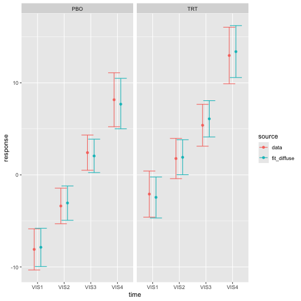
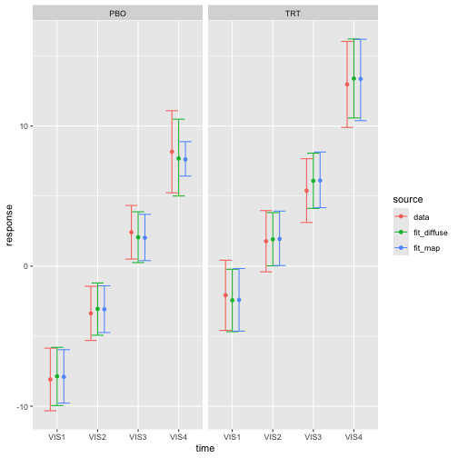

A meta-analytic predictive prior is a type of historical borrowing approach that uses data from one or more previous studies to build a prior distribution for parameters of interest in a new study (@spiegelhalter2004, @neuenschwander2010, @schmidli2014). 
This vignette demonstrates how to supply a meta-analytic predictive prior to a Bayesian MMRM fitted with `brms.mmrm`.

# Data of the current study

We use the FEV1 data from the `mmrm` package, which contains simulated measurements of forced expiratory volume in 1 second (FEV1) for virtual atients with chronic obstructive pulmonary disease (COPD) at multiple visits.


``` r
library(brms.mmrm)
library(dplyr)
data(fev_data, package = "mmrm")
data_current <- fev_data |>
  mutate(FEV1_CHG = FEV1 - FEV1_BL) |>
  brm_data(
    outcome = "FEV1_CHG",
    group = "ARMCD",
    time = "AVISIT",
    patient = "USUBJID",
    reference_group = "PBO"
  ) |>
  brm_data_chronologize(order = "VISITN") |>
  brm_archetype_effects(intercept = FALSE)
data_current
#> # A tibble: 800 × 19
#>    x_PBO_VIS1 x_PBO_VIS2 x_PBO_VIS3 x_PBO_VIS4 x_TRT_VIS1 x_TRT_VIS2 x_TRT_VIS3 x_TRT_VIS4 USUBJID AVISIT ARMCD
#>  *      <int>      <int>      <int>      <int>      <int>      <int>      <int>      <int> <fct>   <ord>  <fct>
#>  1          1          0          0          0          0          0          0          0 PT2     VIS1   PBO  
#>  2          0          1          0          0          0          0          0          0 PT2     VIS2   PBO  
#>  3          0          0          1          0          0          0          0          0 PT2     VIS3   PBO  
#>  4          0          0          0          1          0          0          0          0 PT2     VIS4   PBO  
#>  5          1          0          0          0          0          0          0          0 PT3     VIS1   PBO  
#>  6          0          1          0          0          0          0          0          0 PT3     VIS2   PBO  
#>  7          0          0          1          0          0          0          0          0 PT3     VIS3   PBO  
#>  8          0          0          0          1          0          0          0          0 PT3     VIS4   PBO  
#>  9          1          0          0          0          0          0          0          0 PT5     VIS1   PBO  
#> 10          0          1          0          0          0          0          0          0 PT5     VIS2   PBO  
#> # ℹ 790 more rows
#> # ℹ 8 more variables: RACE <fct>, SEX <fct>, FEV1_BL <dbl>, FEV1 <dbl>, WEIGHT <dbl>, VISITN <int>,
#> #   VISITN2 <dbl>, FEV1_CHG <dbl>
```

We are using a treatment effect informative prior archetype that invites the user to specify an informative prior on the placebo group mean at each study visit.
For more details on informative prior archetypes, see `vignette("archetypes", package = "brms.mmrm")`.


``` r
summary(data_current)
#> # This is the "effects" informative prior archetype in brms.mmrm.
#> # The following equations show the relationships between the
#> # marginal means (left-hand side) and important fixed effect parameters
#> # (right-hand side). Nuisance parameters are omitted.
#> # 
#> #   PBO:VIS1 = x_PBO_VIS1
#> #   PBO:VIS2 = x_PBO_VIS2
#> #   PBO:VIS3 = x_PBO_VIS3
#> #   PBO:VIS4 = x_PBO_VIS4
#> #   TRT:VIS1 = x_PBO_VIS1 + x_TRT_VIS1
#> #   TRT:VIS2 = x_PBO_VIS2 + x_TRT_VIS2
#> #   TRT:VIS3 = x_PBO_VIS3 + x_TRT_VIS3
#> #   TRT:VIS4 = x_PBO_VIS4 + x_TRT_VIS4
```

# Benchmark analysis with a diffuse prior

As a basis for comparison, we first fit a Bayesian MMRM with a diffuse prior:


``` r
fit_diffuse <- brm_model(
  data = data_current,
  formula = brm_formula(data_current),
  refresh = 0L
)
```

The estimated marginal means closely match the analogous data summaries:


``` r
draws_diffuse <- brm_marginal_draws(fit_diffuse)
summaries_diffuse <- brm_marginal_summaries(draws_diffuse)
summaries_data <- brm_marginal_data(data_current)
```


``` r
brm_plot_compare(data = summaries_data, fit_diffuse = summaries_diffuse)
```



Suppose the trial is designed to declare efficacy if the posterior probability of observing a treatment effect at visit 4 ($\delta$) of at least 4 units of FEV1 is at least 85%:

$$
\begin{aligned}
P(\delta > 4 \ \mid \ \text{data}) > 0.85
\end{aligned}
$$

The posterior probability undershoots the efficacy threshold, which is unsurprising because the dataset has few patients and MMRMs with diffuse priors are weak.


``` r
draws_diffuse |>
  brm_marginal_probabilities(direction = "greater", threshold = 4) |>
  filter(time == "VIS4") |>
  pull(value)
#> [1] 0.806
```

# Constructing the robust MAP prior

Suppose we have a wealth of historical summary-level placebo data on FEV1 at visit 4 in similar studies:


``` r
data_historical_visit4 <- tibble::tribble(
  ~study   , ~mean , ~sd   , ~patients ,
  "study1" , 8.16  , 10.01 ,       437 ,
  "study2" , 8.45  ,  9.87 ,       558 ,
  "study3" , 7.34  , 12.33 ,       489 ,
  "study4" , 6.87  , 14.44 ,       320 ,
  "study5" , 7.00  , 12.07 ,       491 ,
  "study6" , 7.10  , 11.11 ,       574
) |>
  mutate(se = sd / sqrt(patients))
```

We use `gMAP()` from `RBesT` to fit this summary data with a meta-analytic predictive model, then `automixfit()` to approximate the MAP posterior as a mixture of normals, and finally `robustify()` to add a weakly informative component that protects against prior-data conflict (@schmidli2014).
This robustified MAP posterior will serve as the MAP prior for the Bayesian MMRM downstream.^[See the documentation of `gMAP()`, `automixfit()` and `robustify()` in `RBesT` for details on how to do this in general.]


``` r
map_mcmc <- RBesT::gMAP(
  cbind(mean, se) ~ 1 | study,
  data = data_historical_visit4,
  family = gaussian,
  tau.dist = "HalfNormal",
  tau.prior = 1,
  beta.prior = cbind(0, 100)
)

map_mixture <- RBesT::automixfit(map_mcmc)

map_robust <- RBesT::robustify(
  map_mixture,
  weight = 0.2,
  mean = 0,
  sigma = mean(data_historical_visit4$sd)
)
```


``` r
map_robust
#> Univariate normal mixture
#> Mixture Components:
#>   comp1      comp2      robust    
#> w  0.5379345  0.2620655  0.2000000
#> m  7.6266400  7.5077601  0.0000000
#> s  0.4063899  1.0777665 11.6383333
```

# Converting the prior for use in `brms.mmrm`

We assign robust MAP prior to the placebo group mean at visit 1:^[See the documentation of `RBesT::mixstanvar()`]


``` r
prior <- brm_prior_label(
  code = "mixnorm(map_w, map_m, map_s)",
  group = "PBO",
  time = "VIS4"
) |>
  brm_prior_archetype(archetype = data_current)

prior
#> b_x_PBO_VIS4 ~ mixnorm(map_w, map_m, map_s)
```

We then use `RBesT::mixstanvar()` to tell the Stan code in `brms` how to interpret `mixnorm()`.
Below, the name "map" has to align with the prefix "map" in the call to `mixnorm()` above.^[The suffixes "_w", "_m", and "_s" in `mixnorm()` are hard-coded.]


``` r
stanvars <- RBesT::mixstanvar(map = map_robust)
```

# Fitting the Bayesian MMRM with the MAP prior

We simply plug `prior` and `stanvars` into the call to `brms.mmrm::brm_model()`:


``` r
fit_map <- brm_model(
  data = data_current,
  formula = brm_formula(data_current),
  prior = prior,
  stanvars = stanvars,
  refresh = 0L
)
```

The model with the MAP prior has a more precise estimate of the placebo group mean at the final visit.


``` r
draws_map <- brm_marginal_draws(fit_map)
summaries_map <- brm_marginal_summaries(draws_map)
```


``` r
brm_plot_compare(
  data = summaries_data,
  fit_diffuse = summaries_diffuse,
  fit_map = summaries_map
)
```



With this added precision, we meet the efficacy threshold:


``` r
draws_map |>
  brm_marginal_probabilities(direction = "greater", threshold = 4) |>
  filter(time == "VIS4") |>
  pull(value)
#> [1] 0.8635
```

In other trials, the MAP prior may have the opposite effect.
To avoid human decision-making bias, it is important to pre-specify the analysis model used to evaluate the efficacy rule.

# Multivariate mixture priors

For a multivariate mixture prior with correlated model coefficients, we can use `mixmvnorm()` in the `prior` specification and `mixstanvar()` to convert the mixture for use in `brms.mmrm`.
Not all multivariate mixture priors are MAP priors, but you can translate a pre-computed MAP prior into the `mixmvnorm()` format as shown below.

First, we specify the distributional family of the prior for `brms`:


``` r
prior <- brms::prior(
  "mixmvnorm(prior_w, prior_m, prior_sigma_L)",
  class = "b",
  dpar = ""
)
```

Before we construct the mixture prior, we need to note the order of the model coefficients in `brms`.


``` r
brms::prior_summary(fit_diffuse)
#>                 prior    class       coef group resp  dpar nlpar lb ub tag       source
#>                (flat)        b                                                  default
#>                (flat)        b x_PBO_VIS1                                  (vectorized)
#>                (flat)        b x_PBO_VIS2                                  (vectorized)
#>                (flat)        b x_PBO_VIS3                                  (vectorized)
#>                (flat)        b x_PBO_VIS4                                  (vectorized)
#>                (flat)        b x_TRT_VIS1                                  (vectorized)
#>                (flat)        b x_TRT_VIS2                                  (vectorized)
#>                (flat)        b x_TRT_VIS3                                  (vectorized)
#>                (flat)        b x_TRT_VIS4                                  (vectorized)
#>                (flat)        b                       sigma                      default
#>                (flat)        b AVISITVIS1            sigma                 (vectorized)
#>                (flat)        b AVISITVIS2            sigma                 (vectorized)
#>                (flat)        b AVISITVIS3            sigma                 (vectorized)
#>                (flat)        b AVISITVIS4            sigma                 (vectorized)
#>  lkj_corr_cholesky(1) Lcortime                                                  default
```

From `brms::prior_summary()`, we see that the model coefficients are ordered first by study arm, then by study visit. 
This is the order we will use for the components of the mean and covariance of the multivariate normal mixture components.


``` r
# Informative component:
# informed placebo means, vague treatment effects.
mean_informative <- c(
  5, # x_PBO_VIS1
  7, # x_PBO_VIS2
  8, # x_PBO_VIS3
  9, # x_PBO_VIS4
  0, # x_TRT_VIS1
  0, # x_TRT_VIS2
  0, # x_TRT_VIS3
  0 #  x_TRT_VIS4
)

# Block-diagonal covariance:
# correlated control block, vague diagonal treatment block.
covariance_control <- matrix(
  rbind(
    c(4, 2, 1, 1),
    c(2, 4, 2, 1),
    c(1, 2, 4, 2),
    c(1, 1, 2, 9)
  ),
  nrow = 4
)
covariance_informative <- matrix(0, 8, 8)
covariance_informative[1:4, 1:4] <- covariance_control
covariance_informative[5:8, 5:8] <- diag(rep(64, 4))

# Robust component: vague everywhere.
mean_robust <- rep(0, 8)
covariance_robust <- diag(rep(81, 8))

# Each mixture component is a vector with the
# weight, mean vector, and covariance matrix elements all inline.
multivariate_mixture <- RBesT::mixmvnorm(
  informative = c(0.8, mean_informative, covariance_informative),
  robust = c(0.2, mean_robust, covariance_robust)
)
```

We then translate the multivariate mixture into a format that `brms` can use:


``` r
stanvars <- RBesT::mixstanvar(prior = multivariate_mixture)
```

Finally, we fit the model:


``` r
fit_multivariate_mixture <- brm_model(
  data = data_current,
  formula = brm_formula(data_current),
  prior = prior,
  stanvars = stanvars,
  refresh = 0L
)
```

# References
