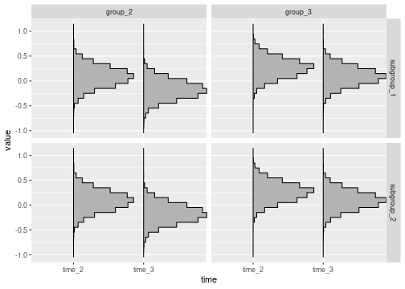
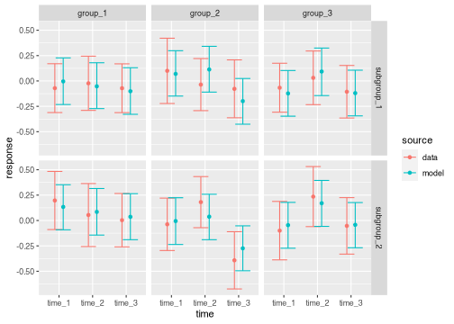
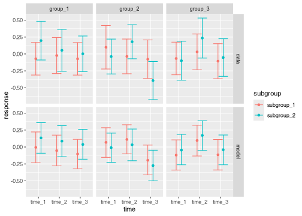
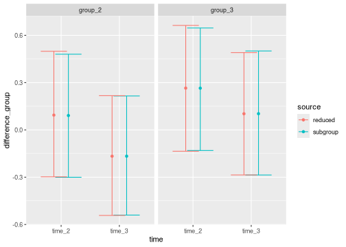

This vignette explains how to incorporate a subgroup variable into an MMRM using the `brms.mmrm` package. Here, we assume the subgroup variable has already been selected in advance (perhaps pre-specified in a trial protocol) because interactions are anticipated or of particular interest. Especially if heterogeneous patient populations are studied, it is important to check that the estimated overall effect is broadly applicable to relevant subgroups (@ICH1998, @EMA2019). It is worth noting, however, that subgroup variable selection is a thorough process that requires deep domain knowledge, careful adjustments for multiplicity, and potentially different modeling approaches, all of which belongs outside the scope of this vignette. Limitations of one-variable-at-a-time subgroup analyses to detect treatment effect heterogeneity have been described in the literature [@Kent2023]. For literature on data-driven subgroup identification methods in clinical trials, we refer to @Lipkovich2017 and @Lipkovich2023.

# Data

The subgroup variable must be categorical.

```r
library(brms.mmrm)
library(dplyr)
library(magrittr)
set.seed(0L)
raw_data <- brm_simulate_outline(
  n_group = 3,
  n_subgroup = 2,
  n_patient = 50,
  n_time = 3,
  rate_dropout = 0,
  rate_lapse = 0
) |>
  mutate(response = rnorm(n = n()))
  
raw_data
#> # A tibble: 900 × 6
#>    response missing group   subgroup   time   patient    
#>       <dbl> <lgl>   <chr>   <chr>      <chr>  <chr>      
#>  1  1.26    FALSE   group_1 subgroup_1 time_1 patient_001
#>  2 -0.326   FALSE   group_1 subgroup_1 time_2 patient_001
#>  3  1.33    FALSE   group_1 subgroup_1 time_3 patient_001
#>  4  1.27    FALSE   group_1 subgroup_1 time_1 patient_002
#>  5  0.415   FALSE   group_1 subgroup_1 time_2 patient_002
#>  6 -1.54    FALSE   group_1 subgroup_1 time_3 patient_002
#>  7 -0.929   FALSE   group_1 subgroup_1 time_1 patient_003
#>  8 -0.295   FALSE   group_1 subgroup_1 time_2 patient_003
#>  9 -0.00577 FALSE   group_1 subgroup_1 time_3 patient_003
#> 10  2.40    FALSE   group_1 subgroup_1 time_1 patient_004
#> # ℹ 890 more rows
```

Each categorical subgroup level should have adequate representation among all treatment groups at all discrete time points. Otherwise, some marginal means of interest may not be estimable.


```r
count(raw_data, group, subgroup, time)
#> # A tibble: 18 × 4
#>    group   subgroup   time       n
#>    <chr>   <chr>      <chr>  <int>
#>  1 group_1 subgroup_1 time_1    50
#>  2 group_1 subgroup_1 time_2    50
#>  3 group_1 subgroup_1 time_3    50
#>  4 group_1 subgroup_2 time_1    50
#>  5 group_1 subgroup_2 time_2    50
#>  6 group_1 subgroup_2 time_3    50
#>  7 group_2 subgroup_1 time_1    50
#>  8 group_2 subgroup_1 time_2    50
#>  9 group_2 subgroup_1 time_3    50
#> 10 group_2 subgroup_2 time_1    50
#> 11 group_2 subgroup_2 time_2    50
#> 12 group_2 subgroup_2 time_3    50
#> 13 group_3 subgroup_1 time_1    50
#> 14 group_3 subgroup_1 time_2    50
#> 15 group_3 subgroup_1 time_3    50
#> 16 group_3 subgroup_2 time_1    50
#> 17 group_3 subgroup_2 time_2    50
#> 18 group_3 subgroup_2 time_3    50
```

When you create the special classed dataset for `brms.mmrm` using `brm_data()`, please supply the name of the subgroup variable and a reference subgroup level. Post-processing functions will use the reference subgroup level to compare pairs of subgroups: for example, the treatment effect of `subgroup_2` minus the treatment effect of the reference subgroup level you choose.


```r
data <- brm_data(
  data = raw_data,
  outcome = "response",
  role = "response",
  baseline = NULL,
  group = "group",
  subgroup = "subgroup",
  time = "time",
  patient = "patient",
  reference_group = "group_1",
  reference_subgroup = "subgroup_1",
  reference_time = "time_1"
)

str(data)
#> brm_data [900 × 5] (S3: brm_data/tbl_df/tbl/data.frame)
#>  $ response: num [1:900] 1.263 -0.326 1.33 1.272 0.415 ...
#>  $ group   : chr [1:900] "group_1" "group_1" "group_1" "group_1" ...
#>  $ subgroup: chr [1:900] "subgroup_1" "subgroup_1" "subgroup_1" "subgroup_1" ...
#>  $ time    : chr [1:900] "time_1" "time_2" "time_3" "time_1" ...
#>  $ patient : chr [1:900] "patient_001" "patient_001" "patient_001" "patient_002" ...
#>  - attr(*, "brm_outcome")= chr "response"
#>  - attr(*, "brm_role")= chr "response"
#>  - attr(*, "brm_group")= chr "group"
#>  - attr(*, "brm_subgroup")= chr "subgroup"
#>  - attr(*, "brm_time")= chr "time"
#>  - attr(*, "brm_patient")= chr "patient"
#>  - attr(*, "brm_covariates")= chr(0) 
#>  - attr(*, "brm_reference_group")= chr "group_1"
#>  - attr(*, "brm_reference_subgroup")= chr "subgroup_1"
#>  - attr(*, "brm_reference_time")= chr "time_1"
#>  - attr(*, "brm_levels_group")= chr [1:3] "group_1" "group_2" "group_3"
#>  - attr(*, "brm_levels_subgroup")= chr [1:2] "subgroup_1" "subgroup_2"
#>  - attr(*, "brm_levels_time")= chr [1:3] "time_1" "time_2" "time_3"
#>  - attr(*, "brm_labels_group")= chr [1:3] "group_1" "group_2" "group_3"
#>  - attr(*, "brm_labels_subgroup")= chr [1:2] "subgroup_1" "subgroup_2"
#>  - attr(*, "brm_labels_time")= chr [1:3] "time_1" "time_2" "time_3"
```

# Formula

For subgroup analysis, the formula should have terms that include the subgroup variable. All plausible interactions are optional via arguments of `brm_formula()`. For this specific example, we disable all interactions except group-subgroup interaction.


```r
formula_subgroup <- brm_formula(
  data = data,
  group_subgroup_time = FALSE,
  subgroup_time = FALSE
)

formula_subgroup
#> response ~ group + group:subgroup + group:time + subgroup + time + unstr(time = time, gr = patient) 
#> sigma ~ 0 + time
```

To create an analogous non-subgroup reduced model, disable each of the terms that involve the subgroup. This will be useful later on for measuring the impact of the subgroup as a whole, without needing to restrict to a specific level of the subgroup.^[If analyzing change from baseline, you would also need to set `baseline_subgroup = FALSE` and `baseline_subgroup_time = FALSE` in the formula of the reduced model.]


```r
formula_reduced <- brm_formula(
  data = data,
  group_subgroup = FALSE,
  group_subgroup_time = FALSE,
  subgroup = FALSE,
  subgroup_time = FALSE
)

formula_reduced
#> response ~ group + group:time + time + unstr(time = time, gr = patient) 
#> sigma ~ 0 + time
```

# Regularization

This analysis assumes there is already sufficient justification for the choice of the subgroup variable in the dataset. Nonetheless, a subgroup may appear significant due to random chance alone, and the inherent statistical multiplicity of subgroup selection increases the risk of this false positive outcome. If this is not a concern in your specific situation, then direct mitigation may not be necessary. Otherwise, one possible strategy is to express prior skepticism of a treatment-by-subgroup interaction: that is, to shrink the treatment-by-subgroup interaction fixed effects toward zero in the prior. A horseshoe prior is one possible shrinkage technique.^[Please be aware that horseshoe cannot be applied to individual scalar parameters. It must apply to an entire parameter class as a whole. Please read <https://paul-buerkner.github.io/brms/reference/horseshoe.html> to adjust the hyperparameters for your specific use case.]


```r
prior <- brms::set_prior(prior = "horseshoe(df = 1)",  class = "b")
```

# Models

To run the full subgroup and reduced non-subgroup models, use `brm_model()` as usual. Remember to supply the appropriate formula to each case.


```r
model_subgroup <- brm_model(
  data = data,
  formula = formula_subgroup,
  # Uncomment the prior to use a the horseshoe shrinkage prior described above
  # to express skepticism about treatment-subgroup interactions.
  # This prior is commented out below for the vignette
  # because it causes divergent transitions in Stan. In some cases,
  # this can be mitigated by raising the horseshoe degrees of freedom.
  # prior = prior,
  refresh = 0
)
```


# Marginals

For the subgroup model, `brm_marginal_draws()` can summarize subgroup-specific and non-subgroup-specific marginal means. The latter is useful for direct comparison with the non-subgroup reduced model.


```r
draws_subgroup_specific <- brm_marginal_draws(
  model = model_subgroup,
  data = data,
  use_subgroup = TRUE
)
```


```r
draws_subgroup_comparison <- brm_marginal_draws(
  model = model_subgroup,
  data = data,
  use_subgroup = FALSE
)
```


```r
draws_reduced <- brm_marginal_draws(
  model = model_reduced,
  data = data,
  use_subgroup = FALSE
)
```

For `draws_subgroup_specific`, the marginals of the time difference (change from baseline) and treatment difference are the same as before, except now they are subgroup-specific.


```r
tibble::as_tibble(draws_subgroup_specific$difference_group)
#> # A tibble: 4,000 × 11
#>    .chain .draw .iteration `group_2|subgroup_1|time_2` `group_2|subgroup_1|time_3`
#>     <int> <int>      <int>                       <dbl>                       <dbl>
#>  1      1     1          1                      0.118                      -0.105 
#>  2      1     2          2                      0.186                      -0.219 
#>  3      1     3          3                      0.0693                     -0.213 
#>  4      1     4          4                      0.174                      -0.281 
#>  5      1     5          5                     -0.570                      -0.492 
#>  6      1     6          6                      0.223                      -0.170 
#>  7      1     7          7                     -0.347                      -0.530 
#>  8      1     8          8                     -0.334                      -0.524 
#>  9      1     9          9                      0.0139                     -0.314 
#> 10      1    10         10                      0.308                       0.0336
#> # ℹ 3,990 more rows
#> # ℹ 6 more variables: `group_2|subgroup_2|time_2` <dbl>,
#> #   `group_2|subgroup_2|time_3` <dbl>, `group_3|subgroup_1|time_2` <dbl>,
#> #   `group_3|subgroup_1|time_3` <dbl>, `group_3|subgroup_2|time_2` <dbl>,
#> #   `group_3|subgroup_2|time_3` <dbl>
```

In addition, there is a new `difference_subgroup` table. The posterior samples in `difference_subgroup` measure the differences between each subgroup level and the reference subgroup level with respect to the treatment effects in `difference_group`.


```r
tibble::as_tibble(draws_subgroup_specific$difference_subgroup)
#> # A tibble: 4,000 × 7
#>    .chain .draw .iteration `group_2|subgroup_2|time_2` `group_2|subgroup_2|time_3`
#>     <int> <int>      <int>                       <dbl>                       <dbl>
#>  1      1     1          1                    0                          -1.39e-17
#>  2      1     2          2                    0                          -2.78e-17
#>  3      1     3          3                    1.39e-17                    0       
#>  4      1     4          4                    0                           0       
#>  5      1     5          5                    0                           0       
#>  6      1     6          6                    0                           0       
#>  7      1     7          7                    1.67e-16                    0       
#>  8      1     8          8                    5.55e-17                    0       
#>  9      1     9          9                    2.78e-17                   -1.11e-16
#> 10      1    10         10                    0                           0       
#> # ℹ 3,990 more rows
#> # ℹ 2 more variables: `group_3|subgroup_2|time_2` <dbl>,
#> #   `group_3|subgroup_2|time_3` <dbl>
```

The `brm_marginal_summaries()` and `brm_marginal_probabilities()` are automatically aware of any subgroup-specific marginals from `brm_marginal_draws()`. Notably, `brm_marginal_summaries()` summarizes the subgroup differences in the `difference_subgroup` table from `brm_marginal_draws()`.


```r
summaries_subgroup_specific <- brm_marginal_summaries(
  draws_subgroup_specific,
  level = 0.95
)

summaries_subgroup_comparison <- brm_marginal_summaries(
  draws_subgroup_comparison,
  level = 0.95
)

summaries_reduced <- brm_marginal_summaries(
  draws_reduced,
  level = 0.95
)

summaries_subgroup_specific
#> # A tibble: 250 × 7
#>    marginal         statistic group   subgroup   time     value    mcse
#>    <chr>            <chr>     <chr>   <chr>      <chr>    <dbl>   <dbl>
#>  1 difference_group lower     group_2 subgroup_1 time_2 -0.313  0.00842
#>  2 difference_group lower     group_2 subgroup_1 time_3 -0.560  0.0106 
#>  3 difference_group lower     group_2 subgroup_2 time_2 -0.313  0.00842
#>  4 difference_group lower     group_2 subgroup_2 time_3 -0.560  0.0106 
#>  5 difference_group lower     group_3 subgroup_1 time_2 -0.127  0.00989
#>  6 difference_group lower     group_3 subgroup_1 time_3 -0.268  0.00860
#>  7 difference_group lower     group_3 subgroup_2 time_2 -0.127  0.00989
#>  8 difference_group lower     group_3 subgroup_2 time_3 -0.268  0.00860
#>  9 difference_group mean      group_2 subgroup_1 time_2  0.0920 0.00448
#> 10 difference_group mean      group_2 subgroup_1 time_3 -0.171  0.00455
#> # ℹ 240 more rows
```

`brm_marginal_probabilities()` still focuses on treatment effects, not on differences between pairs of subgroup levels.


```r
brm_marginal_probabilities(
  draws = draws_subgroup_specific,
  threshold = c(-0.1, 0.1),
  direction = c("greater", "less")
)
#> # A tibble: 16 × 6
#>    direction threshold group   subgroup   time   value
#>    <chr>         <dbl> <chr>   <chr>      <chr>  <dbl>
#>  1 greater        -0.1 group_2 subgroup_1 time_2 0.826
#>  2 greater        -0.1 group_2 subgroup_1 time_3 0.358
#>  3 greater        -0.1 group_2 subgroup_2 time_2 0.826
#>  4 greater        -0.1 group_2 subgroup_2 time_3 0.358
#>  5 greater        -0.1 group_3 subgroup_1 time_2 0.967
#>  6 greater        -0.1 group_3 subgroup_1 time_3 0.849
#>  7 greater        -0.1 group_3 subgroup_2 time_2 0.967
#>  8 greater        -0.1 group_3 subgroup_2 time_3 0.849
#>  9 less            0.1 group_2 subgroup_1 time_2 0.514
#> 10 less            0.1 group_2 subgroup_1 time_3 0.918
#> 11 less            0.1 group_2 subgroup_2 time_2 0.514
#> 12 less            0.1 group_2 subgroup_2 time_3 0.918
#> 13 less            0.1 group_3 subgroup_1 time_2 0.212
#> 14 less            0.1 group_3 subgroup_1 time_3 0.505
#> 15 less            0.1 group_3 subgroup_2 time_2 0.212
#> 16 less            0.1 group_3 subgroup_2 time_3 0.505
```

`brm_marignal_data()` can produce either subgroup-specific or non-subgroup-specific summary statistics.


```r
summaries_data_subgroup <- brm_marginal_data(
  data = data,
  level = 0.95,
  use_subgroup = TRUE
)

summaries_data_subgroup
#> # A tibble: 126 × 5
#>    statistic group   subgroup   time   value
#>    <chr>     <chr>   <chr>      <chr>  <dbl>
#>  1 lower     group_1 subgroup_1 time_1 0.170
#>  2 lower     group_1 subgroup_1 time_2 0.244
#>  3 lower     group_1 subgroup_1 time_3 0.169
#>  4 lower     group_1 subgroup_2 time_1 0.484
#>  5 lower     group_1 subgroup_2 time_2 0.364
#>  6 lower     group_1 subgroup_2 time_3 0.266
#>  7 lower     group_2 subgroup_1 time_1 0.421
#>  8 lower     group_2 subgroup_1 time_2 0.221
#>  9 lower     group_2 subgroup_1 time_3 0.208
#> 10 lower     group_2 subgroup_2 time_1 0.220
#> # ℹ 116 more rows
```


```r
summaries_data_reduced <- brm_marginal_data(
  data = data,
  level = 0.95,
  use_subgroup = FALSE
)

summaries_data_reduced
#> # A tibble: 63 × 4
#>    statistic group   time     value
#>    <chr>     <chr>   <chr>    <dbl>
#>  1 lower     group_1 time_1  0.251 
#>  2 lower     group_1 time_2  0.219 
#>  3 lower     group_1 time_3  0.143 
#>  4 lower     group_2 time_1  0.237 
#>  5 lower     group_2 time_2  0.252 
#>  6 lower     group_2 time_3 -0.0331
#>  7 lower     group_3 time_1  0.104 
#>  8 lower     group_3 time_2  0.332 
#>  9 lower     group_3 time_3  0.110 
#> 10 mean      group_1 time_1  0.0632
#> # ℹ 53 more rows
```

# Model comparison

Metrics from `brms` can compare the full subgroup and reduced non-subgroup model to assess the effect of the subgroup as a whole. We can easily compute the widely applicable information criterion (WAIC) of each model.


```r
brms::waic(model_subgroup)
#> 
#> Computed from 4000 by 900 log-likelihood matrix
#> 
#>           Estimate   SE
#> elpd_waic  -1276.3 20.0
#> p_waic        20.6  1.0
#> waic        2552.6 40.0
```


```r
brms::waic(model_reduced)
#> 
#> Computed from 4000 by 900 log-likelihood matrix
#> 
#>           Estimate   SE
#> elpd_waic  -1273.9 20.0
#> p_waic        17.1  0.9
#> waic        2547.7 40.0
```

Likewise, we can compare the models in terms of the expected log predictive density (ELPD) based on approximate Pareto-smoothed leave-one-out cross-validation.


```r
loo_subgroup <- brms::loo(model_subgroup)
loo_reduced <- brms::loo(model_reduced)
```


```r
loo_subgroup
#> 
#> Computed from 4000 by 900 log-likelihood matrix
#> 
#>          Estimate   SE
#> elpd_loo  -1276.4 20.0
#> p_loo        20.6  1.0
#> looic      2552.7 40.0
#> ------
#> Monte Carlo SE of elpd_loo is 0.1.
#> 
#> All Pareto k estimates are good (k < 0.5).
#> See help('pareto-k-diagnostic') for details.
```


```r
loo_reduced
#> 
#> Computed from 4000 by 900 log-likelihood matrix
#> 
#>          Estimate   SE
#> elpd_loo  -1273.9 20.0
#> p_loo        17.1  0.9
#> looic      2547.8 40.0
#> ------
#> Monte Carlo SE of elpd_loo is 0.1.
#> 
#> All Pareto k estimates are good (k < 0.5).
#> See help('pareto-k-diagnostic') for details.
```


```r
loo::loo_compare(loo_subgroup, loo_reduced)
#>                elpd_diff se_diff
#> model_reduced   0.0       0.0   
#> model_subgroup -2.4       1.6
```

# Visualization

`brm_plot_draws()` is aware of any subgroup-specific marginal means.


```r
brm_plot_draws(draws_subgroup_specific$difference_group)
```



You can adjust visual aesthetics to compare subgroup levels side by side if subgroup level is the primary comparison of interest.


```r
brm_plot_draws(
  draws_subgroup_specific$difference_group,
  axis = "subgroup",
  facet = c("time", "group")
)
```


The following function call compares the subgroup model results against the subgroup data.


```r
brm_plot_compare(
  data = summaries_data_subgroup,
  model = summaries_subgroup_specific,
  marginal = "response"
)
```



You can adjust plot aesthetics to view subgroup levels side by side as the primary comparison of interest.


```r
brm_plot_compare(
  data = summaries_data_subgroup,
  model = summaries_subgroup_specific,
  marginal = "response",
  compare = "subgroup",
  axis = "time",
  facet = c("group", "source")
)
```



We can also visually compare the treatment effects of the full subgroup and reduced non-subgroup models, marginalizing over subgroup levels in both cases.


```r
brm_plot_compare(
  subgroup = summaries_subgroup_comparison,
  reduced = summaries_reduced,
  marginal = "difference_group"
)
```



# References
