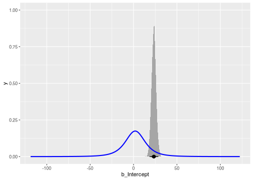

A mixed model of repeated measures (MMRM) analyzes longitudinal clinical trial data. In a longitudinal dataset, there are multiple patients, and each patient has multiple observations at a common set of discrete points in time.

# Raw data

To use the `brms.mmrm` package, begin with a longitudinal dataset with one row per patient observation and columns for the response variable, treatment group indicator, discrete time point indicator, patient ID variable, and optional baseline covariates such as age and gender. As an example, consider the `fev_dat` dataset from the `mmrm` package.


``` r
data(fev_data, package = "mmrm")
```


It is an artificial (simulated) dataset of a clinical trial investigating the 
effect of an active treatment on `FEV1` (forced expired volume in one second),
compared to placebo. `FEV1` is a measure of how quickly the lungs can be 
emptied and low levels may indicate chronic obstructive pulmonary disease 
(COPD). 

The dataset is a `tibble` with 800 rows and the following notable variables:

* `USUBJID` (subject ID)
* `AVISIT` (visit number, factor)
* `VISITN` (visit number, numeric)
* `ARMCD` (treatment, `TRT` or `PBO`)
* `RACE` (3-category race)
* `SEX` (female or male)
* `FEV1_BL` (FEV1 at baseline, %)
* `FEV1` (FEV1 at study visits)
* `WEIGHT` (weighting variable)

For this vignette, we derive the response variable `FEV1_CHG` as the change from baseline of `FEV1`.


``` r
fev_data <- fev_data |>
  mutate(FEV1_CHG = FEV1 - FEV1_BL)
```

# Preprocessing

We use the `brm_data()` function to preprocess the raw data and express it in a special classed data frame for `brms.mmrm`. `brm_data()` stores arguments `outcome`, `group`, `time`, etc. as attributes which the downstream post-processing functions will recognize.


``` r
data <- brm_data(
  data = fev_data,
  outcome = "FEV1_CHG",
  group = "ARMCD",
  time = "AVISIT",
  patient = "USUBJID",
  baseline = "FEV1_BL",
  reference_group = "PBO",
  reference_time = "VIS1",
  covariates = c("RACE", "SEX")
)
```


``` r
data
#> # A tibble: 800 × 11
#>    USUBJID AVISIT ARMCD RACE  SEX   FEV1_BL  FEV1 WEIGHT VISITN VISITN2 FEV1_CHG
#>    <fct>   <fct>  <fct> <fct> <fct>   <dbl> <dbl>  <dbl>  <int>   <dbl>    <dbl>
#>  1 PT2     VIS1   PBO   Asian Male     45.0  NA    0.465      1  0.330     NA   
#>  2 PT2     VIS2   PBO   Asian Male     45.0  31.5  0.233      2 -0.820    -13.6 
#>  3 PT2     VIS3   PBO   Asian Male     45.0  36.9  0.360      3  0.487     -8.15
#>  4 PT2     VIS4   PBO   Asian Male     45.0  48.8  0.507      4  0.738      3.78
#>  5 PT3     VIS1   PBO   Blac… Fema…    43.5  NA    0.682      1  0.576     NA   
#>  6 PT3     VIS2   PBO   Blac… Fema…    43.5  36.0  0.892      2 -0.305     -7.51
#>  7 PT3     VIS3   PBO   Blac… Fema…    43.5  NA    0.128      3  1.51      NA   
#>  8 PT3     VIS4   PBO   Blac… Fema…    43.5  37.2  0.222      4  0.390     -6.34
#>  9 PT5     VIS1   PBO   Blac… Male     43.6  32.3  0.411      1 -0.0162   -11.3 
#> 10 PT5     VIS2   PBO   Blac… Male     43.6  NA    0.422      2  0.944     NA   
#> # ℹ 790 more rows
```


``` r
str(attributes(data))
#> List of 11
#>  $ row.names          : int [1:800] 1 2 3 4 5 6 7 8 9 10 ...
#>  $ names              : chr [1:11] "USUBJID" "AVISIT" "ARMCD" "RACE" ...
#>  $ class              : chr [1:4] "brms_mmrm_data" "tbl_df" "tbl" "data.frame"
#>  $ brm_outcome        : chr "FEV1_CHG"
#>  $ brm_baseline       : chr "FEV1_BL"
#>  $ brm_group          : chr "ARMCD"
#>  $ brm_time           : chr "AVISIT"
#>  $ brm_patient        : chr "USUBJID"
#>  $ brm_covariates     : chr [1:2] "RACE" "SEX"
#>  $ brm_reference_group: chr "PBO"
#>  $ brm_reference_time : chr "VIS1"
```

In addition, we convert the discrete time variable `AVISIT` to an ordered factor whose levels respect the chronological order given by the continuous time variable `VISITN`.


``` r
data <- data |>
  brm_data_chronologize(order = "VISITN")
```

`AVISIT` has a special `contrasts` attribute generated by `contr.treatment()` to prevent base R from automatically assigning the default but inappropriate `contr.poly()` polynomial contrasts.


``` r
str(data$AVISIT)
#>  Ord.factor w/ 4 levels "VIS1"<"VIS2"<..: 1 2 3 4 1 2 3 4 1 2 ...
#>  - attr(*, "contrasts")= num [1:4, 1:3] 0 1 0 0 0 0 1 0 0 0 ...
#>   ..- attr(*, "dimnames")=List of 2
#>   .. ..$ : chr [1:4] "VIS1" "VIS2" "VIS3" "VIS4"
#>   .. ..$ : chr [1:3] "2" "3" "4"
```

# Formula

Next, choose a `brms` model formula for the fixed effect and variance parameters. The `brm_formula()` function from `brms.mmrm` makes this process easier. For example, here is a formula that omits baseline response and interaction terms. 


``` r
brm_formula(
  data = data,
  baseline = FALSE,
  baseline_time = FALSE,
  group_time = FALSE
)
#> FEV1_CHG ~ ARMCD + AVISIT + RACE + SEX + unstr(time = AVISIT, gr = USUBJID) 
#> sigma ~ 0 + AVISIT
```

For the purposes of our example, we choose a fully parameterized analysis of the raw response.


``` r
formula <- brm_formula(data = data)

formula
#> FEV1_CHG ~ FEV1_BL + FEV1_BL:AVISIT + ARMCD + ARMCD:AVISIT + AVISIT + RACE + SEX + unstr(time = AVISIT, gr = USUBJID) 
#> sigma ~ 0 + AVISIT
```

# Priors

Some analyses require informative priors, others require non-informative ones. Please use [`brms`](https://paul-buerkner.github.io/brms/) to construct a prior suitable for your analysis. The [`brms`](https://paul-buerkner.github.io/brms/) package has documentation on how its default priors are constructed and how to set your own priors. Once you have an R object that represents the joint prior distribution of your model, you can pass it to the `brm_model()` function described below. The `get_prior()` function shows the default priors for a given dataset and model formula.


``` r
brms::get_prior(data = data, formula = formula) |>
  as.data.frame() |>
  select(-any_of(c("group", "resp", "nlpar", "lb", "ub", "source")))
#>                      prior     class                       coef  dpar
#> 1                                  b                                 
#> 2                                  b                   ARMCDTRT      
#> 3                                  b           ARMCDTRT:AVISIT2      
#> 4                                  b           ARMCDTRT:AVISIT3      
#> 5                                  b           ARMCDTRT:AVISIT4      
#> 6                                  b                    AVISIT2      
#> 7                                  b                    AVISIT3      
#> 8                                  b                    AVISIT4      
#> 9                                  b                    FEV1_BL      
#> 10                                 b            FEV1_BL:AVISIT2      
#> 11                                 b            FEV1_BL:AVISIT3      
#> 12                                 b            FEV1_BL:AVISIT4      
#> 13                                 b RACEBlackorAfricanAmerican      
#> 14                                 b                  RACEWhite      
#> 15                                 b                  SEXFemale      
#> 16                  lkj(1)   cortime                                 
#> 17 student_t(3, 1.9, 11.8) Intercept                                 
#> 18                                 b                            sigma
#> 19                                 b                 AVISITVIS1 sigma
#> 20                                 b                 AVISITVIS2 sigma
#> 21                                 b                 AVISITVIS3 sigma
#> 22                                 b                 AVISITVIS4 sigma
```

# Model

To run an MMRM, use the `brm_model()` function. This function calls `brms::brm()` behind the scenes, using the formula and prior you set in the `formula` and `prior` arguments.


``` r
model <- brm_model(data = data, formula = formula, refresh = 0)
#> Compiling Stan program...
#> Start sampling
```

The result is a `brms` model object with extra list elements `brms.mmrm_data` and `brms.mmrm_formula` to keep track of the data and formula used to fit the model.


``` r
model
#>  Family: gaussian 
#>   Links: mu = identity; sigma = log 
#> Formula: FEV1_CHG ~ FEV1_BL + FEV1_BL:AVISIT + ARMCD + ARMCD:AVISIT + AVISIT + RACE + SEX + unstr(time = AVISIT, gr = USUBJID) 
#>          sigma ~ 0 + AVISIT
#>    Data: modeled_data (Number of observations: 537) 
#>   Draws: 4 chains, each with iter = 2000; warmup = 1000; thin = 1;
#>          total post-warmup draws = 4000
#> 
#> Correlation Structures:
#>                    Estimate Est.Error l-95% CI u-95% CI Rhat Bulk_ESS Tail_ESS
#> cortime(VIS1,VIS2)     0.36      0.09     0.17     0.51 1.00     5926     2988
#> cortime(VIS1,VIS3)     0.14      0.10    -0.06     0.33 1.00     5214     3152
#> cortime(VIS2,VIS3)     0.04      0.10    -0.16     0.25 1.00     5495     2706
#> cortime(VIS1,VIS4)     0.17      0.11    -0.06     0.38 1.00     5762     2816
#> cortime(VIS2,VIS4)     0.11      0.09    -0.07     0.28 1.00     5909     2829
#> cortime(VIS3,VIS4)     0.00      0.10    -0.19     0.20 1.00     5305     3018
#> 
#> Regression Coefficients:
#>                            Estimate Est.Error l-95% CI u-95% CI Rhat Bulk_ESS
#> Intercept                     23.36      2.55    18.40    28.51 1.00     1814
#> FEV1_BL                       -0.82      0.06    -0.94    -0.70 1.00     1876
#> ARMCDTRT                       4.00      1.06     1.97     6.09 1.00     2505
#> AVISIT2                        4.46      2.73    -0.87     9.73 1.00     2058
#> AVISIT3                       12.54      2.92     6.78    18.33 1.00     1967
#> AVISIT4                       15.52      4.45     6.74    24.29 1.00     2576
#> RACEBlackorAfricanAmerican     1.45      0.59     0.32     2.63 1.00     5718
#> RACEWhite                      5.45      0.63     4.23     6.68 1.00     5124
#> SEXFemale                      0.38      0.52    -0.63     1.40 1.00     5439
#> FEV1_BL:AVISIT2                0.01      0.06    -0.12     0.14 1.00     2221
#> FEV1_BL:AVISIT3               -0.05      0.07    -0.19     0.08 1.00     2041
#> FEV1_BL:AVISIT4               -0.01      0.11    -0.21     0.20 1.00     2686
#> ARMCDTRT:AVISIT2              -0.03      1.16    -2.26     2.24 1.00     2710
#> ARMCDTRT:AVISIT3              -0.99      1.20    -3.42     1.37 1.00     2490
#> ARMCDTRT:AVISIT4               0.44      1.87    -3.15     4.03 1.00     4022
#> sigma_AVISITVIS1               1.83      0.06     1.71     1.95 1.00     5914
#> sigma_AVISITVIS2               1.59      0.06     1.47     1.71 1.00     5225
#> sigma_AVISITVIS3               1.33      0.06     1.21     1.46 1.00     5779
#> sigma_AVISITVIS4               2.28      0.06     2.16     2.41 1.00     5354
#>                            Tail_ESS
#> Intercept                      2393
#> FEV1_BL                        2622
#> ARMCDTRT                       2533
#> AVISIT2                        2730
#> AVISIT3                        2769
#> AVISIT4                        2669
#> RACEBlackorAfricanAmerican     2829
#> RACEWhite                      3019
#> SEXFemale                      2912
#> FEV1_BL:AVISIT2                2831
#> FEV1_BL:AVISIT3                2685
#> FEV1_BL:AVISIT4                2691
#> ARMCDTRT:AVISIT2               3198
#> ARMCDTRT:AVISIT3               2866
#> ARMCDTRT:AVISIT4               2956
#> sigma_AVISITVIS1               3225
#> sigma_AVISITVIS2               3257
#> sigma_AVISITVIS3               3047
#> sigma_AVISITVIS4               2741
#> 
#> Draws were sampled using sampling(NUTS). For each parameter, Bulk_ESS
#> and Tail_ESS are effective sample size measures, and Rhat is the potential
#> scale reduction factor on split chains (at convergence, Rhat = 1).
```


``` r
model$brms.mmrm_data
#> # A tibble: 800 × 11
#>    USUBJID AVISIT ARMCD RACE  SEX   FEV1_BL  FEV1 WEIGHT VISITN VISITN2 FEV1_CHG
#>    <fct>   <ord>  <fct> <fct> <fct>   <dbl> <dbl>  <dbl>  <int>   <dbl>    <dbl>
#>  1 PT2     VIS1   PBO   Asian Male     45.0  NA    0.465      1  0.330     NA   
#>  2 PT2     VIS2   PBO   Asian Male     45.0  31.5  0.233      2 -0.820    -13.6 
#>  3 PT2     VIS3   PBO   Asian Male     45.0  36.9  0.360      3  0.487     -8.15
#>  4 PT2     VIS4   PBO   Asian Male     45.0  48.8  0.507      4  0.738      3.78
#>  5 PT3     VIS1   PBO   Blac… Fema…    43.5  NA    0.682      1  0.576     NA   
#>  6 PT3     VIS2   PBO   Blac… Fema…    43.5  36.0  0.892      2 -0.305     -7.51
#>  7 PT3     VIS3   PBO   Blac… Fema…    43.5  NA    0.128      3  1.51      NA   
#>  8 PT3     VIS4   PBO   Blac… Fema…    43.5  37.2  0.222      4  0.390     -6.34
#>  9 PT5     VIS1   PBO   Blac… Male     43.6  32.3  0.411      1 -0.0162   -11.3 
#> 10 PT5     VIS2   PBO   Blac… Male     43.6  NA    0.422      2  0.944     NA   
#> # ℹ 790 more rows
```


``` r
model$brms.mmrm_formula
#> FEV1_CHG ~ FEV1_BL + FEV1_BL:AVISIT + ARMCD + ARMCD:AVISIT + AVISIT + RACE + SEX + unstr(time = AVISIT, gr = USUBJID) 
#> sigma ~ 0 + AVISIT
```

# Marginals

Regardless of the choice of fixed effects formula, `brms.mmrm` performs inference on the marginal distributions at each treatment group and time point of the mean of the following quantities:

1. Response.
2. Change from baseline. Only reported if you originally declared a baseline time point with the `reference_time` argument of `brm_data()`.
3. Treatment difference. If you declared a baseline in (2), then treatment difference is calculated in terms of change from baseline. Otherwise, it is calculated in terms of raw response.
4. Effect size: treatment difference divided by the residual standard deviation.

To derive posterior draws of these marginals, use the `brm_marginal_draws()` function.


``` r
draws <- brm_marginal_draws(model = model)

names(draws)
#> [1] "response"         "difference_time"  "difference_group" "effect"          
#> [5] "sigma"

draws$difference_group
#> # A draws_df: 1000 iterations, 4 chains, and 3 variables
#>    TRT|VIS2 TRT|VIS3 TRT|VIS4
#> 1      0.63    -1.33    -1.03
#> 2     -1.09    -1.03    -1.18
#> 3      0.26    -0.39    -0.38
#> 4      0.22    -1.27     0.50
#> 5     -0.55    -1.49    -0.14
#> 6     -0.28    -0.91    -3.35
#> 7      0.29    -0.89     1.28
#> 8     -0.11    -0.99    -1.68
#> 9     -0.56    -0.81     1.64
#> 10     0.91    -0.30     0.91
#> # ... with 3990 more draws
#> # ... hidden reserved variables {'.chain', '.iteration', '.draw'}
```

If you need samples from these marginals averaged across time points, e.g. an "overall effect size", `brm_marginal_draws_average()` can average the draws above across discrete time points (either all or a user-defined subset).


``` r
draws_average <- brm_marginal_draws_average(draws = draws, data = data)

names(draws_average)
#> [1] "response"         "difference_time"  "difference_group" "effect"          
#> [5] "sigma"

draws_average$difference_group
#> # A draws_df: 1000 iterations, 4 chains, and 1 variables
#>    TRT|average
#> 1       -0.576
#> 2       -1.101
#> 3       -0.170
#> 4       -0.187
#> 5       -0.726
#> 6       -1.514
#> 7        0.224
#> 8       -0.928
#> 9        0.094
#> 10       0.507
#> # ... with 3990 more draws
#> # ... hidden reserved variables {'.chain', '.iteration', '.draw'}
```

The `brm_marginal_summaries()` function produces posterior summaries of these marginals, and it includes the Monte Carlo standard error (MCSE) of each estimate.


``` r
summaries <- brm_marginal_summaries(draws, level = 0.95)

summaries
#> # A tibble: 140 × 6
#>    marginal         statistic group time    value   mcse
#>    <chr>            <chr>     <chr> <chr>   <dbl>  <dbl>
#>  1 difference_group lower     TRT   VIS2  -2.26   0.0563
#>  2 difference_group lower     TRT   VIS3  -3.42   0.0653
#>  3 difference_group lower     TRT   VIS4  -3.15   0.0801
#>  4 difference_group mean      TRT   VIS2  -0.0350 0.0225
#>  5 difference_group mean      TRT   VIS3  -0.990  0.0244
#>  6 difference_group mean      TRT   VIS4   0.442  0.0297
#>  7 difference_group median    TRT   VIS2  -0.0433 0.0243
#>  8 difference_group median    TRT   VIS3  -0.975  0.0296
#>  9 difference_group median    TRT   VIS4   0.471  0.0349
#> 10 difference_group sd        TRT   VIS2   1.16   0.0152
#> # ℹ 130 more rows
```

The `brm_marginal_probabilities()` function shows posterior probabilities of the form, 

$$
\begin{aligned}
\text{Prob}(\text{treatment effect} > \text{threshold})
\end{aligned}
$$

or 

$$
\begin{aligned}
\text{Prob}(\text{treatment effect} < \text{threshold})
\end{aligned}
$$


``` r
brm_marginal_probabilities(
  draws = draws,
  threshold = c(-0.1, 0.1),
  direction = c("greater", "less")
)
#> # A tibble: 6 × 5
#>   direction threshold group time  value
#>   <chr>         <dbl> <chr> <chr> <dbl>
#> 1 greater        -0.1 TRT   VIS2  0.520
#> 2 greater        -0.1 TRT   VIS3  0.227
#> 3 greater        -0.1 TRT   VIS4  0.619
#> 4 less            0.1 TRT   VIS2  0.547
#> 5 less            0.1 TRT   VIS3  0.829
#> 6 less            0.1 TRT   VIS4  0.421
```

Finally, `brm_marignal_data()` computes marginal means and confidence intervals on the response variable in the data, along with other summary statistics.


``` r
summaries_data <- brm_marginal_data(data = data, level = 0.95)

summaries_data
#> # A tibble: 56 × 4
#>    statistic group time   value
#>    <chr>     <fct> <ord>  <dbl>
#>  1 lower     PBO   VIS1  -5.86 
#>  2 lower     PBO   VIS2  -1.44 
#>  3 lower     PBO   VIS3   4.33 
#>  4 lower     PBO   VIS4  11.1  
#>  5 lower     TRT   VIS1   0.423
#>  6 lower     TRT   VIS2   3.96 
#>  7 lower     TRT   VIS3   7.67 
#>  8 lower     TRT   VIS4  16.0  
#>  9 mean      PBO   VIS1  -8.09 
#> 10 mean      PBO   VIS2  -3.38 
#> # ℹ 46 more rows
```

# Visualization

## Comparing models and data

Suppose we fit a second model which omits baseline.


``` r
summaries_no_baseline <- data |>
  brm_formula(baseline = FALSE, baseline_time = FALSE) |>
  brm_model(data = data, refresh = 0) |>
  brm_marginal_draws() |>
  brm_marginal_summaries()
#> Compiling Stan program...
#> Start sampling
```

The `brm_plot_compare()` function compares means and intervals from different models and data sources in the same plot.


``` r
brm_plot_compare(
  data = summaries_data,
  no_baseline = summaries_no_baseline,
  with_baseline = summaries
)
```


If you omit the marginals of the data, you can show inference on change from baseline or the treatment effect.


``` r
brm_plot_compare(
  no_baseline = summaries_no_baseline,
  with_baseline = summaries,
  marginal = "difference_group" # treatment effect
)
```


Additional arguments let you control the primary comparison of interest (the color aesthetic), the horizontal axis, and the faceting variable.


``` r
brm_plot_compare(
  no_baseline = summaries_no_baseline,
  with_baseline = summaries,
  marginal = "difference_group",
  compare = "group",
  axis = "time",
  facet = "source" # model1 vs model2
)
```


## Plotting draws

`brm_plot_draws()` can plot the posterior draws of the response, change from baseline, or treatment difference.


``` r
brm_plot_draws(draws = draws$difference_group)
```


The `axis` and `facet` arguments customize the horizontal axis and faceting variable, respectively.


``` r
brm_plot_draws(
  draws = draws$difference_group,
  axis = "group",
  facet = "time"
)
```


## Comparing priors and posteriors

Suppose we want to compare the prior on the intercept term to its marginal posterior. `brms` automatically assigns a mildly informative Student t prior to help the MCMC converge:


``` r
brms::prior_summary(model) |>
  filter(class == "Intercept")
#> Intercept ~ student_t(3, 1.9, 11.8)
```

To compare the prior and posterior, we express the prior using the `distributional` package, extract posterior samples from the `brms` model, and visualize them together with the `ggdist` package. Below, the shaded gray region is the posterior density, and the blue line is the prior density.


``` r
library(distributional)
library(ggdist)
library(ggplot2)
library(posterior)

prior <- dist_student_t(3, 1.9, 11.8)
posterior <- as_draws_df(model)

ggplot() +
  stat_halfeye(aes(x = b_Intercept), data = posterior) +
  stat_slab(aes(xdist = prior), color = "blue", fill = NA) +
  scale_thickness_shared()
```



# Appendix A: Contrasts

The formula is not the only factor
that ultimately determines the fixed effect parameterization.
The ordering of the categorical variables in the data,
as well as the `contrast` option in R, affect the
construction of the model matrix. To see the model
matrix that will ultimately be used in `brm_model()`,
run `brms::make_standata()` and examine the `X` element
of the returned list.

The `contrast` option accepts a named vector of two character vectors which govern `model.matrix()` contrasts for unordered and ordered variables, respectively.


``` r
options(contrasts = c(unordered = "contr.SAS", ordered = "contr.poly"))
```

The `make_standata()` function lets you see the data that `brms` will generate for Stan. This includes the fixed effects model matrix `X`. Note the differences in the `groupgroup_*` additive terms between the matrix below and the one above.


``` r
head(brms::make_standata(formula = formula, data = data)$X)
#>     Intercept  FEV1_BL ARMCDPBO AVISIT2 AVISIT3 AVISIT4 RACEAsian
#> 422         1 25.27144        0       1       0       0         0
#> 424         1 25.27144        0       0       0       1         0
#> 2           1 45.02477        1       1       0       0         1
#> 3           1 45.02477        1       0       1       0         1
#> 4           1 45.02477        1       0       0       1         1
#> 6           1 43.50070        1       1       0       0         0
#>     RACEBlackorAfricanAmerican SEXMale FEV1_BL:AVISIT2 FEV1_BL:AVISIT3
#> 422                          1       0        25.27144         0.00000
#> 424                          1       0         0.00000         0.00000
#> 2                            0       1        45.02477         0.00000
#> 3                            0       1         0.00000        45.02477
#> 4                            0       1         0.00000         0.00000
#> 6                            1       0        43.50070         0.00000
#>     FEV1_BL:AVISIT4 ARMCDPBO:AVISIT2 ARMCDPBO:AVISIT3 ARMCDPBO:AVISIT4
#> 422         0.00000                0                0                0
#> 424        25.27144                0                0                0
#> 2           0.00000                1                0                0
#> 3           0.00000                0                1                0
#> 4          45.02477                0                0                1
#> 6           0.00000                1                0                0
```

If you choose a different contrast method, a different model matrix may result.


``` r
options(
  contrasts = c(unordered = "contr.treatment", ordered = "contr.poly")
)
# different model matrix than before:
head(brms::make_standata(formula = formula, data = data)$X)
#>     Intercept  FEV1_BL ARMCDTRT AVISIT2 AVISIT3 AVISIT4
#> 422         1 25.27144        1       1       0       0
#> 424         1 25.27144        1       0       0       1
#> 2           1 45.02477        0       1       0       0
#> 3           1 45.02477        0       0       1       0
#> 4           1 45.02477        0       0       0       1
#> 6           1 43.50070        0       1       0       0
#>     RACEBlackorAfricanAmerican RACEWhite SEXFemale FEV1_BL:AVISIT2
#> 422                          1         0         1        25.27144
#> 424                          1         0         1         0.00000
#> 2                            0         0         0        45.02477
#> 3                            0         0         0         0.00000
#> 4                            0         0         0         0.00000
#> 6                            1         0         1        43.50070
#>     FEV1_BL:AVISIT3 FEV1_BL:AVISIT4 ARMCDTRT:AVISIT2 ARMCDTRT:AVISIT3
#> 422         0.00000         0.00000                1                0
#> 424         0.00000        25.27144                0                0
#> 2           0.00000         0.00000                0                0
#> 3          45.02477         0.00000                0                0
#> 4           0.00000        45.02477                0                0
#> 6           0.00000         0.00000                0                0
#>     ARMCDTRT:AVISIT4
#> 422                0
#> 424                1
#> 2                  0
#> 3                  0
#> 4                  0
#> 6                  0
```

Recall from earlier that `brm_data_chronologize()` protects the discrete time variable (in our case, `AVISIT`) from the `contrasts` option by assigning a `contrasts` attribute of its own.


``` r
str(data$AVISIT)
#>  Ord.factor w/ 4 levels "VIS1"<"VIS2"<..: 1 2 3 4 1 2 3 4 1 2 ...
#>  - attr(*, "contrasts")= num [1:4, 1:3] 0 1 0 0 0 0 1 0 0 0 ...
#>   ..- attr(*, "dimnames")=List of 2
#>   .. ..$ : chr [1:4] "VIS1" "VIS2" "VIS3" "VIS4"
#>   .. ..$ : chr [1:3] "2" "3" "4"
```

# Appendix B: Imputation of missing outcomes

Under the missing at random (MAR) assumptions, MMRMs do not require imputation (@bamdd). However, if the outcomes in your data are not missing at random, or if you are targeting an alternative estimand, then you may need to impute missing outcomes. `brms.mmrm` can leverage either of the two alternative solutions described at <https://paul-buerkner.github.io/brms/articles/brms_missings.html>. 

## Imputation before model fitting

To impute missing outcomes before model fitting, first use create a list of imputed datasets using the multiple imputation method of your choice. The [`rbmi`](https://insightsengineering.github.io/rbmi/main/) package is uniquely suited to the multiple imputation of continuous longitudinal clinical trial data.


``` r
variables <- rbmi::set_vars(
  outcome = "FEV1_CHG",
  visit = "AVISIT",
  subjid = "USUBJID",
  group = "ARMCD",
  covariates = c("RACE", "SEX")
)
imputation_draws <- rbmi::draws(
  data = data |>
    mutate(
      USUBJID = as.factor(USUBJID),
      AVISIT = as.factor(AVISIT)
    ),
  vars = variables,
  method = rbmi::method_condmean(type = "jackknife"),
  quiet = TRUE
)
imputation_run <- rbmi::impute(
  draws = imputation_draws,
  references = c(
    placebo = "PBO",
    treatment = "TRT"
  )
)
imputed_datasets <- rbmi::extract_imputed_dfs(imputation_run)
```

At this point, `imputed_datasets` is a list of data frames with the response variable imputed with multiple imputation. Simply supply this list to the `imputed` argument of `brm_model()`. Internally, `brm_model()` calls `brms::brm_multiple(data = imputed, formula = formula)` instead of `brms::brm(data = data, formula = formula)` to fit an MMRM to each of the individual imputed datasets in the `imputed` object. The computation could take several hours because it requires many fitted MMRM.


``` r
model <- brm_model(
  data = data, # Yes, please supply the original non-imputed dataset too.
  formula = formula,
  imputed = imputed_datasets,
  refresh = 0
)
```

Unless you set `combine = FALSE` in `brm_model()`, `brms` automatically combines posterior samples across imputed datasets. This means the downstream post-processing workflow below is exactly the same as the non-imputation case.

## Imputation during model fitting

Alternatively, to conduct imputation during the fitting of that model, set `model_missing_outcomes` to `TRUE` in `brm_formula()`. This formula uses `response | mi()` instead of just `response` on the left-hand side to tell `brms` to model each missing outcome as a model parameter. To use this type of imputation, simply supply the returned formula object to the `formula` argument of `brm_model()`.


``` r
brm_formula(data, model_missing_outcomes = TRUE)
#> FEV1_CHG | mi() ~ FEV1_BL + FEV1_BL:AVISIT + ARMCD + ARMCD:AVISIT + AVISIT + RACE + SEX + unstr(time = AVISIT, gr = USUBJID) 
#> sigma ~ 0 + AVISIT
```

Unlike imputation before model fitting, this approach requires only one fit of the model. However, that model will sample posterior draws for each missing outcome as if it were a model parameter, so the MCMC may run slower and produce a larger output object.

# References
