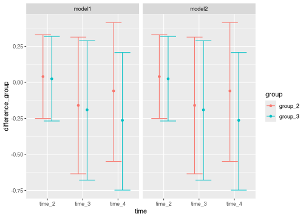
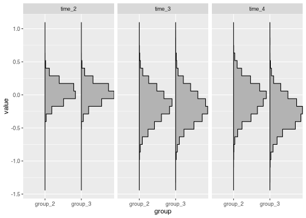

A mixed model of repeated measures (MMRM) analyzes longitudinal clinical trial data. In a longitudinal dataset, there are multiple patients, and each patient has multiple observations at a common set of discrete points in time.

# Data

To use the `brms.mmrm` package, begin with a longitudinal dataset with one row per patient observation and columns for the response variable, treatment group indicator, discrete time point indicator, patient ID variable, and optional baseline covariates such as age and region. If you do not have a real dataset of your own, you can simulate one from the package. The following dataset has the raw response variable, the  essential factor variables, and continuous baseline covariates.^[Covariates can be categorical too.] In general, the outcome variable can either be the raw response or change from baseline.


```r
library(brms.mmrm)
library(dplyr)
library(magrittr)
set.seed(0L)
raw_data <- brm_simulate_simple(
  n_group = 3,
  n_patient = 100,
  n_time = 4
) %>%
  extract2("data") %>%
  brm_simulate_continuous(c("biomarker1", "biomarker2", "biomarker3"))

raw_data
#> # A tibble: 1,200 × 7
#>    response group   time   patient     biomarker1 biomarker2 biomarker3
#>       <dbl> <chr>   <chr>  <chr>            <dbl>      <dbl>      <dbl>
#>  1    1.11  group_1 time_1 patient_001      1.31      -0.361      1.52 
#>  2    2.15  group_1 time_2 patient_001      1.31      -0.361      1.52 
#>  3    2.54  group_1 time_3 patient_001      1.31      -0.361      1.52 
#>  4   -1.73  group_1 time_4 patient_001      1.31      -0.361      1.52 
#>  5    1.11  group_1 time_1 patient_002      0.107     -2.44      -0.139
#>  6    2.64  group_1 time_2 patient_002      0.107     -2.44      -0.139
#>  7    1.69  group_1 time_3 patient_002      0.107     -2.44      -0.139
#>  8    0.783 group_1 time_4 patient_002      0.107     -2.44      -0.139
#>  9    0.118 group_1 time_1 patient_003      1.44      -0.419     -1.54 
#> 10    2.48  group_1 time_2 patient_003      1.44      -0.419     -1.54 
#> # ℹ 1,190 more rows
```

Next, create a special classed dataset that the package will recognize. The classed data object contains a pre-processed version of the data, along with attributes to declare the outcome variable, whether the outcome is response or change from baseline, the treatment group variable, the discrete time point variable, control group, baseline time point, and the covariates selected for analysis.


```r
data <- brm_data(
  data = raw_data,
  outcome = "response",
  role = "response",
  group = "group",
  patient = "patient",
  time = "time",
  covariates = c("biomarker1", "biomarker2"),
  reference_group = "group_1",
  reference_time = "time_1"
)

data
#> # A tibble: 1,200 × 6
#>    response group   time   patient     biomarker1 biomarker2
#>       <dbl> <chr>   <chr>  <chr>            <dbl>      <dbl>
#>  1    1.11  group_1 time_1 patient_001      1.31      -0.361
#>  2    2.15  group_1 time_2 patient_001      1.31      -0.361
#>  3    2.54  group_1 time_3 patient_001      1.31      -0.361
#>  4   -1.73  group_1 time_4 patient_001      1.31      -0.361
#>  5    1.11  group_1 time_1 patient_002      0.107     -2.44 
#>  6    2.64  group_1 time_2 patient_002      0.107     -2.44 
#>  7    1.69  group_1 time_3 patient_002      0.107     -2.44 
#>  8    0.783 group_1 time_4 patient_002      0.107     -2.44 
#>  9    0.118 group_1 time_1 patient_003      1.44      -0.419
#> 10    2.48  group_1 time_2 patient_003      1.44      -0.419
#> # ℹ 1,190 more rows

class(data)
#> [1] "brm_data"   "tbl_df"     "tbl"        "data.frame"

roles <- attributes(data)
roles$row.names <- NULL
str(roles)
#> List of 14
#>  $ names              : chr [1:6] "response" "group" "time" "patient" ...
#>  $ class              : chr [1:4] "brm_data" "tbl_df" "tbl" "data.frame"
#>  $ brm_outcome        : chr "response"
#>  $ brm_role           : chr "response"
#>  $ brm_group          : chr "group"
#>  $ brm_time           : chr "time"
#>  $ brm_patient        : chr "patient"
#>  $ brm_covariates     : chr [1:2] "biomarker1" "biomarker2"
#>  $ brm_reference_group: chr "group_1"
#>  $ brm_reference_time : chr "time_1"
#>  $ brm_levels_group   : chr [1:3] "group_1" "group_2" "group_3"
#>  $ brm_levels_time    : chr [1:4] "time_1" "time_2" "time_3" "time_4"
#>  $ brm_labels_group   : chr [1:3] "group_1" "group_2" "group_3"
#>  $ brm_labels_time    : chr [1:4] "time_1" "time_2" "time_3" "time_4"
```

# Formula

Next, choose a `brms` model formula for the fixed effect and variance parameters. The `brm_formula()` function from `brms.mmrm` makes this process easier. A cell means parameterization for this particular model can be expressed as follows. It specifies one fixed effect parameter for each combination of treatment group and time point, and it makes the specification of informative priors straightforward through the `prior` argument of `brm_model()`.


```r
brm_formula(
  data = data,
  intercept = FALSE,
  baseline = FALSE,
  group = FALSE,
  time = FALSE,
  baseline_time = FALSE,
  group_time = TRUE
)
#> response ~ 0 + group:time + biomarker1 + biomarker2 + unstr(time = time, gr = patient) 
#> sigma ~ 0 + time
```

For the purposes of our example, we choose a fully parameterized analysis of the raw response.


```r
formula <- brm_formula(
  data = data,
  intercept = TRUE,
  baseline = FALSE,
  group = TRUE,
  time = TRUE,
  baseline_time = FALSE,
  group_time = TRUE
)

formula
#> response ~ group + group:time + time + biomarker1 + biomarker2 + unstr(time = time, gr = patient) 
#> sigma ~ 0 + time
```

# Parameterization

The formula is not the only factor
that ultimately determines the fixed effect parameterization.
The ordering of the categorical variables in the data,
as well as the `contrast` option in R, affect the
construction of the model matrix. To see the model
matrix that will ultimately be used in `brm_model()`,
run `brms::make_standata()` and examine the `X` element
of the returned list.

The `contrast` option accepts a named vector of two character vectors which govern `model.matrix()` contrasts for unordered and ordered variables, respectively.


```r
options(contrasts = c(unordered = "contr.SAS", ordered = "contr.poly"))
```

The `make_standata()` function lets you see the data that `brms` will generate for Stan. This includes the fixed effects model matrix `X`. Note the differences in the `groupgroup_*` additive terms between the matrix below and the one above.


```r
head(brms::make_standata(formula = formula, data = data)$X)
#>   Intercept groupgroup_1 groupgroup_2 timetime_1 timetime_2 timetime_3 biomarker1
#> 1         1            1            0          1          0          0  1.3126508
#> 2         1            1            0          0          1          0  1.3126508
#> 3         1            1            0          0          0          1  1.3126508
#> 4         1            1            0          0          0          0  1.3126508
#> 5         1            1            0          1          0          0  0.1068624
#> 6         1            1            0          0          1          0  0.1068624
#>   biomarker2 groupgroup_1:timetime_1 groupgroup_2:timetime_1 groupgroup_1:timetime_2
#> 1 -0.3608809                       1                       0                       0
#> 2 -0.3608809                       0                       0                       1
#> 3 -0.3608809                       0                       0                       0
#> 4 -0.3608809                       0                       0                       0
#> 5 -2.4441488                       1                       0                       0
#> 6 -2.4441488                       0                       0                       1
#>   groupgroup_2:timetime_2 groupgroup_1:timetime_3 groupgroup_2:timetime_3
#> 1                       0                       0                       0
#> 2                       0                       0                       0
#> 3                       0                       1                       0
#> 4                       0                       0                       0
#> 5                       0                       0                       0
#> 6                       0                       0                       0
```

If you choose a different contrast method, a different model matrix may result.


```r
options(
  contrasts = c(unordered = "contr.treatment", ordered = "contr.poly")
)
# different model matrix than before:
head(brms::make_standata(formula = formula, data = data)$X)
#>   Intercept groupgroup_2 groupgroup_3 timetime_2 timetime_3 timetime_4 biomarker1
#> 1         1            0            0          0          0          0  1.3126508
#> 2         1            0            0          1          0          0  1.3126508
#> 3         1            0            0          0          1          0  1.3126508
#> 4         1            0            0          0          0          1  1.3126508
#> 5         1            0            0          0          0          0  0.1068624
#> 6         1            0            0          1          0          0  0.1068624
#>   biomarker2 groupgroup_2:timetime_2 groupgroup_3:timetime_2 groupgroup_2:timetime_3
#> 1 -0.3608809                       0                       0                       0
#> 2 -0.3608809                       0                       0                       0
#> 3 -0.3608809                       0                       0                       0
#> 4 -0.3608809                       0                       0                       0
#> 5 -2.4441488                       0                       0                       0
#> 6 -2.4441488                       0                       0                       0
#>   groupgroup_3:timetime_3 groupgroup_2:timetime_4 groupgroup_3:timetime_4
#> 1                       0                       0                       0
#> 2                       0                       0                       0
#> 3                       0                       0                       0
#> 4                       0                       0                       0
#> 5                       0                       0                       0
#> 6                       0                       0                       0
```

# Priors

Some analyses require informative priors, others require non-informative ones. Please use [`brms`](https://paul-buerkner.github.io/brms/) to construct a prior suitable for your analysis. The [`brms`](https://paul-buerkner.github.io/brms/) package has documentation on how its default priors are constructed and how to set your own priors. Once you have an R object that represents the joint prior distribution of your model, you can pass it to the `brm_model()` function described below. The `get_prior()` function shows the default priors for a given dataset and model formula.


```r
brms::get_prior(data = data, formula = formula)
#>                   prior     class                    coef group resp  dpar nlpar lb ub
#>                  (flat)         b                                                     
#>                  (flat)         b              biomarker1                             
#>                  (flat)         b              biomarker2                             
#>                  (flat)         b            groupgroup_2                             
#>                  (flat)         b groupgroup_2:timetime_2                             
#>                  (flat)         b groupgroup_2:timetime_3                             
#>                  (flat)         b groupgroup_2:timetime_4                             
#>                  (flat)         b            groupgroup_3                             
#>                  (flat)         b groupgroup_3:timetime_2                             
#>                  (flat)         b groupgroup_3:timetime_3                             
#>                  (flat)         b groupgroup_3:timetime_4                             
#>                  (flat)         b              timetime_2                             
#>                  (flat)         b              timetime_3                             
#>                  (flat)         b              timetime_4                             
#>                  lkj(1)   cortime                                                     
#>  student_t(3, 0.9, 2.5) Intercept                                                     
#>                  (flat)         b                                    sigma            
#>                  (flat)         b              timetime_1            sigma            
#>                  (flat)         b              timetime_2            sigma            
#>                  (flat)         b              timetime_3            sigma            
#>                  (flat)         b              timetime_4            sigma            
#>        source
#>       default
#>  (vectorized)
#>  (vectorized)
#>  (vectorized)
#>  (vectorized)
#>  (vectorized)
#>  (vectorized)
#>  (vectorized)
#>  (vectorized)
#>  (vectorized)
#>  (vectorized)
#>  (vectorized)
#>  (vectorized)
#>  (vectorized)
#>       default
#>       default
#>       default
#>  (vectorized)
#>  (vectorized)
#>  (vectorized)
#>  (vectorized)
```

# Model

To run an MMRM, use the `brm_model()` function. This function calls `brms::brm()` behind the scenes, using the formula and prior you set in the `formula` and `prior` arguments.


```r
model <- brm_model(data = data, formula = formula, refresh = 0)
```


The result is a `brms` model object.


```r
model
#>  Family: gaussian 
#>   Links: mu = identity; sigma = log 
#> Formula: response ~ group + group:time + time + biomarker1 + biomarker2 + unstr(time = time, gr = patient) 
#>          sigma ~ 0 + time
#>    Data: data[!is.na(data[[attr(data, "brm_outcome")]]), ] (Number of observations: 1200) 
#>   Draws: 4 chains, each with iter = 2000; warmup = 1000; thin = 1;
#>          total post-warmup draws = 4000
#> 
#> Correlation Structures:
#>                        Estimate Est.Error l-95% CI u-95% CI Rhat Bulk_ESS Tail_ESS
#> cortime(time_1,time_2)     0.42      0.05     0.33     0.51 1.00     3382     2852
#> cortime(time_1,time_3)    -0.80      0.02    -0.84    -0.76 1.00     2556     2895
#> cortime(time_2,time_3)    -0.54      0.04    -0.62    -0.46 1.00     3662     3516
#> cortime(time_1,time_4)    -0.29      0.05    -0.39    -0.18 1.00     3986     2962
#> cortime(time_2,time_4)     0.03      0.06    -0.08     0.14 1.00     3173     2746
#> cortime(time_3,time_4)    -0.10      0.06    -0.21     0.01 1.00     3969     2808
#> 
#> Population-Level Effects: 
#>                         Estimate Est.Error l-95% CI u-95% CI Rhat Bulk_ESS Tail_ESS
#> Intercept                   1.22      0.09     1.05     1.39 1.01     1362     2352
#> groupgroup_2               -1.54      0.13    -1.78    -1.30 1.01     1402     2349
#> groupgroup_3                0.18      0.12    -0.06     0.42 1.00     1547     2209
#> timetime_2                  1.31      0.10     1.11     1.51 1.00     1807     2158
#> timetime_3                  0.51      0.17     0.17     0.84 1.00     1538     2286
#> timetime_4                 -1.45      0.17    -1.79    -1.12 1.01     1539     2284
#> biomarker1                 -0.01      0.01    -0.03     0.01 1.00     5220     3207
#> biomarker2                  0.02      0.01     0.00     0.04 1.00     5408     2900
#> groupgroup_2:timetime_2     0.04      0.15    -0.24     0.33 1.00     2001     2680
#> groupgroup_3:timetime_2     0.03      0.14    -0.25     0.30 1.00     2139     2806
#> groupgroup_2:timetime_3    -0.16      0.25    -0.64     0.32 1.00     1566     2224
#> groupgroup_3:timetime_3    -0.19      0.25    -0.68     0.29 1.00     1784     2678
#> groupgroup_2:timetime_4    -0.06      0.24    -0.54     0.42 1.00     1691     2437
#> groupgroup_3:timetime_4    -0.25      0.24    -0.71     0.22 1.00     1789     2256
#> sigma_timetime_1           -0.12      0.04    -0.20    -0.04 1.00     2528     2525
#> sigma_timetime_2            0.00      0.04    -0.07     0.09 1.00     3831     2891
#> sigma_timetime_3           -0.05      0.04    -0.13     0.03 1.00     2345     2748
#> sigma_timetime_4            0.21      0.04     0.13     0.29 1.00     3631     2831
#> 
#> Draws were sampled using sampling(NUTS). For each parameter, Bulk_ESS
#> and Tail_ESS are effective sample size measures, and Rhat is the potential
#> scale reduction factor on split chains (at convergence, Rhat = 1).
```

# Marginals

Regardless of the choice of fixed effects formula, `brms.mmrm` performs inference on the marginal distributions at each treatment group and time point of the mean of the following quantities:

1. Response.
2. Change from baseline, if you set `role` to `"change"` in `brm_data()`.
3. Treatment difference, in terms of change from baseline.
4. Effect size: treatment difference divided by the residual standard deviation.

To derive posterior draws of these marginals, use the `brm_marginal_draws()` function.


```r
draws <- brm_marginal_draws(model = model, data = data)

draws
#> $response
#> # A draws_df: 1000 iterations, 4 chains, and 12 variables
#>    group_1|time_1 group_2|time_1 group_3|time_1 group_1|time_2 group_2|time_2
#> 1             1.2          -0.41            1.4            2.5           1.01
#> 2             1.2          -0.29            1.3            2.6           1.09
#> 3             1.3          -0.32            1.4            2.4           1.08
#> 4             1.2          -0.33            1.4            2.4           0.98
#> 5             1.2          -0.43            1.3            2.5           1.04
#> 6             1.3          -0.41            1.3            2.4           0.96
#> 7             1.4          -0.32            1.5            2.5           1.03
#> 8             1.3          -0.23            1.4            2.6           1.12
#> 9             1.2          -0.31            1.4            2.6           1.10
#> 10            1.2          -0.24            1.4            2.4           1.10
#>    group_3|time_2 group_1|time_3 group_2|time_3
#> 1             2.6            1.7          0.121
#> 2             2.8            1.7         -0.065
#> 3             2.8            1.7          0.054
#> 4             2.8            1.8          0.078
#> 5             2.8            1.7          0.039
#> 6             2.7            1.8          0.139
#> 7             2.7            1.6          0.085
#> 8             2.8            1.5         -0.138
#> 9             2.6            1.7          0.014
#> 10            2.6            1.7         -0.072
#> # ... with 3990 more draws, and 4 more variables
#> # ... hidden reserved variables {'.chain', '.iteration', '.draw'}
#> 
#> $difference_time
#> # A draws_df: 1000 iterations, 4 chains, and 9 variables
#>    group_1|time_2 group_1|time_3 group_1|time_4 group_2|time_2 group_2|time_3
#> 1             1.3           0.47           -1.4            1.4          0.527
#> 2             1.3           0.48           -1.4            1.4          0.221
#> 3             1.2           0.42           -1.5            1.4          0.375
#> 4             1.2           0.53           -1.5            1.3          0.411
#> 5             1.2           0.49           -1.6            1.5          0.470
#> 6             1.2           0.52           -1.5            1.4          0.552
#> 7             1.0           0.14           -2.1            1.4          0.407
#> 8             1.3           0.26           -1.3            1.4          0.096
#> 9             1.4           0.48           -1.3            1.4          0.322
#> 10            1.2           0.50           -1.5            1.3          0.171
#>    group_2|time_4 group_3|time_2 group_3|time_3
#> 1            -1.5            1.2           0.29
#> 2            -1.4            1.5           0.50
#> 3            -1.7            1.3           0.18
#> 4            -1.6            1.4           0.23
#> 5            -1.2            1.5           0.56
#> 6            -1.4            1.4           0.61
#> 7            -1.6            1.2           0.13
#> 8            -1.4            1.4           0.28
#> 9            -1.6            1.2           0.33
#> 10           -1.5            1.2           0.36
#> # ... with 3990 more draws, and 1 more variables
#> # ... hidden reserved variables {'.chain', '.iteration', '.draw'}
#> 
#> $difference_group
#> # A draws_df: 1000 iterations, 4 chains, and 6 variables
#>    group_2|time_2 group_2|time_3 group_2|time_4 group_3|time_2 group_3|time_3
#> 1           0.133          0.054         -0.096         -0.053        -0.1791
#> 2           0.059         -0.264          0.017          0.167         0.0151
#> 3           0.219         -0.049         -0.144          0.154        -0.2428
#> 4           0.142         -0.115         -0.085          0.199        -0.2974
#> 5           0.244         -0.016          0.382          0.321         0.0719
#> 6           0.209          0.034          0.170          0.275         0.0925
#> 7           0.324          0.269          0.442          0.217        -0.0091
#> 8           0.006         -0.161         -0.097          0.049         0.0216
#> 9          -0.016         -0.156         -0.354         -0.174        -0.1527
#> 10          0.148         -0.325          0.036          0.041        -0.1382
#>    group_3|time_4
#> 1          -0.376
#> 2          -0.063
#> 3          -0.046
#> 4          -0.069
#> 5          -0.049
#> 6          -0.029
#> 7           0.486
#> 8          -0.299
#> 9          -0.431
#> 10         -0.316
#> # ... with 3990 more draws
#> # ... hidden reserved variables {'.chain', '.iteration', '.draw'}
#> 
#> $effect
#> # A draws_df: 1000 iterations, 4 chains, and 6 variables
#>    group_2|time_2 group_2|time_3 group_2|time_4 group_3|time_2 group_3|time_3
#> 1           0.134          0.055         -0.079         -0.054        -0.1846
#> 2           0.060         -0.286          0.014          0.170         0.0164
#> 3           0.209         -0.047         -0.118          0.147        -0.2351
#> 4           0.137         -0.112         -0.070          0.192        -0.2910
#> 5           0.223         -0.016          0.313          0.292         0.0726
#> 6           0.195          0.034          0.140          0.257         0.0930
#> 7           0.337          0.275          0.360          0.226        -0.0094
#> 8           0.006         -0.179         -0.079          0.049         0.0241
#> 9          -0.016         -0.167         -0.282         -0.177        -0.1632
#> 10          0.150         -0.345          0.030          0.041        -0.1465
#>    group_3|time_4
#> 1          -0.307
#> 2          -0.052
#> 3          -0.037
#> 4          -0.057
#> 5          -0.040
#> 6          -0.024
#> 7           0.396
#> 8          -0.246
#> 9          -0.343
#> 10         -0.262
#> # ... with 3990 more draws
#> # ... hidden reserved variables {'.chain', '.iteration', '.draw'}
```

If you need samples from these marginals averaged across time points, e.g. an "overall effect size", `brm_marginal_draws_average()` can average the draws above across discrete time points (either all or a user-defined subset).


```r
brm_marginal_draws_average(draws = draws, data = data)
#> $response
#> # A draws_df: 1000 iterations, 4 chains, and 3 variables
#>    group_1|average group_2|average group_3|average
#> 1              1.3           -0.31             1.3
#> 2              1.3           -0.24             1.4
#> 3              1.3           -0.29             1.4
#> 4              1.3           -0.30             1.4
#> 5              1.3           -0.24             1.4
#> 6              1.3           -0.28             1.4
#> 7              1.2           -0.29             1.4
#> 8              1.4           -0.23             1.4
#> 9              1.3           -0.29             1.4
#> 10             1.3           -0.24             1.3
#> # ... with 3990 more draws
#> # ... hidden reserved variables {'.chain', '.iteration', '.draw'}
#> 
#> $difference_time
#> # A draws_df: 1000 iterations, 4 chains, and 3 variables
#>    group_1|average group_2|average group_3|average
#> 1            0.104          0.1343         -0.0983
#> 2            0.125          0.0620          0.1643
#> 3            0.029          0.0377         -0.0159
#> 4            0.058          0.0387          0.0024
#> 5            0.045          0.2492          0.1599
#> 6            0.045          0.1828          0.1580
#> 7           -0.301          0.0444         -0.0696
#> 8            0.092          0.0083          0.0158
#> 9            0.205          0.0291         -0.0480
#> 10           0.054          0.0073         -0.0835
#> # ... with 3990 more draws
#> # ... hidden reserved variables {'.chain', '.iteration', '.draw'}
#> 
#> $difference_group
#> # A draws_df: 1000 iterations, 4 chains, and 2 variables
#>    group_2|average group_3|average
#> 1           0.0300          -0.203
#> 2          -0.0626           0.040
#> 3           0.0087          -0.045
#> 4          -0.0195          -0.056
#> 5           0.2037           0.114
#> 6           0.1377           0.113
#> 7           0.3453           0.231
#> 8          -0.0837          -0.076
#> 9          -0.1754          -0.253
#> 10         -0.0472          -0.138
#> # ... with 3990 more draws
#> # ... hidden reserved variables {'.chain', '.iteration', '.draw'}
#> 
#> $effect
#> # A draws_df: 1000 iterations, 4 chains, and 2 variables
#>    group_2|average group_3|average
#> 1            0.037          -0.182
#> 2           -0.071           0.045
#> 3            0.015          -0.042
#> 4           -0.015          -0.052
#> 5            0.173           0.108
#> 6            0.123           0.109
#> 7            0.324           0.204
#> 8           -0.084          -0.058
#> 9           -0.155          -0.228
#> 10          -0.055          -0.122
#> # ... with 3990 more draws
#> # ... hidden reserved variables {'.chain', '.iteration', '.draw'}
```

The `brm_marginal_summaries()` function produces posterior summaries of these marginals, and it includes the Monte Carlo standard error (MCSE) of each estimate.


```r
summaries <- brm_marginal_summaries(draws, level = 0.95)

summaries
#> # A tibble: 165 × 6
#>    marginal         statistic group   time     value    mcse
#>    <chr>            <chr>     <chr>   <chr>    <dbl>   <dbl>
#>  1 difference_group lower     group_2 time_2 -0.238  0.00963
#>  2 difference_group lower     group_2 time_3 -0.636  0.00938
#>  3 difference_group lower     group_2 time_4 -0.540  0.00959
#>  4 difference_group lower     group_3 time_2 -0.250  0.00661
#>  5 difference_group lower     group_3 time_3 -0.679  0.00935
#>  6 difference_group lower     group_3 time_4 -0.713  0.0103 
#>  7 difference_group mean      group_2 time_2  0.0441 0.00329
#>  8 difference_group mean      group_2 time_3 -0.159  0.00624
#>  9 difference_group mean      group_2 time_4 -0.0616 0.00593
#> 10 difference_group mean      group_3 time_2  0.0279 0.00312
#> # ℹ 155 more rows
```

The `brm_marginal_probabilities()` function shows posterior probabilities of the form, 

$$
\begin{aligned}
\text{Prob}(\text{treatment effect} > \text{threshold})
\end{aligned}
$$

or 

$$
\begin{aligned}
\text{Prob}(\text{treatment effect} < \text{threshold})
\end{aligned}
$$


```r
brm_marginal_probabilities(
  draws = draws,
  threshold = c(-0.1, 0.1),
  direction = c("greater", "less")
)
#> # A tibble: 12 × 5
#>    direction threshold group   time   value
#>    <chr>         <dbl> <chr>   <chr>  <dbl>
#>  1 greater        -0.1 group_2 time_2 0.828
#>  2 greater        -0.1 group_2 time_3 0.404
#>  3 greater        -0.1 group_2 time_4 0.567
#>  4 greater        -0.1 group_3 time_2 0.816
#>  5 greater        -0.1 group_3 time_3 0.365
#>  6 greater        -0.1 group_3 time_4 0.254
#>  7 less            0.1 group_2 time_2 0.645
#>  8 less            0.1 group_2 time_3 0.850
#>  9 less            0.1 group_2 time_4 0.753
#> 10 less            0.1 group_3 time_2 0.703
#> 11 less            0.1 group_3 time_3 0.885
#> 12 less            0.1 group_3 time_4 0.926
```

Finally, `brm_marignal_data()` computes marginal means and confidence intervals on the response variable in the data, along with other summary statistics.


```r
summaries_data <- brm_marginal_data(data = data, level = 0.95)

summaries_data
#> # A tibble: 84 × 4
#>    statistic group   time     value
#>    <chr>     <chr>   <chr>    <dbl>
#>  1 lower     group_1 time_1  1.40  
#>  2 lower     group_1 time_2  2.71  
#>  3 lower     group_1 time_3  1.91  
#>  4 lower     group_1 time_4  0.0151
#>  5 lower     group_2 time_1 -0.150 
#>  6 lower     group_2 time_2  1.23  
#>  7 lower     group_2 time_3  0.218 
#>  8 lower     group_2 time_4 -1.59  
#>  9 lower     group_3 time_1  1.57  
#> 10 lower     group_3 time_2  2.95  
#> # ℹ 74 more rows
```

# Visualization

The `brm_plot_compare()` function compares means and intervals from many different models and data sources in the same plot. First, we need the marginals of the data.


```r
brm_plot_compare(
  data = summaries_data,
  model1 = summaries,
  model2 = summaries
)
```


If you omit the marginals of the data, you can show inference on change from baseline or the treatment effect.


```r
brm_plot_compare(
  model1 = summaries,
  model2 = summaries,
  marginal = "difference_group" # treatment effect
)
```


Additional arguments let you control the primary comparison of interest (the color aesthetic), the horizontal axis, and the faceting variable.


```r
brm_plot_compare(
  model1 = summaries,
  model2 = summaries,
  marginal = "difference_group",
  compare = "group",
  axis = "time",
  facet = "source" # model1 vs model2
)
```



Finally, `brm_plot_draws()` can plot the posterior draws of the response, change from baseline, or treatment difference.


```r
brm_plot_draws(draws = draws$difference_group)
```


The `axis` and `facet` arguments customize the horizontal axis and faceting variable, respectively.


```r
brm_plot_draws(
  draws = draws$difference_group,
  axis = "group",
  facet = "time"
)
```


